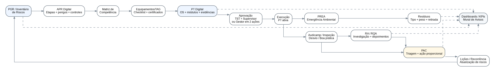
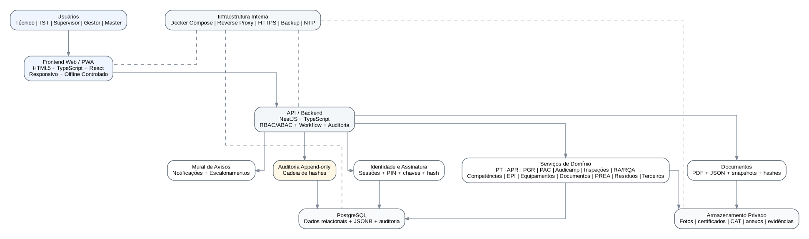

# PISMA - Plataforma Integrada de Segurança e Meio Ambiente
## PRD + Especificação Funcional, Técnica, de Segurança, UX/UI e Arquitetura

**Versão:** 1.3 - Especificação consolidada para desenvolvimento por IA/equipe de software  
**Data:** 13/08/2026  
**Plataforma:** Aplicação web HTML responsiva para rede interna da empresa  
**Nome do produto:** **PISMA - Plataforma Integrada de Segurança e Meio Ambiente**  
**Documento-base funcional:** FS 13-01 - Permissão de Trabalho, Rev.05 - Proposta Melhorada  
**Status deste documento:** Base de desenvolvimento consolidada. Requer validação final da empresa antes de produção.

**Revisão 1.3 - expansão para plataforma integrada:** mantém integralmente os controles consolidados até a v1.2 e transforma o produto na **PISMA - Plataforma Integrada de Segurança e Meio Ambiente**. A v1.3 implementa AR/APR Digital, GRO/PGR, Inventário de Riscos, Plano de Ação Corretiva (PAC), Audicamp, inspeções digitais, matriz automática de competência, gestão ampliada de EPI, equipamentos e certificados, documentos e procedimentos, painel operacional, dashboards gerenciais, modo PWA/offline controlado, notificações no Mural de Avisos, gestão opcional de terceiros, PREA, gestão de resíduos e obrigatoriedade de seleção/checklist de equipamentos por TAG na PT.

---


> **Regra de precedência da v1.3:** as seções 74 a 103 deste documento são requisitos novos ou refinamentos. Em caso de conflito com qualquer regra anterior da v1.0, v1.1 ou v1.2, **prevalece a regra mais recente descrita nas seções 74 a 103**. O nome do produto passa a ser **PISMA**; a expressão **Permissão de Trabalho Digital** permanece como nome do módulo de PT dentro da plataforma.

## 0. Instrução principal para a IA de desenvolvimento

A IA ou equipe responsável pela implementação deverá tratar este documento como a **fonte principal de requisitos do produto**. Não deverá simplificar fluxos críticos de segurança, assinatura, auditoria, aprovação, controle de versões ou proteção de dados sem aprovação explícita do Product Owner.

Quando houver ambiguidade entre facilidade de uso e rastreabilidade de segurança, deve prevalecer a solução que:

1. preserve a integridade da Permissão de Trabalho;
2. impeça aprovação de conteúdo incompleto ou com requisito aplicável marcado como "NÃO";
3. preserve histórico e versões anteriores;
4. impeça que um usuário assine em nome de outro;
5. mantenha segregação de funções e menor privilégio;
6. permita auditoria completa do ciclo de vida;
7. proteja dados pessoais, fotografias e credenciais;
8. mantenha a aplicação funcional dentro da rede interna, sem dependência obrigatória de serviços externos.

A aplicação deverá ser construída como um **produto industrial**, e não como um formulário web simples.

---

# 1. Visão do produto

A **Permissão de Trabalho Digital** é uma aplicação web destinada à emissão, avaliação, aprovação, controle, consulta, revalidação, cancelamento e encerramento de Permissões de Trabalho em obras e unidades operacionais.

A aplicação digitaliza o formulário FS 13-01 revisado, transformando-o em um fluxo controlado, rastreável e orientado a risco. O sistema deve conduzir o Técnico pelo preenchimento quadro a quadro, aplicar regras automáticas de bloqueio, disponibilizar a PT para aprovação por TST/Supervisor/Gestor, registrar assinaturas eletrônicas internas, congelar versões aprovadas e gerar documentos finais em PDF e metadados estruturados. A versão 1.1 ampliou o produto com uma **Ficha Digital do Técnico**, contendo dados cadastrais, treinamentos, ASO e histórico de EPIs. A versão 1.2 acrescenta um segundo domínio operacional completo: **Registro de Acidente (RA) e Registro de Quase Acidente (RQA)**, permitindo abertura, investigação, coleta de depoimentos assinados, gestão de evidências, documentos médicos restritos, elaboração da conclusão e encerramento formal do processo.

O sistema será acessado por navegador em computadores, tablets e celulares conectados à rede interna da empresa.

A aplicação deve funcionar por **Obra**, mantendo todos os usuários, documentos, permissões e registros vinculados a uma obra específica.

---

# 2. Objetivos de negócio e segurança

## 2.1 Objetivo principal

Eliminar o uso disperso de formulários manuais de PT e estabelecer um processo digital padronizado que demonstre, de forma rastreável, que os requisitos aplicáveis foram avaliados antes da execução da atividade.

## 2.2 Objetivos secundários

- reduzir erros de preenchimento;
- impedir campos obrigatórios em branco;
- impedir liberação com requisito aplicável marcado como "NÃO";
- conduzir o usuário apenas pelos módulos aplicáveis à atividade;
- registrar autoria, aprovação, reprovação e alterações;
- permitir consulta rápida pelo número da Ordem de Serviço;
- manter histórico por Técnico, obra, data, situação e natureza da atividade;
- disponibilizar PDF padronizado para impressão e compartilhamento;
- manter metadados estruturados para auditoria e futura integração;
- permitir comprovação da integridade do documento após assinatura;
- reduzir possibilidade de assinatura por terceiro;
- controlar rigorosamente a única oportunidade de edição posterior ao envio para aprovação;
- permitir cancelamento e reemissão sem apagar histórico;
- permitir operação integral em rede interna.
- centralizar a ficha funcional de segurança dos Técnicos por Obra;
- permitir ao TST/Gestor registrar treinamentos, ASO e entregas de EPI;
- sinalizar documentos vencidos ou próximos do vencimento;
- permitir ao Técnico consultar e imprimir sua própria ficha individual;
- permitir bloqueio operacional de usuários pelo Gestor, com motivo, escopo e auditoria.
- registrar acidentes e quase acidentes em processos internos rastreáveis;
- permitir que TST/Gestor abram RA ou RQA e distribuam tarefas de depoimento;
- preservar depoimentos assinados de forma imutável, aceitando apenas novos depoimentos complementares;
- manter fotos, relatórios, exames, atestados e demais evidências vinculados ao processo;
- aplicar acesso diferenciado entre principal envolvido, testemunha, TST e Gestor;
- encerrar RA/RQA somente após conclusão formal assinada por Gestor, TST e Técnico designado.

---

# 3. Base funcional derivada da PT Rev.05

A aplicação deve reproduzir conceitualmente os 19 blocos do modelo melhorado:

1. Emissão, escopo e validade;
2. Descrição da atividade e condições impeditivas;
3. Documentos e pré-requisitos;
4. Identificação de perigos/impactos;
5. Precauções obrigatórias para toda atividade;
6. Controle de energias perigosas - LOTO/energia zero;
7. Trabalho a quente;
8. Trabalho em altura;
9. Içamento e movimentação de carga;
10. Eletricidade;
11. Escavações;
12. Espaço confinado;
13. Trabalho a frio/máquinas e ferramentas;
14. Controles ambientais e de interface;
15. EPI/EPC/recursos obrigatórios;
16. Ações corretivas/recomendações adicionais;
17. Autorização e ciência da equipe;
18. Revalidação/suspensão;
19. Encerramento e devolução da área.

O formulário digital não deve ser apenas uma transcrição visual do Word. Deve ser um **motor de workflow e validação** que use esses blocos como módulos.

---

# 4. Princípios obrigatórios do sistema

## 4.1 Regra de bloqueio

Para perguntas de checklist:

- **SIM** = requisito atendido;
- **NÃO** = requisito não atendido e bloqueante;
- **N/A** = requisito avaliado e considerado não aplicável;
- **Em branco** = preenchimento incompleto e bloqueante.

A PT não pode ser enviada para aprovação enquanto existir:

- resposta obrigatória em branco;
- resposta "NÃO" não corrigida;
- ação corretiva pendente;
- documento obrigatório ausente;
- assinatura/ciência obrigatória ausente;
- condição de regra específica não atendida.

## 4.2 Integridade histórica

Nenhum registro aprovado, assinado, reprovado, cancelado ou encerrado poderá ser apagado fisicamente pela interface.

Correções devem produzir nova versão ou novo documento, preservando o anterior.

## 4.3 Separação entre rascunho e documento submetido

Para evitar inviabilidade operacional, o termo "salvar" deve possuir dois conceitos diferentes:

### Salvar rascunho

Enquanto a PT estiver em **RASCUNHO**, o Técnico poderá salvá-la e editá-la quantas vezes forem necessárias. O sistema deve possuir salvamento automático.

### Finalizar e enviar para aprovação

Ao selecionar **Finalizar e enviar**, o Técnico deverá revisar um resumo final e assinar como autor/responsável pelo preenchimento. A partir desse momento o conteúdo fica congelado.

A regra de "uma única edição autorizada" começa **após a primeira submissão para aprovação**, e não durante a elaboração do rascunho.

---

# 5. Arquitetura de usuários e perfis

O sistema possuirá cinco perfis de acesso.

## 5.1 MASTER

Finalidade: administração da instalação/obra e auditoria.

Permissões principais:

- cadastrar, editar, ativar e desativar Obras;
- cadastrar usuários;
- atribuir usuários às Obras;
- atribuir perfil funcional;
- gerar senha temporária/redefinir acesso;
- bloquear ou desbloquear conta;
- visualizar status de cadastro dos usuários;
- visualizar histórico de acessos e ações;
- visualizar trilha de auditoria;
- consultar PTs para finalidade administrativa/auditoria, em modo somente leitura;
- configurar identidade visual da Obra;
- configurar parâmetros permitidos do sistema;
- exportar relatórios administrativos;
- executar rotinas autorizadas de backup/restauração por meio da camada administrativa, caso esta função seja implementada na interface.

Restrições:

- MASTER não aprova PT por ser Master;
- MASTER não pode assinar no lugar de Técnico, TST, Supervisor ou Gestor;
- MASTER não pode alterar conteúdo de PT submetida;
- alterações administrativas devem ser auditadas;
- se o mesmo colaborador precisar atuar também como Gestor, essa capacidade deve ser atribuída explicitamente como um segundo papel, mantendo o registro de qual papel foi usado em cada ação.

## 5.2 TÉCNICO

Finalidade: **único perfil operacional autorizado a criar e preencher Permissões de Trabalho**.

O Técnico será identificado por sua **função profissional**, além do perfil "Técnico".

Exemplos de função:

- Técnico Mecânico;
- Técnico Elétrico;
- Encarregado de Manutenção;
- Técnico de Instrumentação;
- Técnico Civil;
- Líder de Equipe;
- outra função cadastrada.

Permissões relacionadas à PT:

- criar PT;
- salvar e editar rascunho próprio;
- preencher todo o fluxo;
- anexar evidências e documentos;
- cadastrar equipe executante da PT;
- assinar a autoria/submissão;
- enviar para aprovação;
- visualizar somente as PTs que criou;
- acompanhar status;
- responder correções dentro da única edição autorizada;
- solicitar cancelamento quando aplicável;
- iniciar procedimento de encerramento conforme regra da Obra;
- baixar PDF de PT à qual tenha acesso.

Permissões relacionadas ao próprio cadastro:

- visualizar seus dados pessoais e funcionais;
- visualizar sua assinatura cadastrada e status da credencial, sem acesso à chave privada;
- visualizar treinamentos registrados pelo TST/Gestor, datas de realização, prazos de validade, datas de vencimento e status;
- visualizar a data do ASO e sua data de validade;
- visualizar histórico de EPIs entregues, com descrição, CA e data de entrega;
- visualizar alertas de documentos próximos do vencimento;
- gerar, baixar e imprimir a **Ficha de Informações do Técnico** em PDF;
- consultar o histórico de atualizações de sua ficha em modo somente leitura.

Permissões relacionadas a RA/RQA:

- visualizar os processos RA/RQA em que esteja formalmente incluído conforme seu papel no processo;
- quando for **principal envolvido**, visualizar o processo completo durante todo o ciclo de vida, ressalvados anexos de terceiros com restrição legal/privacidade configurada;
- quando for **testemunha**, visualizar apenas sua tarefa, seu próprio depoimento e eventuais depoimentos complementares de sua autoria;
- receber tarefas de depoimento, esclarecimento ou manifestação complementar atribuídas por TST/Gestor;
- responder seu depoimento diretamente no sistema;
- revisar o depoimento antes da submissão;
- assinar eletronicamente cada depoimento enviado;
- após envio, não substituir nem editar o depoimento assinado;
- realizar **novo depoimento complementar** quando solicitado ou autorizado, preservando todos os anteriores;
- quando for principal envolvido ou Técnico designado, poder **iniciar um rascunho de conclusão** após a etapa de depoimentos, sujeito à revisão do processo e às três assinaturas obrigatórias;
- quando designado como Técnico principal da conclusão, revisar e assinar a conclusão final do RA/RQA.

Restrições:

- não vê PTs de outros Técnicos;
- não aprova PT;
- não concede a si mesmo autorização de edição;
- não altera PT congelada sem autorização;
- não apaga PT histórica;
- não cadastra, altera ou exclui seus próprios registros de treinamento, ASO ou EPI;
- não desbloqueia a própria conta ou bloqueio operacional;
- não pode emitir PT quando existir bloqueio operacional vigente para a ação `EMIT_PT`, `SIGN` ou `ALL_OPERATIONAL`.
- não abre novo RA/RQA;
- não altera depoimento já assinado;
- não visualiza depoimentos de terceiros quando atuar apenas como testemunha;
- não adiciona evidências administrativas ao processo salvo quando houver tarefa explícita;
- não encerra RA/RQA sozinho.

## 5.3 TST

Finalidade: **gestão de segurança dos Técnicos e aprovação no slot TST**.

O TST **não cria, não emite e não preenche Permissão de Trabalho**.

Permissões relacionadas à PT:

- visualizar todas as PTs da(s) Obra(s) às quais está vinculado;
- pesquisar e filtrar PTs;
- abrir PT pronta para análise;
- aprovar no slot TST;
- reprovar, com justificativa obrigatória;
- participar da autorização da única edição posterior à submissão;
- participar de cancelamento/revalidação quando a política exigir;
- visualizar PDF e trilha de aprovações;
- consultar histórico.

Permissões relacionadas à gestão dos Técnicos:

- visualizar a lista de Técnicos da Obra;
- consultar a ficha individual do Técnico;
- registrar treinamento realizado;
- informar nome do treinamento;
- informar data de realização;
- informar prazo de validade e/ou data de vencimento;
- anexar certificado ou evidência de treinamento, quando a empresa desejar;
- registrar data do ASO e respectiva data de validade;
- registrar entrega de EPI, com data da entrega;
- adicionar um ou mais itens de EPI na mesma entrega;
- informar para cada EPI: descrição e número do CA;
- opcionalmente informar quantidade, observação e evidência de entrega;
- corrigir registros de treinamento, ASO e EPI através de **nova versão/supersessão auditada**, sem apagar silenciosamente o registro anterior;
- gerar/consultar a ficha individual do Técnico;
- consultar painel de vencimentos e pendências documentais.

Permissões relacionadas a RA/RQA:

- visualizar **todos os RA/RQA** das Obras às quais estiver vinculado;
- abrir novo processo RA ou RQA;
- definir o principal envolvido e as testemunhas;
- atribuir tarefas de depoimento ou esclarecimento a Técnicos;
- acompanhar pendências de depoimentos;
- anexar fotos, relatórios, documentos técnicos, exames, atestados e demais evidências permitidas;
- solicitar novos depoimentos ou depoimentos complementares sem sobrescrever os já assinados;
- registrar análise técnica, fatos apurados, fatores contribuintes e ações recomendadas;
- iniciar/elaborar a seção de conclusão conforme fluxo definido;
- assinar a conclusão final;
- reabrir tecnicamente um processo concluído quando houver nova evidência material, com justificativa e auditoria, conforme política da Obra.

Restrições:

- **não cria PT**;
- não edita respostas do Técnico na PT;
- não aprova no slot Supervisor;
- não modifica assinatura de terceiros;
- não altera dados cadastrais pessoais autodeclarados do Técnico sem fluxo administrativo apropriado;
- não registra diagnóstico, patologia, medicação ou conteúdo clínico do ASO; o módulo registra apenas datas e situação documental;
- não bloqueia ou desbloqueia usuários, salvo se a empresa futuramente conceder permissão específica distinta.
- não edita nem apaga depoimento já assinado por Técnico;
- não assina depoimento em nome do Técnico;
- não modifica silenciosamente uma conclusão já assinada; nova evidência após conclusão deve gerar aditivo ou reabertura formal.

## 5.4 SUPERVISOR

Finalidade: **aprovação operacional da PT no slot Supervisor**.

O Supervisor permanece como perfil estritamente aprovador e **não cria, não emite e não preenche PT**.

Permissões:

- visualizar todas as PTs da(s) Obra(s) às quais está vinculado;
- pesquisar e filtrar PTs;
- abrir PT pronta para análise;
- aprovar no slot Supervisor;
- reprovar, com justificativa obrigatória;
- participar da autorização da única edição posterior à submissão;
- participar de cancelamento/revalidação quando a política exigir;
- visualizar PDF, versões e trilha de aprovações;
- consultar histórico e relatórios de PT compatíveis com seu perfil.

Restrições:

- **não cria PT**;
- não edita respostas do Técnico;
- não aprova no slot TST;
- não cadastra ou altera treinamento, ASO ou EPI dos Técnicos;
- não bloqueia usuários;
- não modifica assinatura de terceiros.
- não possui acesso ao módulo RA/RQA por padrão; o escopo solicitado para RA/RQA é Técnico, TST e Gestor.

## 5.5 GESTOR

Finalidade: gestão operacional superior, com capacidade de executar ou supervisionar **qualquer tarefa atribuída ao TST e ao Supervisor**, sem se tornar emissor de PT.

O Gestor **não cria, não emite e não preenche Permissão de Trabalho**.

O Gestor poderá:

- visualizar todas as PTs da(s) Obra(s) às quais está vinculado;
- aprovar no slot TST;
- aprovar no slot Supervisor;
- assinar os dois slots da mesma PT, em ações deliberadas e independentes;
- reprovar PT em qualquer um dos dois papéis;
- executar os fluxos de autorização de edição, cancelamento e revalidação atribuídos a TST/Supervisor;
- consultar todos os Técnicos da Obra;
- inserir e corrigir registros de treinamento, ASO e EPI, com as mesmas regras do TST;
- consultar e editar tarefas administrativas do módulo TST/Supervisor quando ainda forem editáveis;
- gerar ficha individual de Técnico;
- consultar históricos e relatórios de PT e de conformidade dos Técnicos;
- aplicar e remover **bloqueios operacionais** de usuários da Obra, sempre com motivo e registro de auditoria.
- visualizar todos os RA/RQA da Obra;
- abrir novo RA ou RQA;
- executar qualquer tarefa operacional de investigação atribuída ao TST, respeitando imutabilidade de evidências e depoimentos;
- definir principal envolvido, testemunhas e Técnico designado para a conclusão;
- atribuir e reatribuir tarefas;
- adicionar evidências e documentos;
- solicitar novos depoimentos;
- elaborar, revisar e assinar a conclusão;
- assinar a conclusão final no papel Gestor;
- reabrir processo concluído ou registrar aditivo pós-conclusão, sempre com justificativa e trilha de auditoria.

Quando o Gestor assinar duas vezes:

1. o sistema deve exigir duas ações de assinatura deliberadas;
2. a primeira deve identificar explicitamente "Assinatura no papel TST";
3. a segunda deve identificar "Assinatura no papel Supervisor";
4. deve existir nova confirmação/reautenticação em cada assinatura;
5. os dois eventos devem possuir timestamps independentes;
6. o sistema deve registrar que o mesmo usuário exerceu os dois papéis por regra autorizada.

O Gestor não poderá gerar duas assinaturas com um único clique.

### 5.5.1 Limite do poder de edição do Gestor

"Editar qualquer tarefa do TST e Supervisor" significa poder executar, corrigir ou substituir tarefas **ainda operacionais**, porém não significa reescrever o passado. Assim:

- aprovação já assinada não pode ser alterada silenciosamente;
- registro histórico de TST/Supervisor não pode ser apagado;
- correções devem gerar novo evento/versão com vínculo ao registro anterior;
- bloqueio ou desbloqueio de usuário deve registrar motivo, autor, data/hora e escopo;
- o Gestor não pode editar o conteúdo de uma PT emitida pelo Técnico em lugar do autor;
- a única edição da PT continua pertencendo ao Técnico, depois de autorizada pelo fluxo definido.

### 5.5.2 Bloqueio operacional pelo Gestor

O sistema deve distinguir **bloqueio de conta** (administração Master) de **bloqueio operacional** (Gestor).

Escopos mínimos de bloqueio operacional:

- `EMIT_PT` - impede o Técnico de criar/submeter PT;
- `APPROVE_PT` - impede TST/Supervisor/Gestor de aprovar ou reprovar PT;
- `SIGN` - impede assinatura eletrônica interna;
- `MANAGE_TECHNICIANS` - impede inclusão/alteração de treinamento, ASO e EPI;
- `MANAGE_OCCURRENCES` - impede abertura/gestão de RA/RQA;
- `RESPOND_OCCURRENCE_TASKS` - impede Técnico de responder novas tarefas de RA/RQA, preservando consulta permitida;
- `ALL_OPERATIONAL` - impede todas as ações operacionais, mantendo consulta mínima permitida;
- `CUSTOM` - combinação parametrizada dos escopos acima.

Campos obrigatórios do bloqueio:

- usuário afetado;
- Obra;
- escopo;
- motivo;
- Gestor responsável;
- data/hora de início;
- data/hora de término opcional;
- observação;
- status ativo/inativo.

O desbloqueio deve ser um novo evento e nunca a exclusão do bloqueio anterior.

---

# 6. Matriz resumida de permissões

| Ação | Master | Técnico | TST | Supervisor | Gestor |
|---|---:|---:|---:|---:|---:|
| Cadastrar obra | Sim | Não | Não | Não | Não* |
| Cadastrar usuário | Sim | Não | Não | Não | Não* |
| Bloquear conta/login | Sim | Não | Não | Não | Não* |
| Aplicar bloqueio operacional na Obra | Opcional/admin | Não | Não | Não | Sim |
| Ver auditoria global | Sim | Não | Não | Não | Parcial/Obra |
| **Criar/emitir PT** | **Não** | **Sim** | **Não** | **Não** | **Não** |
| Editar rascunho próprio | Não | Sim | Não | Não | Não |
| Ver PT própria | Auditoria | Sim | Sim | Sim | Sim |
| Ver PT de outros Técnicos | Auditoria | Não | Sim | Sim | Sim |
| Aprovar slot TST | Não | Não | Sim | Não | Sim |
| Aprovar slot Supervisor | Não | Não | Não | Sim | Sim |
| Reprovar PT | Não | Não | Sim | Sim | Sim |
| Autorizar edição | Administração somente | Não | Sim | Sim | Sim |
| Alterar PT submetida | Não | Com autorização e somente 1 vez | Não | Não | Não |
| Cancelar PT | Administração de sistema não | Solicita | Participa | Participa | Sim conforme regra |
| Baixar PDF de PT acessível | Auditoria | Sim, próprias | Sim | Sim | Sim |
| Ver própria ficha funcional | Próprio cadastro | Sim | Sim | Sim | Sim |
| Gerar/imprimir própria ficha | Não | Sim | Não | Não | Não |
| Ver ficha de Técnico da Obra | Auditoria limitada | Não, exceto própria | Sim | Não | Sim |
| Registrar treinamento de Técnico | Não | Não | Sim | Não | Sim |
| Registrar ASO/data de validade | Não | Não | Sim | Não | Sim |
| Registrar entrega de EPI/CA | Não | Não | Sim | Não | Sim |
| Corrigir registro TST de treinamento/ASO/EPI | Não | Não | Sim, versionado | Não | Sim, versionado |
| Consultar painel de vencimentos | Administração limitada | Próprios | Sim | Não | Sim |
| Ver lista global de RA/RQA da Obra | Metadados/auditoria | Não | Sim | Não | Sim |
| Abrir novo RA/RQA | Não | Não | Sim | Não | Sim |
| Ver RA/RQA como principal envolvido | Não | Sim, processo próprio | Sim | Não | Sim |
| Ver RA/RQA como testemunha | Não | Somente próprio depoimento | Sim | Não | Sim |
| Responder depoimento | Não | Sim, quando solicitado | Não | Não | Não |
| Assinar próprio depoimento | Não | Sim | Não | Não | Não |
| Adicionar evidência ao RA/RQA | Não | Somente se tarefa permitir | Sim | Não | Sim |
| Solicitar novo depoimento | Não | Não | Sim | Não | Sim |
| Elaborar conclusão | Não | Participação conforme designação | Sim | Não | Sim |
| Assinar conclusão como Técnico | Não | Sim, se designado | Não | Não | Não |
| Assinar conclusão como TST | Não | Não | Sim | Não | Não* |
| Assinar conclusão como Gestor | Não | Não | Não | Não | Sim |
| Reabrir RA/RQA concluído | Não | Não | Sim conforme política | Não | Sim |

\* Se a empresa desejar que um Gestor também seja administrador Master, deve atribuir o perfil Master separadamente. O poder operacional do Gestor é limitado às Obras às quais está vinculado.

---

# 7. Cadastro da Obra

O sistema deverá ser multiobra, ainda que a implantação inicial seja de apenas uma Obra.

Cada PT deverá possuir `obra_id` obrigatório.

## 7.1 Campos da Obra

- Nome da Obra;
- Código interno;
- Cliente;
- Empresa executora/contratada principal;
- endereço/localização textual;
- data de início;
- data prevista de término;
- status: ativa/inativa/encerrada;
- fuso horário;
- logomarca da empresa/obra;
- nome exibido no cabeçalho dos PDFs;
- código do procedimento de PT;
- revisão vigente do formulário;
- política de validade padrão;
- parâmetros de revalidação;
- dados de contato de emergência opcionais;
- observações administrativas.

## 7.2 Isolamento lógico por Obra

Todos os acessos deverão validar se o usuário possui vínculo com a Obra do registro solicitado.

O simples conhecimento de um UUID/ID não pode permitir acesso cruzado.

---

# 8. Cadastro e primeiro acesso do usuário

## 8.1 Criação pelo Master

O Master informará inicialmente:

- nome ou nome provisório;
- matrícula;
- perfil: Técnico, TST, Supervisor ou Gestor;
- função profissional;
- Obra(s) vinculada(s);
- usuário de login;
- senha temporária gerada pelo sistema ou definida conforme política.

## 8.2 Primeiro acesso obrigatório

Ao efetuar o primeiro login, o usuário deverá ser direcionado para um **Assistente de Ativação de Conta**. Nenhuma outra função ficará disponível até sua conclusão.

Etapas:

### Etapa 1 - Troca de senha

- senha atual temporária;
- nova senha;
- confirmação da nova senha.

### Etapa 2 - Dados pessoais e funcionais

Obrigatórios:

- Nome completo;
- CPF;
- Ano de nascimento;
- Matrícula da empresa;
- Função;
- Empresa empregadora;
- Obra(s) vinculada(s), somente leitura;
- Perfil(is), somente leitura.

Recomendado:

- telefone corporativo, se houver finalidade operacional;
- e-mail corporativo, se houver notificação por e-mail.

### Etapa 3 - Ciência de privacidade

Apresentar aviso claro sobre:

- finalidade da coleta;
- quais dados são armazenados;
- quem pode acessá-los;
- uso da selfie e crachá;
- uso da assinatura eletrônica interna;
- prazo/política de retenção;
- canal interno de privacidade.

### Etapa 4 - Cadastro da assinatura visual

Exibir canvas de assinatura.

Requisitos:

- área grande para toque/mouse/caneta;
- botão "Limpar";
- botão "Refazer";
- pré-visualização;
- confirmação explícita;
- armazenar a imagem em fundo transparente ou branco, formato PNG;
- normalizar dimensões sem deformar o traço;
- nunca permitir que Master desenhe a assinatura em nome do usuário.

### Etapa 5 - Credencial exclusiva de assinatura

O usuário deverá cadastrar um **PIN de Assinatura**, diferente da senha de login.

Recomendação: 6 a 12 caracteres, podendo ser numérico ou alfanumérico conforme política.

O PIN não deve ser armazenado em texto puro.

### Etapa 6 - Selfie

- capturar por câmera do dispositivo quando disponível;
- permitir upload de arquivo como contingência;
- exibir enquadramento;
- validar presença de arquivo e qualidade mínima;
- armazenar original e miniatura.

**Importante:** a selfie é evidência cadastral. Por padrão o sistema **não deverá realizar reconhecimento facial automático**.

### Etapa 7 - Crachá frente

- foto;
- pré-visualização;
- recaptura.

### Etapa 8 - Crachá verso

Mesmas regras.

### Etapa 9 - Confirmação

O usuário confirma que os dados pertencem a ele e conclui o cadastro.

## 8.3 Validação de cadastro

Recomendação adicional: após o primeiro acesso, o cadastro pode assumir o status **PENDENTE DE VALIDAÇÃO** para o Master confirmar visualmente selfie/crachá e ativar a capacidade de assinatura.

Essa validação não permite ao Master editar a assinatura.

---

# 8A. Ficha Digital do Técnico

A aplicação deve possuir um módulo próprio denominado **Ficha do Técnico**, separado da PT. Ele funciona como registro funcional de segurança por Obra e é a base para consulta de treinamentos, ASO e entregas de EPI.

## 8A.1 Propriedade dos dados

A ficha possui duas categorias:

### Dados declarados/cadastrais

Preenchidos pelo próprio usuário no primeiro acesso:

- nome completo;
- CPF;
- ano de nascimento;
- matrícula;
- função;
- empresa empregadora;
- assinatura visual;
- selfie;
- crachá frente;
- crachá verso.

### Dados de segurança e qualificação

Preenchidos exclusivamente pelo **TST ou Gestor**:

- treinamentos;
- prazos e datas de validade;
- ASO - data e validade;
- entregas de EPI;
- descrição de cada EPI;
- CA de cada EPI;
- data de entrega;
- observações e evidências, quando configuradas.

O Técnico visualiza seus próprios registros, porém não os altera.

## 8A.2 Resumo visual da ficha

No topo da ficha exibir:

- foto/selfie;
- nome;
- matrícula;
- função;
- empresa;
- Obra;
- status da conta;
- status da assinatura;
- status de bloqueio operacional;
- cartão **ASO**: válido / próximo do vencimento / vencido / não informado;
- cartão **Treinamentos**: quantidade válidos, próximos do vencimento e vencidos;
- cartão **EPI**: data da última entrega registrada e quantidade de itens no histórico.

Cores semânticas devem sempre ser acompanhadas de texto e ícone.

## 8A.3 Treinamentos

Cada registro de treinamento deve conter no mínimo:

- `training_name` - nome do treinamento;
- `completed_at` - data de realização;
- `validity_value` - prazo de validade;
- `validity_unit` - dias/meses/anos, quando aplicável;
- `valid_until` - data final de validade;
- `status` - válido / vence em breve / vencido / sem validade definida;
- `notes` - observação opcional;
- `certificate_file_id` - certificado/evidência opcional;
- usuário TST/Gestor que registrou;
- data/hora do registro.

Regra recomendada: quando TST informar data de realização + prazo de validade, o sistema calcula `valid_until`, permite conferência manual e registra o cálculo no histórico.

Alteração posterior não deve apagar o valor anterior. O registro corrigido deve possuir `supersedes_id` e motivo da correção.

## 8A.4 ASO

O módulo de ASO deve armazenar apenas informações administrativas necessárias ao controle documental:

- `aso_date` - data do ASO;
- `valid_until` - data de validade;
- status calculado;
- observação administrativa opcional;
- usuário que registrou;
- data/hora do registro.

**Não armazenar diagnóstico, patologia, medicação, exames, restrições clínicas detalhadas ou outros dados médicos no módulo padrão.** Caso a empresa futuramente deseje armazenar o documento de ASO, deverá existir permissão específica e revisão de privacidade.

## 8A.5 Entrega de EPI

O TST/Gestor deve poder registrar uma entrega contendo:

- Técnico destinatário;
- data da entrega;
- observação geral opcional;
- usuário responsável pelo lançamento;
- um ou mais itens de EPI.

Para cada item:

- descrição do EPI;
- número do CA;
- quantidade opcional;
- observação opcional.

A ficha deve apresentar o **histórico de entregas**, não apenas a última entrega. O sistema não deve inferir automaticamente vida útil do EPI apenas a partir do CA sem regra corporativa definida.

## 8A.6 Alertas de validade

Parâmetro por Obra:

- verde: validade superior ao limite de alerta;
- amarelo: vencimento dentro do limite de alerta;
- vermelho: vencido;
- cinza: sem dado ou sem validade aplicável.

Valor inicial recomendado do limite de alerta: **30 dias**, configurável.

O sistema deve exibir alertas:

- ao próprio Técnico, apenas de seus dados;
- ao TST, para os Técnicos da Obra;
- ao Gestor, para os Técnicos da Obra.

O Supervisor não precisa visualizar dados individuais de ASO/treinamento/EPI para exercer sua função de aprovação, salvo futura regra corporativa expressa.

## 8A.7 Regra de bloqueio por vencimento

O vencimento de treinamento ou ASO **não deve gerar automaticamente uma regra universal rígida de bloqueio da PT sem configuração corporativa**, pois a aplicabilidade depende da função, atividade e matriz interna.

O sistema deve oferecer:

- aviso de vencimento;
- possibilidade de o Gestor aplicar bloqueio operacional manual;
- futura matriz de requisitos por função/atividade;
- configuração opcional para bloqueio automático quando uma qualificação marcada como obrigatória estiver vencida.

Qualquer bloqueio automático deve registrar a regra que o originou e permitir rastreabilidade.

## 8A.8 Ficha de Informações do Técnico - impressão/PDF

O Técnico deve possuir botão destacado:

**`Gerar minha ficha em PDF`**

O arquivo deve ser A4, legível em preto e branco, com identidade visual da Obra e conter:

1. identificação do Técnico;
2. nome, CPF, ano de nascimento, matrícula, função e empresa;
3. Obra vinculada;
4. selfie/foto de identificação;
5. status da assinatura eletrônica interna;
6. quadro de treinamentos com data, prazo, vencimento e status;
7. quadro do ASO com data e validade;
8. histórico de EPI com descrição, CA e data de entrega;
9. data/hora de geração;
10. identificador do documento;
11. indicação **"Uso interno - contém dados pessoais"**;
12. opcionalmente, anexo com imagens de crachá frente/verso e assinatura visual, mediante configuração da empresa.

Como o próprio titular está gerando sua ficha, o PDF pode apresentar os dados completos definidos pela empresa. A geração deve exigir sessão autenticada e ser auditada.

Eventos mínimos:

- `TECH_PROFILE_VIEWED`;
- `TECH_PROFILE_PDF_GENERATED`;
- `TECH_PROFILE_PDF_DOWNLOADED`.

## 8A.9 Tela do TST - Técnicos

Criar menu **Técnicos** para o TST.

Tabela recomendada:

| Técnico | Matrícula | Função | ASO | Treinamentos | Último EPI | Bloqueio | Ação |
|---|---|---|---|---|---|---|---|
| João Silva | 10234 | Técnico Mecânico | Válido até 15/02/2027 | 5 válidos / 1 vence em 22 dias | 05/08/2026 | Livre | Abrir ficha |

Filtros:

- nome/matrícula;
- função;
- ASO vencido/próximo;
- treinamento vencido/próximo;
- sem registro de EPI;
- bloqueado;
- Obra.

Ao abrir um Técnico, utilizar abas:

- **Resumo**;
- **Treinamentos**;
- **ASO**;
- **EPI**;
- **Histórico**.

Ações TST:

- `+ Registrar treinamento`;
- `Atualizar ASO`;
- `Registrar entrega de EPI`;
- `Gerar ficha`;
- `Ver histórico`.

O TST não verá botão **Nova PT**.

## 8A.10 Tela do Gestor - gestão e bloqueios

O Gestor terá as mesmas telas de gestão de Técnicos do TST, adicionando:

- botão `Bloquear usuário`;
- botão `Remover bloqueio` quando autorizado;
- visão de bloqueios ativos;
- histórico de bloqueios;
- possibilidade de corrigir/substituir de forma versionada registro lançado pelo TST;
- indicação clara de quem criou e quem alterou cada registro.

Modal de bloqueio:

- usuário;
- escopo;
- motivo obrigatório;
- início;
- término opcional;
- observação;
- confirmação.

A interface deve explicar o efeito do escopo antes da confirmação.


---

# 8B. Módulo de Registro de Acidente (RA) e Registro de Quase Acidente (RQA)

A versão 1.2 deve incluir um módulo próprio denominado **Ocorrências**, contendo dois tipos de processo:

- **RA - Registro de Acidente**;
- **RQA - Registro de Quase Acidente**.

RA/RQA são registros internos do produto. O sistema deve permitir que a empresa ajuste a nomenclatura em configuração, sem alterar a estrutura do processo.

## 8B.1 Princípio central do módulo

O RA/RQA não deve funcionar como um formulário isolado. Deve ser um **processo investigativo digital**, composto por:

1. abertura formal;
2. identificação da ocorrência;
3. identificação dos participantes;
4. coleta de depoimentos;
5. anexação contínua de evidências;
6. análise/investigação;
7. complementações;
8. conclusão fundamentada;
9. três assinaturas obrigatórias da conclusão;
10. geração de relatório final imutável;
11. possibilidade de aditivo/reabertura formal sem apagar o histórico.

## 8B.2 Quem pode abrir RA/RQA

Somente:

- **TST**;
- **Gestor**.

Técnico não cria RA/RQA. Supervisor não cria, não acompanha e não recebe acesso ao módulo por padrão.

Botões disponíveis ao TST/Gestor:

- `+ Novo RA`;
- `+ Novo RQA`;
- opcionalmente um botão unificado `+ Nova Ocorrência`, seguido da seleção do tipo.

## 8B.3 Numeração

Além do UUID interno, cada processo deve receber referência humana sequencial por Obra.

Exemplos:

- `RA-2026-000127`;
- `RQA-2026-000084`.

Campos técnicos:

- `occurrence_id` UUID;
- `work_id`;
- `occurrence_type` = `RA` ou `RQA`;
- `year`;
- `sequence_number`;
- `display_number`;
- `opened_by`;
- `opened_at`.

A sequência deve ser transacional para impedir números duplicados.

## 8B.4 Dados mínimos da abertura

A tela de abertura deve solicitar:

- tipo: RA/RQA;
- data da ocorrência;
- hora da ocorrência;
- Obra;
- local/área;
- equipamento/TAG, quando aplicável;
- atividade que estava sendo realizada;
- número da OS/PT relacionada, quando existir;
- descrição inicial objetiva;
- consequências imediatas observadas;
- medidas imediatas adotadas;
- status operacional da área;
- principal envolvido;
- demais envolvidos, quando aplicável;
- testemunhas conhecidas;
- responsável TST;
- Gestor responsável ou Gestor da Obra;
- classificação inicial de gravidade/potencial conforme matriz corporativa;
- fotos/evidências iniciais opcionais;
- campo `CAT aplicável?` com estados `SIM`, `NÃO`, `EM AVALIAÇÃO`, sem automatizar conclusão jurídica.

O sistema deve desencorajar linguagem de culpa na abertura. A descrição inicial deve registrar **fatos observáveis**, deixando causas e conclusão para a etapa de análise.

## 8B.5 Papéis dentro de um processo

Os papéis do processo são diferentes dos perfis globais do sistema.

### Principal envolvido

É o Técnico diretamente associado à ocorrência, quando houver.

Direitos:

- acesso contínuo ao processo em que está envolvido;
- visualizar identificação, linha do tempo, evidências gerais, análises e conclusão;
- responder tarefas atribuídas;
- prestar e assinar depoimento;
- prestar depoimentos complementares;
- assinar a conclusão quando for o Técnico designado para a conclusão.

### Testemunha

É um Técnico chamado a prestar depoimento.

Direitos:

- visualizar somente a tarefa recebida;
- visualizar orientações necessárias para responder;
- redigir, revisar e assinar seu próprio depoimento;
- visualizar todos os depoimentos de sua própria autoria naquele processo;
- não visualizar depoimentos de outras testemunhas;
- não visualizar a investigação completa, salvo se possuir outro papel que conceda acesso.

### TST

- acesso completo a todos os RA/RQA da Obra;
- abertura e gestão do processo;
- gestão de participantes e tarefas;
- análise e inclusão de evidências;
- assinatura da conclusão.

### Gestor

- acesso completo a todos os RA/RQA da Obra;
- mesmas capacidades operacionais de gestão do processo atribuídas ao TST;
- administração de tarefas e bloqueios;
- assinatura obrigatória da conclusão.

### Supervisor

- sem acesso por padrão ao RA/RQA, pois o escopo definido pelo Product Owner limita a visualização a Técnico, TST e Gestor.

### Master

- acesso a metadados, auditoria e administração da plataforma;
- **não receber acesso automático ao conteúdo médico ou aos depoimentos** somente por possuir papel Master;
- eventual acesso extraordinário deve depender de permissão explícita e ser auditado.

## 8B.6 Regra de acesso do Técnico

A autorização deve ser calculada pelo backend a partir da associação do usuário ao processo.

Pseudo-regra:

```text
if user.role in [TST, MANAGER] and user.belongs_to(work): FULL_PROCESS_ACCESS
elif user == primary_involved: PROCESS_ACCESS
elif user in witnesses: OWN_STATEMENTS_AND_ASSIGNED_TASKS_ONLY
elif user has assigned_occurrence_task: TASK_SCOPE_ONLY
else: DENY
```

A interface não pode ser o único mecanismo de restrição.

## 8B.7 Criação de participantes e solicitações

Na abertura ou em qualquer momento posterior, TST/Gestor poderá:

- definir/substituir o principal envolvido com justificativa;
- adicionar testemunha;
- remover testemunha ainda não notificada, registrando auditoria;
- se a testemunha já tiver enviado depoimento, nunca apagar sua participação; marcar como `REMOVIDA_DA_COLETA_FUTURA` se necessário;
- criar tarefa de depoimento inicial;
- criar tarefa de depoimento complementar;
- criar tarefa de esclarecimento;
- definir prazo interno;
- informar instruções específicas;
- acompanhar entrega.

## 8B.8 Central de tarefas do Técnico

O Técnico deve possuir menu **Minhas Ocorrências / Tarefas**.

Cards de tarefa:

- número RA/RQA;
- tipo;
- papel do Técnico: Principal envolvido / Testemunha / Outro participante;
- tarefa;
- prazo;
- status;
- botão `Responder` ou `Ver processo`, conforme permissão.

Status de tarefa:

- `PENDENTE`;
- `EM_PREENCHIMENTO`;
- `ENVIADA`;
- `ASSINADA`;
- `CANCELADA`;
- `SUBSTITUIDA_POR_NOVA_SOLICITACAO`.

## 8B.9 Depoimento digital

O depoimento deve ser composto por conteúdo estruturado e narrativa livre.

Campos mínimos:

- identidade do depoente preenchida automaticamente;
- número do processo;
- papel no processo;
- data/hora de início do depoimento;
- campo **Relato livre do ocorrido**;
- campo **O que estava acontecendo imediatamente antes?**;
- campo **O que você viu, ouviu ou percebeu?**;
- campo **Quais ações foram tomadas imediatamente após?**;
- perigos/condições percebidas, opcional;
- pessoas presentes conhecidas, opcional;
- anexos do próprio depoente, quando permitido;
- declaração de veracidade;
- assinatura eletrônica.

Não obrigar o Técnico a apontar culpados ou causas. O depoimento deve priorizar fatos, percepção e sequência temporal.

## 8B.10 Revisão e assinatura do depoimento

Antes de enviar, mostrar uma tela **Revisar depoimento** com todo o conteúdo.

Botões:

- `Voltar e editar`;
- `Assinar e enviar depoimento`.

Ao assinar:

1. exigir reautenticação/PIN da AEI;
2. criar snapshot canônico;
3. calcular SHA-256;
4. registrar data/hora do servidor;
5. gravar assinatura eletrônica;
6. congelar o depoimento;
7. status = `ASSINADO`;
8. notificar TST/Gestor.

Texto de confirmação:

> Declaro que este depoimento corresponde ao meu relato e às informações que tenho conhecimento, e confirmo sua veracidade conforme minha percepção dos fatos.

## 8B.11 Imutabilidade do depoimento

Após assinatura:

- depoimento não pode ser editado;
- depoimento não pode ser substituído;
- TST/Gestor não pode alterar texto do depoente;
- nem o próprio Técnico pode reabrir o mesmo depoimento.

Se houver correção, informação adicional ou mudança de memória, deverá existir botão:

**`Novo depoimento complementar`**

O novo depoimento:

- recebe número sequencial;
- referencia o depoimento anterior;
- registra motivo/solicitação;
- é assinado separadamente;
- aparece no relatório em ordem cronológica;
- nunca apaga o original.

## 8B.12 Evidências e documentos do processo

TST/Gestor poderá inserir novas informações a qualquer momento.

Categorias mínimas:

- foto;
- vídeo;
- documento técnico;
- relatório interno;
- laudo;
- exame;
- atestado médico;
- comprovante de atendimento;
- comunicado externo;
- croqui/desenho;
- depoimento;
- relatório de equipamento;
- registro de PT/OS;
- ação corretiva;
- outro.

Cada item deve possuir:

- categoria;
- título;
- descrição;
- arquivo;
- data do documento;
- data/hora de inclusão;
- incluído por;
- hash do arquivo;
- nível de confidencialidade;
- vínculo opcional a uma pessoa;
- status ativo/supersedido;
- `supersedes_id` quando houver nova versão documental.

## 8B.13 Níveis de confidencialidade de anexos

Para reduzir exposição indevida, cada evidência deverá possuir classificação de acesso:

1. `PROCESS_GENERAL` - visível a quem possui acesso integral ao processo;
2. `PRIMARY_INVOLVED_PRIVATE` - TST/Gestor + principal envolvido;
3. `SST_MANAGER_ONLY` - somente TST/Gestor;
4. `STATEMENT_OWNER` - TST/Gestor + autor do depoimento;
5. `CUSTOM_RESTRICTED` - exceção autorizada e auditada.

**Regra recomendada:** exames, atestados e documentos médicos devem iniciar como `PRIMARY_INVOLVED_PRIVATE` ou `SST_MANAGER_ONLY`, nunca públicos para testemunhas.

## 8B.14 Documentos médicos e privacidade

A v1.2 admite anexação de **exames, atestados médicos e documentos de atendimento** porque o requisito foi solicitado para o RA. Esses arquivos devem ser tratados como conteúdo de alta sensibilidade.

Requisitos técnicos mínimos:

- criptografia em repouso;
- autorização em nível de objeto/arquivo;
- download por URL temporária/autorizada, nunca caminho público;
- registro de cada visualização e download;
- não indexar conteúdo médico em busca global de texto por padrão;
- não incluir documento médico integral no PDF geral automaticamente;
- o relatório pode listar a existência do documento e seu identificador, anexando-o somente conforme política;
- política de retenção específica;
- mascaramento de informações desnecessárias em telas de resumo;
- proibição de registrar diagnóstico em logs de aplicação.

## 8B.15 Linha do tempo do processo

A tela de detalhe deve possuir uma **Timeline de Investigação** com eventos ordenados:

- processo aberto;
- participante adicionado;
- tarefa enviada;
- depoimento assinado;
- foto adicionada;
- documento adicionado;
- análise registrada;
- nova solicitação;
- depoimento complementar;
- conclusão aberta;
- assinaturas da conclusão;
- conclusão finalizada;
- aditivo/reabertura.

A timeline deve diferenciar `evento de auditoria` de `conteúdo de investigação`.

## 8B.16 Análise do TST/Gestor

Criar área **Análise e Investigação**, editável apenas por TST/Gestor enquanto o processo estiver aberto.

Campos recomendados:

- cronologia consolidada dos fatos;
- fatos confirmados;
- pontos ainda não confirmados;
- condições observadas;
- barreiras/controles existentes;
- barreiras ausentes ou ineficazes;
- fatores contribuintes;
- causas imediatas, se a metodologia corporativa utilizar esse termo;
- causas básicas/organizacionais, quando aplicável;
- documentos analisados;
- ações imediatas executadas;
- recomendações preventivas;
- responsáveis e prazos das ações;
- método de investigação utilizado, quando aplicável.

Não permitir que campos de análise alterem o texto de depoimentos.

## 8B.17 Ações corretivas/preventivas

O processo pode possuir ações vinculadas:

- descrição;
- tipo: imediata/corretiva/preventiva;
- responsável;
- prazo;
- prioridade;
- status;
- evidência de conclusão;
- verificador;
- data/hora.

Uma ação pode permanecer aberta após a conclusão investigativa, desde que a política da empresa permita e o relatório indique claramente sua situação.

## 8B.18 Gatilho para Conclusão

Após a coleta dos depoimentos necessários, o sistema deve permitir abrir a seção **Conclusão**.

Para respeitar o requisito de que o Técnico ou Gestor possa definir a inclusão da Conclusão sem permitir encerramento unilateral, aplicar:

- o **principal envolvido/Técnico designado**, o TST ou o Gestor pode clicar `Iniciar conclusão`;
- quando iniciada pelo Técnico, a seção nasce como rascunho e fica obrigatoriamente disponível para revisão do TST/Gestor;
- qualquer um dos três pode registrar contribuição na versão de rascunho conforme permissão, mas nenhum pode encerrar sozinho;
- o fechamento efetivo depende das três assinaturas definidas abaixo.

Antes de abrir conclusão, o sistema deve apresentar checklist de prontidão:

- depoimento do principal envolvido recebido, quando aplicável;
- todas as testemunhas solicitadas responderam **ou** foram formalmente dispensadas com justificativa;
- evidências mínimas revisadas;
- análise técnica preenchida;
- pendências críticas identificadas;
- responsável Técnico pela assinatura da conclusão definido.

## 8B.19 Conteúdo obrigatório da Conclusão

A conclusão deve conter:

1. resumo objetivo do evento;
2. fatos considerados confirmados;
3. evidências utilizadas;
4. depoimentos considerados;
5. sequência/cronologia considerada;
6. análise dos fatores contribuintes;
7. explicação de **como se chegou à conclusão**;
8. conclusão propriamente dita;
9. medidas tomadas;
10. recomendações/ações futuras;
11. pendências ainda abertas, se houver;
12. observações finais.

A aplicação deve separar visualmente:

- **Conclusão**;
- **Fundamentação da conclusão / como se chegou a ela**.

## 8B.20 Assinaturas obrigatórias da Conclusão

A conclusão somente muda para `CONCLUIDA` quando existirem três assinaturas independentes:

1. **Gestor**;
2. **TST**;
3. **Técnico designado**, preferencialmente o principal envolvido quando aplicável.

Cada assinatura deve:

- ser realizada por ação deliberada;
- exigir reautenticação/PIN;
- possuir timestamp próprio;
- indicar o papel assinado;
- vincular-se ao mesmo hash da versão da conclusão;
- falhar se o conteúdo mudar entre leitura e assinatura.

Não permitir assinatura automática em lote.

## 8B.21 Efeito de alteração durante as assinaturas

Se a conclusão for modificada depois da primeira assinatura:

- invalidar operacionalmente as assinaturas da versão anterior;
- preservar as assinaturas antigas no histórico;
- criar nova versão de conclusão;
- exigir novamente as três assinaturas.

## 8B.22 Estado final e imutabilidade

Quando as três assinaturas forem concluídas:

- status do processo = `CONCLUIDO`;
- gerar snapshot JSON canônico;
- gerar PDF final;
- calcular hash do PDF e snapshot;
- congelar a conclusão;
- preservar todos os depoimentos e anexos;
- registrar evento de encerramento.

## 8B.23 Novas informações após conclusão

Como o requisito permite inserir novas informações a qualquer momento, a aplicação deve evitar que uma nova foto ou exame altere silenciosamente um processo fechado.

Após `CONCLUIDO`, TST/Gestor poderá:

### Aditivo pós-conclusão

Usar quando a nova informação **não altera materialmente a conclusão**.

- adicionar arquivo/nota;
- justificar o aditivo;
- registrar data/hora;
- gerar seção de aditivos no processo;
- manter a conclusão original intacta.

### Reabrir investigação

Usar quando nova evidência **puder alterar a conclusão**.

- motivo obrigatório;
- TST/Gestor responsável;
- status = `REABERTO`;
- criar nova versão de análise/conclusão;
- preservar versão concluída anterior;
- novas assinaturas obrigatórias ao concluir novamente.

## 8B.24 Máquina de estados RA/RQA

Estados mínimos:

```text
ABERTO
  -> COLETA_INFORMACOES
  -> AGUARDANDO_DEPOIMENTOS
  -> EM_ANALISE
  -> CONCLUSAO_EM_ELABORACAO
  -> AGUARDANDO_ASSINATURAS
  -> CONCLUIDO
  -> REABERTO
  -> EM_ANALISE ...
```

Estados adicionais:

- `CANCELADO` - abertura indevida/duplicada, sem exclusão;
- `ARQUIVADO` - somente para governança documental, sem apagar;
- `AGUARDANDO_DOCUMENTOS` - opcional;
- `AGUARDANDO_ACAO_EXTERNA` - opcional.

## 8B.25 Tela de lista RA/RQA para TST/Gestor

Menu: **Ocorrências**.

Tabela:

| Nº | Tipo | Data | Local | Principal envolvido | Status | Depoimentos | Última atualização | Ação |
|---|---|---|---|---|---|---|---|---|
| RA-2026-000127 | RA | 12/08/2026 | Oficina | João Silva | Em análise | 3/3 | 15:44 | Abrir |
| RQA-2026-000084 | RQA | 11/08/2026 | Pátio | Carlos Souza | Aguardando depoimentos | 1/3 | 14:08 | Abrir |

Filtros:

- RA/RQA;
- número;
- período;
- local;
- principal envolvido;
- testemunha;
- status;
- classificação;
- pendência de depoimento;
- pendência de conclusão;
- processo reaberto.

## 8B.26 Tela de detalhe RA/RQA

Layout desktop recomendado:

### Cabeçalho fixo

- número;
- chip RA/RQA;
- status;
- data/hora;
- local;
- principal envolvido;
- responsável TST;
- Gestor;
- classificação inicial.

### Coluna principal

Abas:

1. `Resumo`;
2. `Participantes`;
3. `Depoimentos`;
4. `Evidências`;
5. `Análise`;
6. `Ações`;
7. `Conclusão`;
8. `Histórico`.

### Painel lateral

- tarefas pendentes;
- depoimentos recebidos/esperados;
- documentos novos;
- status CAT quando aplicável;
- prontidão para conclusão;
- atalhos autorizados.

## 8B.27 Tela da testemunha

A testemunha não deve enxergar a investigação completa.

Tela minimalista:

- RA/RQA e data do evento;
- orientação sobre a tarefa;
- identificação do próprio usuário;
- formulário de depoimento;
- anexos permitidos;
- botão `Salvar rascunho`;
- botão `Revisar`;
- botão `Assinar e enviar`.

Após envio:

- mostrar `Depoimento enviado e assinado`;
- disponibilizar somente leitura;
- oferecer `Novo depoimento complementar` apenas quando autorizado/solicitado.

## 8B.28 Tela do principal envolvido

O principal envolvido recebe uma experiência diferente:

- acesso ao processo;
- banner `Você é o principal envolvido neste processo`;
- timeline;
- depoimentos de sua autoria;
- evidências gerais visíveis ao seu nível;
- análise e conclusão quando disponíveis;
- tarefas pendentes;
- botão para assinar conclusão quando chegar sua vez.

## 8B.29 Documento final RA/RQA em PDF

Após conclusão, gerar PDF A4 com:

- capa do processo;
- número RA/RQA;
- Obra;
- dados da ocorrência;
- envolvidos;
- cronologia;
- lista de evidências;
- depoimento do principal envolvido;
- depoimentos das testemunhas, conforme versão corporativa do relatório;
- depoimentos complementares;
- análise;
- ações corretivas/preventivas;
- conclusão;
- fundamentação da conclusão;
- três assinaturas;
- histórico de reabertura/aditivos;
- hash;
- QR Code interno de verificação;
- data/hora de geração.

Documentos médicos sensíveis devem ser **listados ou anexados de acordo com a política de acesso**, e não incorporados automaticamente ao relatório distribuível.

## 8B.30 Snapshot de metadados RA/RQA

Gerar JSON imutável no encerramento:

```json
{
  "schema_version": "1.2",
  "occurrence_id": "uuid",
  "display_number": "RA-2026-000127",
  "type": "RA",
  "work_id": "uuid",
  "status": "CONCLUIDO",
  "primary_involved_user_id": "uuid",
  "participants": [],
  "statements": [],
  "evidence": [],
  "analysis_versions": [],
  "conclusion": {},
  "conclusion_signatures": [],
  "document_sha256": "...",
  "audit_root_hash": "..."
}
```

## 8B.31 Integração com CAT/eSocial - governança

O RA é um processo interno e **não deve ser tratado como substituto automático da Comunicação de Acidente de Trabalho (CAT) ou do evento eSocial S-2210 quando estes forem aplicáveis**.

O sistema deve possuir campos de acompanhamento:

- `cat_applicability`: SIM/NÃO/EM_AVALIAÇÃO;
- `cat_number` opcional;
- `cat_issued_at`;
- `esocial_s2210_status`;
- `esocial_receipt` opcional;
- responsável pelo acompanhamento;
- observação.

Integração automática com eSocial fica fora do escopo inicial, mas o modelo deve permitir evolução futura.

Referências oficiais para governança:

- Serviço CAT: https://www.gov.br/pt-br/servicos/registrar-comunicacao-de-acidente-de-trabalho-cat
- Evento S-2210: https://www.gov.br/esocial/pt-br/canais_atendimento/formularios/empresas/S-2210-Comunicacao-de-Acidente-de-Trabalho

## 8B.32 Auditoria específica RA/RQA

Eventos mínimos:

- `OCCURRENCE_CREATED`;
- `OCCURRENCE_PARTICIPANT_ADDED`;
- `OCCURRENCE_PARTICIPANT_ROLE_CHANGED`;
- `STATEMENT_REQUESTED`;
- `STATEMENT_DRAFT_SAVED`;
- `STATEMENT_SIGNED`;
- `SUPPLEMENTAL_STATEMENT_REQUESTED`;
- `SUPPLEMENTAL_STATEMENT_SIGNED`;
- `EVIDENCE_ADDED`;
- `EVIDENCE_VIEWED`;
- `MEDICAL_DOCUMENT_VIEWED`;
- `MEDICAL_DOCUMENT_DOWNLOADED`;
- `ANALYSIS_UPDATED`;
- `CONCLUSION_OPENED`;
- `CONCLUSION_VERSION_CREATED`;
- `CONCLUSION_SIGNED_TECHNICIAN`;
- `CONCLUSION_SIGNED_TST`;
- `CONCLUSION_SIGNED_MANAGER`;
- `OCCURRENCE_CONCLUDED`;
- `POST_CONCLUSION_ADDENDUM_CREATED`;
- `OCCURRENCE_REOPENED`.

## 8B.33 Banco de dados - entidades RA/RQA

### `occurrences`

- id UUID;
- work_id;
- occurrence_type RA/RQA;
- display_number;
- sequence_number;
- occurred_at;
- location;
- equipment_tag nullable;
- related_os_number nullable;
- related_pt_id nullable;
- initial_description;
- immediate_consequences;
- immediate_actions;
- initial_classification;
- primary_involved_user_id nullable;
- responsible_tst_user_id;
- responsible_manager_user_id nullable;
- status;
- cat_applicability;
- cat_number nullable;
- esocial_s2210_status nullable;
- opened_by;
- opened_at;
- concluded_at nullable;
- reopened_at nullable.

### `occurrence_participants`

- id UUID;
- occurrence_id;
- user_id;
- process_role PRIMARY_INVOLVED/WITNESS/OTHER_INVOLVED/TECHNICIAN_DESIGNATED;
- active;
- added_by;
- added_at;
- removed_from_future_collection_at nullable;
- removal_reason nullable.

### `occurrence_tasks`

- id UUID;
- occurrence_id;
- assigned_user_id;
- task_type INITIAL_STATEMENT/SUPPLEMENTAL_STATEMENT/CLARIFICATION/FINAL_ACKNOWLEDGEMENT/OTHER;
- instructions;
- due_at nullable;
- status;
- created_by;
- created_at;
- completed_at nullable.

### `occurrence_statements`

- id UUID;
- occurrence_id;
- task_id nullable;
- author_user_id;
- statement_number;
- statement_type INITIAL/SUPPLEMENTAL/CLARIFICATION;
- parent_statement_id nullable;
- content_jsonb;
- snapshot_sha256;
- signature_credential_id;
- signature_crypto;
- signed_at;
- created_at;
- immutable = true.

### `occurrence_evidence`

- id UUID;
- occurrence_id;
- category;
- title;
- description;
- file_id;
- document_date nullable;
- confidentiality_level;
- subject_user_id nullable;
- supersedes_id nullable;
- status;
- uploaded_by;
- created_at.

### `occurrence_analysis_versions`

- id UUID;
- occurrence_id;
- version_number;
- content_jsonb;
- created_by;
- created_at;
- supersedes_id nullable.

### `occurrence_actions`

- id UUID;
- occurrence_id;
- action_type;
- description;
- responsible_user_id nullable;
- responsible_text nullable;
- due_at nullable;
- status;
- evidence_file_id nullable;
- verified_by nullable;
- verified_at nullable;
- created_at.

### `occurrence_conclusions`

- id UUID;
- occurrence_id;
- version_number;
- summary;
- confirmed_facts;
- evidence_basis;
- chronology_basis;
- contributing_factors;
- reasoning;
- conclusion_text;
- measures_taken;
- future_actions;
- open_items;
- status DRAFT/AWAITING_SIGNATURES/SIGNED/SUPERSEDED;
- snapshot_sha256;
- created_by;
- created_at;
- supersedes_id nullable.

### `occurrence_conclusion_signatures`

- id UUID;
- conclusion_id;
- slot TECHNICIAN/TST/MANAGER;
- signer_user_id;
- signature_credential_id;
- signature_crypto;
- document_hash;
- signed_at.

Unique: `(conclusion_id, slot)`.

### `occurrence_addenda`

- id UUID;
- occurrence_id;
- type INFORMATION/EVIDENCE/ADMINISTRATIVE;
- description;
- file_id nullable;
- created_by;
- created_at.

## 8B.34 API RA/RQA

Prefixo `/api/v1`.

- `GET /occurrences`;
- `POST /occurrences` - TST/Gestor;
- `GET /occurrences/:id`;
- `PATCH /occurrences/:id` - somente campos editáveis e TST/Gestor;
- `POST /occurrences/:id/participants`;
- `POST /occurrences/:id/tasks`;
- `GET /occurrence-tasks/my`;
- `GET /occurrences/:id/statements`;
- `POST /occurrences/:id/statements/draft`;
- `POST /occurrences/:id/statements/:statementId/sign`;
- `POST /occurrences/:id/statements/supplemental`;
- `POST /occurrences/:id/evidence`;
- `GET /occurrences/:id/evidence/:evidenceId`;
- `POST /occurrences/:id/analysis`;
- `POST /occurrences/:id/actions`;
- `POST /occurrences/:id/conclusion/open`;
- `PUT /occurrences/:id/conclusion/draft`;
- `POST /occurrences/:id/conclusion/submit-for-signatures`;
- `POST /occurrences/:id/conclusion/sign/technician`;
- `POST /occurrences/:id/conclusion/sign/tst`;
- `POST /occurrences/:id/conclusion/sign/manager`;
- `POST /occurrences/:id/addenda`;
- `POST /occurrences/:id/reopen`;
- `GET /occurrences/:id/pdf`;
- `GET /occurrences/:id/metadata`.

Todos os endpoints devem aplicar autorização por **perfil + Obra + papel no processo + escopo do objeto**.

## 8B.35 Notificações RA/RQA

Gerar notificação interna para:

- novo processo criado envolvendo o Técnico;
- depoimento solicitado;
- lembrete de depoimento pendente;
- novo depoimento complementar solicitado;
- evidência que exige manifestação;
- conclusão disponível para assinatura;
- processo concluído;
- processo reaberto;
- ação atribuída ao usuário.

## 8B.36 Indicadores e relatórios RA/RQA

TST/Gestor:

- RA por período;
- RQA por período;
- local/área;
- tipo de ocorrência;
- tendência mensal;
- tempo médio até primeiro depoimento;
- tempo médio até conclusão;
- quantidade de processos em atraso;
- principais fatores contribuintes categorizados;
- ações corretivas abertas/atrasadas;
- reincidências por área/equipamento;
- quantidade de reaberturas;
- processos com CAT marcada como aplicável/pendente de avaliação.

Técnico:

- apenas seus próprios processos/tarefas, sem dashboard agregado de terceiros.

## 8B.37 Critérios de aceite RA/RQA

O módulo somente será aceito se:

1. somente TST/Gestor abrir RA/RQA;
2. Técnico principal acessar seu processo;
3. testemunha receber somente sua tarefa/depoimento;
4. testemunha não acessar depoimentos alheios;
5. TST/Gestor acessar todos os processos da Obra;
6. Técnico conseguir salvar rascunho de depoimento;
7. assinatura do depoimento exigir reautenticação;
8. depoimento assinado ficar imutável;
9. novo depoimento complementar preservar o anterior;
10. TST/Gestor adicionar evidências a qualquer momento;
11. documentos médicos possuírem ACL restrita;
12. toda visualização/download médico gerar auditoria;
13. conclusão indicar explicitamente como foi alcançada;
14. conclusão exigir assinaturas de Gestor, TST e Técnico;
15. alteração da conclusão após uma assinatura invalidar operacionalmente as assinaturas daquela versão;
16. conclusão assinada gerar PDF + JSON + hashes;
17. nova evidência pós-conclusão gerar aditivo ou reabertura, nunca alteração silenciosa;
18. Supervisor receber 403 ao tentar acessar RA/RQA por padrão;
19. Técnico fora do processo receber 403;
20. Master sem permissão específica não obter conteúdo de depoimento/documento médico.

## 8B.38 Cenários E2E RA/RQA

### E2E-RA-01 - Acidente com principal envolvido e duas testemunhas

TST abre RA -> seleciona João como principal -> seleciona Carlos e Pedro como testemunhas -> sistema cria três tarefas -> cada Técnico assina seu depoimento -> TST adiciona fotos/relatório -> Gestor adiciona laudo -> conclusão é elaborada -> Técnico principal, TST e Gestor assinam -> PDF final é gerado.

### E2E-RQA-02 - Testemunha tenta acessar processo

Testemunha recebe tarefa -> acessa URL direta do processo completo -> backend retorna 403 -> consegue abrir apenas seu depoimento.

### E2E-RA-03 - Depoimento complementar

Técnico assina depoimento inicial -> percebe informação adicional -> TST solicita complemento -> Técnico cria novo depoimento -> assina -> ambos aparecem no relatório; primeiro permanece inalterado.

### E2E-RA-04 - Nova evidência após conclusão

Processo concluído -> TST adiciona novo relatório -> sistema exige escolher Aditivo ou Reabrir -> conclusão original permanece imutável.

### E2E-RA-05 - Conclusão alterada entre assinaturas

Gestor assina versão 2 -> TST altera rascunho por fluxo autorizado -> sistema cria versão 3 e marca assinatura da v2 como histórica/não vigente -> exige novamente três assinaturas.

### E2E-RQA-06 - RQA sem principal envolvido definido

Gestor abre RQA -> não existe pessoa diretamente envolvida -> seleciona um **Técnico designado para conclusão** e justifica -> processo segue -> conclusão exige assinatura desse Técnico designado + TST + Gestor.

## 8B.39 Decisões de UX

- RA usa destaque semântico vermelho discreto, sem alarmismo;
- RQA usa destaque âmbar/laranja;
- estados processuais utilizam texto + ícone, nunca apenas cor;
- testemunha deve ter interface simples, sem menus investigativos desnecessários;
- TST/Gestor devem visualizar pendências de depoimento no topo;
- evidências médicas exibem ícone de conteúdo restrito;
- qualquer botão de assinatura deve exibir exatamente o papel utilizado;
- após assinatura de depoimento, substituir campos por visualização somente leitura e selo de integridade.

---

# 9. Modelo de Assinatura Eletrônica Interna - AEI

## 9.1 Objetivo

Criar uma assinatura eletrônica particular do sistema, adequada para controle interno, com forte evidência de:

- autoria;
- identidade do usuário autenticado;
- manifestação de vontade;
- data/hora;
- papel exercido;
- integridade do documento;
- impossibilidade de alteração silenciosa após assinatura.

## 9.2 Terminologia obrigatória

A interface e os documentos devem utilizar a expressão:

> **Assinatura Eletrônica Interna - controle corporativo**

Não declarar automaticamente que a assinatura é uma "assinatura digital ICP-Brasil" ou "assinatura qualificada".

## 9.3 Camadas da assinatura

A assinatura deverá combinar quatro camadas:

### Camada A - identidade cadastrada

- usuário;
- nome;
- CPF;
- matrícula;
- função;
- Obra;
- selfie/crachá de cadastro;
- status da conta.

### Camada B - assinatura visual

Imagem manuscrita cadastrada no primeiro acesso.

A imagem é um elemento visual do documento, e não deve ser considerada sozinha como prova técnica de integridade.

### Camada C - reautenticação no ato de assinar

Ao clicar em "Assinar e aprovar", o usuário deverá inserir seu PIN de Assinatura ou executar fator equivalente autorizado.

A sessão já aberta não é suficiente para assinar.

### Camada D - evidência criptográfica

No instante da assinatura:

1. o sistema produz um snapshot canônico da PT;
2. calcula SHA-256 do snapshot;
3. registra o hash da versão;
4. assina criptograficamente o hash com a credencial associada ao usuário;
5. registra timestamp do servidor;
6. grava evento de auditoria;
7. produz selo do sistema sobre o conjunto de evidências.

## 9.4 Modelo recomendado de chave por usuário

Para aproximar o sistema do conceito de controle exclusivo:

- gerar um par de chaves **ECDSA P-256** por usuário;
- armazenar chave pública no banco;
- armazenar a chave privada apenas em formato criptografado;
- proteger a chave privada com material derivado do PIN de Assinatura;
- realizar a operação de assinatura somente após fornecimento do PIN;
- nunca registrar PIN em logs;
- permitir revogação da credencial;
- nunca reutilizar a chave privada de um usuário para outro.

Implementação preferencial: desencriptar/usar a chave no navegador via WebCrypto quando tecnicamente viável, mantendo o material privado fora de logs e respostas do servidor.

## 9.5 Revogação e recadastro

Se houver suspeita de comprometimento:

- Master bloqueia capacidade de assinatura;
- sistema revoga a credencial atual;
- usuário realiza novo procedimento presencial/interno de validação;
- nova chave é gerada;
- assinaturas anteriores continuam vinculadas à chave antiga e permanecem verificáveis.

## 9.6 Dados exibidos no PDF junto à assinatura

- imagem da assinatura;
- nome completo;
- matrícula;
- função/papel da assinatura;
- data e hora;
- CPF mascarado, por exemplo `***.456.789-**`, se a empresa decidir exibir;
- identificador do evento;
- fragmento do hash do documento;
- texto "Assinatura Eletrônica Interna".

---

# 10. Número da Ordem de Serviço como referência da PT

A Ordem de Serviço é o número público principal da Permissão de Trabalho.

## 10.1 Regra de exibição

Toda PT deverá ser apresentada ao usuário prioritariamente como:

**OS 45821 - Substituição de flange e válvula da linha de água industrial**

## 10.2 Identificador técnico

Internamente, a PT deve usar UUID próprio como chave primária. Nunca utilizar apenas a OS como chave de banco.

## 10.3 Reemissão

Como uma PT pode ser cancelada e refeita, recomenda-se:

- OS: `45821`;
- Emissão: `1`, `2`, `3`...;
- referência visual: `OS 45821 / Emissão 2`.

O número da OS permanece o principal elemento de consulta, sem perder histórico de documentos cancelados.

---

# 11. Criação de uma nova PT - jornada do Técnico

## 11.1 Tela inicial "Nova PT"

Os dois primeiros campos devem ser destacados:

1. **Número da Ordem de Serviço**;
2. **Descrição do Serviço**.

Botão principal: **Iniciar Permissão de Trabalho**.

Ao iniciar:

- criar `pt_id` UUID;
- registrar autoria;
- registrar Obra;
- registrar data/hora;
- criar versão 1;
- carregar versão vigente do template de PT;
- salvar OS e descrição;
- status = RASCUNHO.

## 11.2 Preenchimento em formato Wizard

O preenchimento será apresentado quadro por quadro.

Desktop:

- stepper lateral esquerdo;
- conteúdo central;
- painel de resumo lateral opcional.

Mobile/tablet:

- stepper horizontal compacto no topo;
- uma seção por tela;
- botões fixos na parte inferior.

## 11.3 Barra de ações fixa

- `Voltar`;
- `Salvar rascunho`;
- indicador "Salvo há X segundos";
- `Próximo`.

Na última etapa:

- `Revisar PT`;
- `Finalizar e enviar para aprovação`.

---

# 12. Etapa 1 - Emissão, escopo e validade

Campos:

- Número da OS - preenchido e bloqueado após criação, salvo edição autorizada;
- Data;
- Início autorizado/previsto;
- Término previsto;
- Local/área;
- Equipamento/TAG;
- Turno;
- Empresa executante;
- Responsável pela execução;
- Dono da área;
- Emitente da PT - preenchido automaticamente com o Técnico;
- AR/APR nº;
- Procedimento nº;
- PT relacionada nº;
- validade: turno/jornada/outra;
- campo de validade customizada, quando "outra".

## 12.1 Natureza da atividade

Seleção múltipla:

- Trabalho a quente;
- Trabalho em altura;
- Içamento de carga;
- Eletricidade;
- Escavação;
- Espaço confinado;
- Trabalho a frio;
- Abertura de linha/equipamento;
- Outro crítico.

Essas seleções ativam módulos específicos.

---

# 13. Etapa 2 - Descrição e condições impeditivas

Campos:

- descrição objetiva da atividade;
- etapas críticas;
- condições impeditivas previstas na AR/APR;
- observações de mudança de cenário.

Exibir caixa informativa permanente:

> Mudança de escopo, local, equipe, processo, energia, clima, interferência, equipamento, isolamento ou condição de risco não prevista exige parada e nova avaliação.

---

# 14. Etapa 3 - Documentos e pré-requisitos

Perguntas S/N/N/A:

- AR/APR realizada e disponível;
- procedimento aplicável disponível;
- OS/escopo alinhado;
- capacitações e autorizações verificadas;
- aptidão ocupacional específica verificada, quando aplicável, sem armazenar diagnóstico;
- inspeções/checklists de ferramentas/equipamentos válidos;
- ART/projeto/plano técnico quando exigível;
- PET emitida para espaço confinado quando aplicável.

## 14.1 Anexos

Permitir anexar:

- AR/APR;
- procedimento;
- plano de rigging;
- ART;
- PET;
- checklist de equipamento;
- imagens de condição inicial;
- outros documentos.

Cada anexo deve possuir:

- tipo;
- nome;
- data/hora;
- usuário que anexou;
- hash do arquivo;
- status ativo;
- vínculo com versão da PT.

---

# 15. Etapa 4 - Identificação de perigos e impactos

Apresentar cartões/checks multi-seleção com os perigos do modelo Rev.05.

O usuário deve selecionar todos aplicáveis.

Lista mínima:

- incêndio/explosão/atmosfera inflamável;
- queimaduras/calor;
- queda de pessoa;
- queda/projeção de materiais;
- choque/arco elétrico;
- energias armazenadas;
- prensamento/esmagamento/corte/perfuração;
- carga suspensa;
- veículos/atropelamento/abalroamento;
- escavação/soterramento;
- interferências subterrâneas;
- espaço confinado/atmosfera perigosa;
- produtos químicos;
- poeira/fumos/particulados;
- ruído/vibração;
- calor/frio/intempéries/descargas atmosféricas;
- piso escorregadio/desnível;
- ergonomia/esforço/postura;
- animais peçonhentos/agentes biológicos;
- trabalho simultâneo/interferência de terceiros;
- derramamento/contaminação;
- resíduos/emissões/efluentes;
- área classificada/fonte de ignição;
- outro.

Para `Outro`, comentário obrigatório.

---

# 16. Etapa 5 - Precauções obrigatórias para toda atividade

Reproduzir o checklist geral do formulário melhorado.

Cada pergunta deve ser exibida em um componente padrão:

**Pergunta**  
[ SIM ] [ NÃO ] [ N/A ]  
`Adicionar observação` | `Adicionar evidência`

Se "NÃO":

- cartão muda para estado de bloqueio;
- comentário de desvio torna-se obrigatório;
- sistema cria automaticamente item em "Ações corretivas";
- o usuário deverá informar responsável e ação necessária;
- somente após correção o item poderá ser reavaliado para SIM ou N/A;
- o histórico deve registrar que originalmente houve NÃO.

---

# 17. Etapa 6 - LOTO / Energia Zero

O módulo deve ser ativado sempre que houver possibilidade de energia perigosa ou quando selecionado explicitamente.

Tabela digital:

| Fonte | Existe? | Ponto/dispositivo de isolamento | TAG/cadeado | Energia zero testada? | Evidência |
|---|---|---|---|---|---|
| Elétrica | S/N | texto | texto | S/N/N/A | foto |
| Mecânica/gravitacional | S/N | texto | texto | S/N/N/A | foto |
| Hidráulica | S/N | texto | texto | S/N/N/A | foto |
| Pneumática/pressão/vácuo | S/N | texto | texto | S/N/N/A | foto |
| Térmica | S/N | texto | texto | S/N/N/A | foto |
| Química/processo/fluido | S/N | texto | texto | S/N/N/A | foto |
| Outra | S/N | texto | texto | S/N/N/A | foto |

Se `Existe = Sim`, ponto de isolamento e resultado da verificação de energia zero tornam-se obrigatórios conforme aplicabilidade.

---

# 18. Módulos específicos por natureza da atividade

O sistema deve exibir apenas os módulos correspondentes às naturezas selecionadas, mantendo os módulos gerais sempre obrigatórios.

## 18.1 Trabalho a quente

Implementar integralmente os requisitos da seção 7 da Rev.05, incluindo:

- análise específica;
- combustíveis/inflamáveis;
- incompatibilidades;
- proteção contra fagulha/calor;
- combate a incêndio;
- observador/vigia quando definido;
- inspeção de equipamentos;
- ventilação/exaustão;
- cilindros;
- inspeção pós-serviço;
- vigilância adicional definida por AR/procedimento.

## 18.2 Trabalho em altura

Requisitos:

- AR;
- autorização/capacitação/aptidão;
- hierarquia de controle;
- sistema de proteção contra quedas;
- ancoragens;
- andaimes/plataformas/PEMT/escadas;
- queda de objetos;
- clima/rede elétrica;
- emergência/resgate;
- mudança de condição/equipe/escopo.

## 18.3 Içamento e movimentação de carga

Requisitos:

- peso/centro de gravidade/geometria;
- capacidade do equipamento;
- inspeção de acessórios;
- patolamento/piso;
- raio e interferências;
- isolamento;
- operador/sinaleiro/rigger;
- comunicação;
- corda-guia;
- plano de rigging/projeto/ART quando definido por critérios aplicáveis.

## 18.4 Eletricidade

Requisitos:

- priorização de desenergização;
- impedimento de reenergização;
- ausência de tensão;
- aterramento temporário quando aplicável;
- energias residuais;
- zonas/barreiras/distâncias;
- qualificação/autorização;
- EPI/EPC/ferramentas;
- condições impeditivas;
- documentação técnica;
- justificativa/autorização específica para energizado/proximidade.

## 18.5 Escavações

Requisitos:

- interferências subterrâneas;
- liberação técnica quando aplicável;
- taludamento/escoramento;
- bordas e entrada de água;
- acesso/saída;
- inspeção;
- tráfego;
- atmosfera perigosa/emergência.

## 18.6 Espaço confinado

A PT geral **não substitui PET**.

Campos obrigatórios quando marcado:

- número da PET;
- supervisor de entrada;
- vigia;
- condição de atmosfera;
- isolamento/purga/ventilação;
- comunicação;
- resgate;
- equipamentos adequados;
- regra de abandono.

## 18.7 Trabalho a frio / máquinas e ferramentas

Requisitos da Rev.05 referentes a integridade, proteções, fixação, linhas de fogo, cabos/mangueiras, competência e controles de poeira/ruído/vibração/ergonomia.

---

# 19. Etapa de controles ambientais

Checklist obrigatório de meio ambiente/interface:

- proteção de drenos/canaletas/solo/corpos d'água;
- segregação/identificação/acondicionamento de resíduos;
- contenção de óleo/combustíveis/químicos;
- kit de resposta a derramamento;
- controle de poeira/fumos/ruído/efluentes;
- fauna/flora/áreas sensíveis/condicionantes;
- entrega limpa da área;
- aspecto/impacto adicional.

O campo "aspecto adicional" deve permitir texto livre.

---

# 20. Etapa EPI / EPC / recursos

Apresentar cards selecionáveis para:

- capacete;
- óculos;
- protetor facial;
- proteção auditiva;
- respirador;
- luvas;
- calçado;
- cinturão;
- talabarte/trava-quedas;
- vestimenta para arco;
- luvas isolantes;
- ferramenta isolada/antifaiscante;
- aterramento temporário;
- barreira/biombo/manta;
- extintor;
- sinalização/isolamento;
- iluminação Ex;
- detector de gases;
- ventilação/exaustão;
- kit de derramamento;
- rádio;
- equipamento de resgate;
- outros.

Permitir adicionar item customizado.

---

# 21. Ações corretivas e desvios

Toda resposta "NÃO" deve gerar automaticamente um desvio.

Campos:

- número sequencial;
- origem/pergunta;
- descrição do desvio;
- ação necessária;
- responsável;
- data/hora de abertura;
- prazo;
- evidência de correção;
- usuário que verificou;
- data/hora da verificação;
- status: aberto/corrigido/verificado.

A PT só pode seguir para aprovação se todos os desvios bloqueantes estiverem `VERIFICADOS`.

O histórico do "NÃO" permanece no log mesmo que a resposta final seja SIM.

---

# 22. Equipe executante e ciência

A PT deve permitir cadastro dos colaboradores envolvidos.

Campos:

- nome;
- função;
- matrícula;
- empresa;
- tipo: usuário do sistema / colaborador sem conta;
- ciência;
- data/hora.

## 22.1 Usuário do sistema

A ciência pode ser realizada com login/PIN.

## 22.2 Colaborador sem conta

Permitir assinatura manuscrita presencial em canvas no dispositivo do Técnico, exclusivamente pelo próprio colaborador.

Exibir declaração:

> Confirmo que fui orientado sobre escopo, riscos, controles, condições impeditivas e emergência e que interromperei a atividade diante de condição não prevista ou insegura.

Essa assinatura de ciência não concede capacidade de aprovação.

---

# 23. Revisão final antes da submissão

A etapa "Revisar PT" deve exibir um **Painel de Prontidão**.

Cards:

- Dados gerais: completo/incompleto;
- Documentos: completo/incompleto;
- Checklists gerais: completo/bloqueado;
- Atividades específicas: completo/bloqueado;
- LOTO: completo/não aplicável/bloqueado;
- Meio ambiente: completo/bloqueado;
- EPI/EPC: definido;
- Desvios: 0 pendentes;
- Equipe: ciência completa;
- Assinatura do Técnico: pendente.

Botão `Finalizar e enviar` somente ativo quando tudo estiver verde.

Ao enviar:

1. solicitar PIN de Assinatura do Técnico;
2. gerar snapshot da versão;
3. registrar assinatura de autoria;
4. congelar versão;
5. status = `PENDENTE_APROVACAO`;
6. criar os dois slots de aprovação;
7. gerar notificações internas para aprovadores.

---

# 24. Fluxo de aprovação

## 24.1 Slots obrigatórios

Cada PT exige exatamente dois slots de aprovação:

- Slot A = TST;
- Slot B = Supervisor.

A PT só fica `APROVADA` com os dois slots aprovados.

## 24.2 Combinações válidas

- TST + Supervisor;
- TST + Gestor atuando como Supervisor;
- Gestor atuando como TST + Supervisor;
- Gestor atuando como TST + Gestor atuando como Supervisor.

## 24.3 Combinações inválidas

- dois TST;
- dois Supervisores;
- um único clique do Gestor preenchendo dois slots;
- Master assinando por função administrativa;
- Técnico aprovando sua própria PT.

## 24.4 Reprovação

Ao clicar `Reprovar`:

- exigir motivo;
- permitir marcar itens associados;
- solicitar assinatura/PIN do reprovador;
- congelar evento de reprovação;
- status = `REPROVADA`;
- notificar Técnico;
- oferecer fluxo de "Solicitar edição" ou "Cancelar/Reemitir" conforme regras.

## 24.5 Aprovação parcial

Com apenas um slot aprovado:

- status = `APROVADA_PARCIALMENTE`;
- PT não pode iniciar execução;
- assinatura já realizada permanece registrada;
- segundo aprovador vê a primeira assinatura e horário.

---

# 25. Regra da única edição autorizada

Esta é uma regra central do produto.

## 25.1 Contador

Cada PT deve possuir:

`post_submission_edit_count = 0 ou 1`

Nunca poderá ser maior que 1.

## 25.2 Quando a edição pode ser usada

- após primeira submissão;
- antes ou após reprovação;
- opcionalmente após aprovação completa **somente se a atividade ainda não foi iniciada**.

## 25.3 Regra recomendada de autorização

Para manter o mesmo nível de governança da aprovação, a edição deverá ser autorizada por:

- TST + Supervisor; **ou**
- Gestor preenchendo deliberadamente os dois slots de autorização.

Essa regra pode ser parametrizada pela empresa antes da implantação, mas este deve ser o padrão.

## 25.4 Efeito da autorização

Ao concluir a autorização:

- criar nova versão da PT a partir da anterior;
- incrementar contador para 1;
- invalidar aprovações anteriores para efeito operacional;
- preservar assinaturas anteriores no histórico;
- status = `EDICAO_AUTORIZADA`;
- Técnico recebe acesso de edição somente à nova versão;
- registrar motivo da edição;
- destacar campos alterados em comparação com versão anterior;
- após reenvio, exigir novas duas aprovações.

## 25.5 Segunda necessidade de alteração

Se o contador já for 1:

- botão de edição não aparece;
- sistema deve informar: "A edição posterior à submissão já foi utilizada. A PT deverá ser cancelada e reemitida.";
- oferecer `Cancelar e reemitir a partir desta PT`.

---

# 26. Cancelamento e reemissão

Cancelar nunca significa apagar.

## 26.1 Campos obrigatórios

- motivo do cancelamento;
- usuário solicitante;
- usuário(s) autorizador(es), quando aplicável;
- data/hora;
- situação operacional.

## 26.2 Reemitir

Botão `Reemitir a partir desta PT`:

- mantém a mesma OS;
- cria nova emissão;
- copia dados como rascunho;
- não copia assinaturas;
- não copia aprovações;
- marca documento anterior como `CANCELADO`;
- registra relação `reissued_from_pt_id`;
- Técnico precisa revisar todos os módulos novamente.

---

# 27. Início da execução

Melhoria recomendada: após aprovação completa, o Técnico deve clicar **Iniciar Serviço**.

Antes de iniciar:

- confirmar que a condição da área não mudou;
- confirmar horário;
- confirmar equipe;
- confirmar que a PT está dentro da validade.

Status = `EM_EXECUCAO`.

Após esse ponto, nenhuma edição de conteúdo é permitida. Mudança material exige suspensão/revalidação ou cancelamento/reemissão.

---

# 28. Suspensão e revalidação

A Rev.05 incorporou revalidação; o sistema deve preservá-la.

## 28.1 Suspensão

Pode ocorrer por:

- mudança de clima;
- alarme/emergência;
- mudança de equipe relevante;
- alteração de energia/bloqueio;
- mudança de equipamento/método;
- SIMOPS não previsto;
- condição insegura;
- perda de recurso de emergência;
- decisão da equipe.

Registrar:

- quem suspendeu;
- motivo;
- data/hora;
- observação.

## 28.2 Revalidação

Revalidação deve confirmar:

- condições inalteradas ou reavaliadas;
- equipe compatível;
- controles eficazes;
- ausência de alteração material de escopo;
- aprovadores necessários.

Se a mudança for material, cancelar/reemitir em vez de revalidar.

---

# 29. Encerramento da PT

Ao final, abrir checklist de devolução da área.

Itens mínimos da Rev.05:

- trabalho concluído ou formalmente suspenso;
- ferramentas/materiais/temporários/resíduos recolhidos;
- proteções/guardas reinstaladas;
- bloqueios removidos conforme procedimento;
- vazamentos/danos/anormalidades tratados;
- área limpa/organizada;
- dono da área informado;
- registros encaminhados para arquivamento.

Nenhum requisito aplicável pode permanecer "NÃO" no encerramento.

Ao encerrar:

- gerar nova fotografia documental do estado final, se configurado;
- registrar assinatura do responsável pelo encerramento;
- status = `ENCERRADA`;
- gerar PDF final de encerramento;
- gerar novo snapshot JSON;
- preservar PDF original de aprovação.

---

# 30. Máquina de estados



Estados mínimos:

- `RASCUNHO`;
- `PENDENTE_APROVACAO`;
- `APROVADA_PARCIALMENTE`;
- `APROVADA`;
- `REPROVADA`;
- `EDICAO_SOLICITADA`;
- `EDICAO_AUTORIZADA`;
- `EM_EXECUCAO`;
- `SUSPENSA`;
- `REVALIDACAO_PENDENTE`;
- `ENCERRADA`;
- `CANCELADA`;
- `EXPIRADA`.

## 30.1 Regras de transição

Toda transição deve ser validada no backend. Nunca depender exclusivamente de botões ocultos no frontend.

O backend deve rejeitar transições ilegais mesmo se chamadas diretamente pela API.

---

# 31. Tela principal - conceito de comunicação com o usuário

A home deve ser diferente de acordo com o perfil.

## 31.1 Cabeçalho global

Desktop:

- logo no canto superior esquerdo;
- nome **Permissão de Trabalho Digital**;
- chip da Obra ativa;
- indicador de rede/sincronização;
- sino de notificações;
- avatar/foto do usuário;
- nome;
- função;
- menu de conta.

## 31.2 Menu lateral

### Técnico

- Resumo;
- Nova PT;
- Minhas PTs;
- Minha Ficha;
- Perfil.

### TST

- Resumo;
- Aprovações;
- Todas as PTs;
- Técnicos;
- Validades;
- Relatórios;
- Perfil.

Não exibir **Nova PT** para TST.

### Supervisor

- Resumo;
- Aprovações;
- Todas as PTs;
- Relatórios de PT;
- Perfil.

Não exibir **Nova PT**, **Técnicos**, **ASO**, **Treinamentos** ou **EPI** para Supervisor.

### Gestor

- Resumo;
- Aprovações;
- Todas as PTs;
- Técnicos;
- Validades;
- Bloqueios;
- Relatórios;
- Perfil.

Não exibir **Nova PT** para Gestor.

### Master

- Resumo Administrativo;
- Obras;
- Usuários;
- Auditoria;
- Configurações;
- Perfil.

---

# 32. Tabela de Permissões de Trabalho

Esta tabela é um dos elementos mais importantes da interface.

## 32.1 Colunas recomendadas

1. **OS** - maior destaque;
2. **Descrição** - até duas linhas;
3. **Técnico/Emitente**;
4. **Natureza** - chips;
5. **Criada em**;
6. **Validade**;
7. **Status**;
8. **Aprovações** - TST e Supervisor;
9. **Última ação**;
10. menu de ações.

## 32.2 Exemplo

| OS | Descrição | Técnico | Status | TST | Supervisor | Última ação |
|---|---|---|---|---|---|---|
| 45821 | Substituição de flange da linha de água | João Silva | Aguardando Supervisor | Aprovado | Pendente | 10:42 |
| 45820 | Inspeção elétrica no QGBT | Carlos Souza | Aprovada | Aprovado | Aprovado | 09:18 |
| 45819 | Manutenção de telhado | Marcos Lima | Reprovada | Reprovada | - | Ontem |

## 32.3 Filtros

- OS;
- texto da descrição;
- Técnico;
- status;
- natureza;
- período;
- Obra;
- TST pendente;
- Supervisor pendente;
- PT com edição utilizada;
- PT cancelada;
- PT expirada.

## 32.4 Status visual

- Rascunho - cinza;
- Pendente - âmbar;
- Aprovação parcial - amarelo/âmbar;
- Aprovada - verde;
- Em execução - azul/verde;
- Reprovada - vermelho;
- Suspensa - laranja;
- Cancelada - cinza escuro;
- Encerrada - azul;
- Expirada - vermelho escuro/neutral com ícone.

Nunca utilizar apenas cor. Incluir texto e ícone.

---

# 33. Tela de aprovação

A tela de aprovação deve ser prioritariamente de leitura, sem permitir edição.

## 33.1 Cabeçalho fixo

- OS;
- descrição;
- Técnico;
- Obra;
- status;
- natureza;
- validade;
- versão/emissão;
- contador de edição.

## 33.2 Coluna de conteúdo

Mostrar seções como acordeões, abertas por padrão para itens de maior risco.

Respostas:

- SIM = check verde;
- N/A = cinza;
- histórico de NÃO corrigido = ícone informativo amarelo, com acesso à ação corretiva;
- qualquer inconsistência = vermelho.

## 33.3 Painel lateral de decisão

- Prontidão documental;
- Assinatura do Técnico;
- Slot TST;
- Slot Supervisor;
- histórico de versões;
- anexos;
- hash do snapshot.

Botões:

- `Aprovar como TST` ou `Aprovar como Supervisor` conforme papel;
- `Reprovar`;
- `Solicitar/Autorizar edição` quando aplicável;
- `Baixar PDF`;
- `Ver histórico`.

Gestor verá os dois botões de papel disponíveis, com texto explícito.

---

# 34. Tela de Master - Usuários

Tabela:

- foto/avatar;
- nome;
- matrícula;
- CPF mascarado;
- função;
- perfil;
- Obra;
- status;
- cadastro completo;
- assinatura ativa;
- último acesso;
- ações.

Ações:

- ver cadastro;
- editar dados administrativos;
- alterar Obra/perfil;
- bloquear;
- gerar redefinição de senha;
- revogar credencial de assinatura;
- ver histórico do usuário.

Não exibir assinatura completa na tabela.

---

# 35. Tela de Auditoria

Disponível ao Master.

Filtros:

- data/hora;
- usuário;
- matrícula;
- IP;
- Obra;
- OS;
- entidade;
- ação;
- resultado;
- severidade.

Exemplos de evento:

- LOGIN_SUCESSO;
- LOGIN_FALHA;
- USUARIO_CRIADO;
- PERFIL_ATUALIZADO;
- ASSINATURA_CADASTRADA;
- ASSINATURA_REVOGADA;
- PT_CRIADA;
- PT_RASCUNHO_SALVO;
- PT_SUBMETIDA;
- PT_APROVADA_TST;
- PT_APROVADA_SUPERVISOR;
- PT_REPROVADA;
- EDICAO_SOLICITADA;
- EDICAO_AUTORIZADA;
- PT_REENVIADA;
- PT_CANCELADA;
- PT_REEMITIDA;
- PT_INICIADA;
- PT_SUSPENSA;
- PT_REVALIDADA;
- PT_ENCERRADA;
- PDF_GERADO;
- PDF_BAIXADO;
- DADO_PESSOAL_VISUALIZADO;
- TREINAMENTO_REGISTRADO;
- TREINAMENTO_SUPERSEDIDO;
- ASO_REGISTRADO;
- ASO_SUPERSEDIDO;
- EPI_ENTREGA_REGISTRADA;
- EPI_ENTREGA_SUPERSEDIDA;
- TECH_PROFILE_VIEWED;
- TECH_PROFILE_PDF_GENERATED;
- TECH_PROFILE_PDF_DOWNLOADED;
- USER_OPERATIONALLY_BLOCKED;
- USER_OPERATIONAL_BLOCK_RELEASED.

O log não poderá ser editado pela interface.

---

# 35A. Novas telas de gestão de Técnicos - versão 1.1

## 35A.1 Técnico - Minha Ficha

Layout desktop em três zonas:

1. **Cabeçalho da ficha**: foto, nome, matrícula, função, empresa, Obra e status de bloqueio;
2. **Cards de conformidade**: ASO, treinamentos e EPI;
3. **Conteúdo em abas**: Dados, Treinamentos, ASO, EPIs e Identificação.

Botões no canto superior direito:

- `Gerar minha ficha em PDF` - primário;
- `Imprimir` - secundário;
- `Ver histórico` - secundário.

O Técnico não verá controles de edição nos blocos de treinamento, ASO e EPI.

## 35A.2 TST - Gestão de Técnicos

Dashboard com quatro KPIs:

- Técnicos ativos;
- ASOs vencidos/próximos;
- treinamentos vencidos/próximos;
- Técnicos sem atualização de EPI no período configurado.

Abaixo, tabela de Técnicos com chips de situação e ação `Abrir ficha`.

## 35A.3 TST/Gestor - Detalhe do Técnico

Cabeçalho com identificação e status.

Abas:

- Resumo;
- Treinamentos;
- ASO;
- EPI;
- Histórico.

A aba Treinamentos deve exibir tabela:

- treinamento;
- realizado em;
- prazo;
- vence em;
- status;
- registrado por;
- ações.

A aba ASO deve exibir o registro vigente em destaque e histórico abaixo.

A aba EPI deve exibir entregas agrupadas por data, com itens, descrição e CA.

## 35A.4 Modais de cadastro

### Registrar treinamento

Campos:

- Nome do treinamento;
- Data de realização;
- Prazo de validade;
- Unidade do prazo;
- Data de vencimento calculada/editável;
- Certificado opcional;
- Observação.

### Atualizar ASO

Campos:

- Data do ASO;
- Data de validade;
- Observação administrativa opcional.

Mensagem fixa: **"Não registre diagnóstico ou informação clínica neste campo."**

### Registrar entrega de EPI

Campos gerais:

- Data da entrega;
- Observação.

Itens repetíveis:

- Descrição do EPI;
- CA;
- Quantidade opcional;
- `+ Adicionar outro EPI`.

## 35A.5 Gestor - Bloqueios

Tela composta por:

- lista de bloqueios ativos;
- histórico de bloqueios;
- filtro por usuário/perfil/escopo;
- botão `Novo bloqueio`;
- botão `Remover bloqueio`.

Cada linha deve informar:

- usuário;
- perfil;
- escopo;
- motivo resumido;
- criado por;
- início;
- término;
- status.

## 35A.6 Estados de validade

Componentes visuais:

- `Válido` - verde;
- `Vence em X dias` - amarelo;
- `Vencido há X dias` - vermelho;
- `Sem informação` - cinza.

Não utilizar somente cor.

---

# 36. Plano visual - Design System

## 36.1 Direção estética

A aplicação deve transmitir:

- segurança;
- confiabilidade;
- indústria;
- clareza;
- controle;
- sobriedade;
- facilidade de leitura em campo.

Evitar aparência de "ERP antigo" ou formulário Word digitalizado.

O visual deve ser moderno, limpo e robusto.

## 36.2 Paleta recomendada

| Token | Cor | Uso |
|---|---|---|
| `primary-900` | `#0F2744` | cabeçalho, navegação, títulos fortes |
| `primary-700` | `#19436B` | botões secundários, links |
| `action-600` | `#1F6FEB` | ação principal/continuação |
| `success-600` | `#18794E` | aprovado/sim/concluído |
| `warning-500` | `#D99A18` | pendente/atenção |
| `danger-600` | `#C23B3B` | não/reprovado/bloqueio |
| `neutral-900` | `#1D2939` | texto |
| `neutral-600` | `#667085` | texto secundário |
| `neutral-200` | `#EAECF0` | bordas |
| `neutral-50` | `#F8FAFC` | fundo |
| `white` | `#FFFFFF` | superfícies |

Se a empresa possuir identidade visual própria, os tokens `primary` poderão ser substituídos sem alterar cores semânticas de segurança.

## 36.3 Tipografia

Não depender de fontes externas de CDN.

Stack recomendada:

`Inter, Segoe UI, Roboto, Helvetica Neue, Arial, sans-serif`

Se Inter não estiver instalada/localmente empacotada, utilizar Segoe UI/Roboto/Arial.

Tamanhos:

- H1: 28-32 px;
- H2: 22-24 px;
- H3: 18-20 px;
- corpo: 15-16 px;
- tabela: 14 px;
- metadados: 12-13 px.

## 36.4 Grid

Desktop: 12 colunas, conteúdo máximo entre 1440 e 1600 px.

Sidebar: 240-264 px.

Espaçamento base: 4 px, escala 4/8/12/16/20/24/32/40.

## 36.5 Componentes principais

- AppShell;
- Sidebar;
- Header;
- StatusChip;
- WorkBadge;
- PTTable;
- SearchField;
- FilterDrawer;
- WizardStepper;
- QuestionCard;
- YesNoNAControl;
- AttachmentCard;
- EvidenceUploader;
- SignaturePad;
- SignatureModal;
- ApprovalPanel;
- AuditTimeline;
- UserAvatar;
- EmptyState;
- BlockingAlert;
- ConfirmDialog;
- VersionDiff;
- PDFPreview;
- Toast;
- SkeletonLoader.

## 36.6 Regras de botões

Primário:

- fundo azul;
- texto branco;
- ícone à esquerda opcional;
- altura mínima 44 px.

Perigoso:

- vermelho;
- confirmação obrigatória;
- motivo obrigatório quando altera status documental.

Aprovar:

- verde;
- nunca apenas ícone;
- texto explícito com papel: `Assinar e aprovar como TST`.

---

# 37. Responsividade e uso em campo

A aplicação deverá funcionar em:

- desktop 1366x768 ou superior;
- tablet 768 px;
- celular 360 px ou superior.

## 37.1 Mobile

- menu lateral vira drawer;
- tabela vira lista de cards;
- filtros em painel inferior;
- botões críticos ocupam largura total;
- controles S/N/N/A possuem alvo de toque grande;
- canvas de assinatura usa largura disponível;
- câmera deve abrir diretamente quando suportada.

## 37.2 Condição de rede

Como a aplicação estará em rede interna, a submissão/assinatura/aprovação exige comunicação com servidor.

Pode existir cache dos ativos estáticos e salvamento local temporário de rascunho, mas:

- assinatura nunca deve ser considerada válida offline;
- aprovação nunca deve ser concluída offline;
- conflitos devem ser resolvidos no servidor;
- ao reconectar, o usuário deve receber confirmação de sincronização.

---

# 38. Acessibilidade

Meta: WCAG 2.2 AA sempre que viável.

Requisitos:

- navegação por teclado;
- foco visível;
- labels reais em formulários;
- contraste adequado;
- ícone + texto nos estados;
- mensagem de erro ligada ao campo;
- `aria-live` para alertas relevantes;
- controles com no mínimo aproximadamente 44x44 px para toque;
- não usar cor como única indicação;
- tabelas com cabeçalho semântico;
- PDFs com ordem de leitura coerente quando a ferramenta permitir.

---

# 39. Geração de PDF

## 39.1 Momentos de geração

Gerar PDF imutável:

1. após aprovação completa;
2. após revalidação relevante, como nova revisão documental, se configurado;
3. após encerramento.

## 39.2 Layout

Formato A4, impressão em preto e branco compreensível, mantendo cores suaves na versão digital.

Cabeçalho em todas as páginas:

- logomarca;
- Permissão de Trabalho Digital;
- Obra;
- OS;
- emissão/versão;
- status;
- data;
- paginação.

Rodapé:

- ID interno;
- hash abreviado;
- data/hora de geração;
- revisão do template;
- QR Code de verificação interna.

## 39.3 Conteúdo

O PDF deve conter todas as perguntas exibidas e respectivas respostas, inclusive módulos não aplicáveis identificados de forma compacta.

Também:

- anexos listados;
- desvios e correções;
- equipe;
- assinatura do Técnico;
- assinatura TST;
- assinatura Supervisor;
- quando Gestor, indicação do papel em cada assinatura;
- histórico de revalidação;
- encerramento;
- observações;
- resumo da trilha documental.

## 39.4 QR Code

Conteúdo recomendado:

URL interna do tipo:

`https://ptd.interno/verify/<verification_token>`

A página deve mostrar:

- OS;
- status;
- emissão;
- hash;
- data;
- assinaturas;
- indicação se o PDF apresentado corresponde ao hash registrado.

---

# 40. Arquivo de metadados

Após aprovação, gerar um snapshot JSON estruturado.

Extensão sugerida:

`OS-45821-emissao-1-aprovada.pt.json`

Exemplo simplificado:

```json
{
  "schema_version": "1.0",
  "pt_id": "3f08e5c0-4d2d-4f6c-8f46-...",
  "obra_id": "...",
  "os_number": "45821",
  "issue": 1,
  "status": "APROVADA",
  "template": {
    "code": "FS 13-01",
    "revision": "05"
  },
  "created_by": {
    "user_id": "...",
    "name": "João da Silva",
    "matricula": "10234"
  },
  "answers": [],
  "hazards": [],
  "ppe_epc": [],
  "deviations": [],
  "attachments": [],
  "signatures": [
    {
      "slot": "TST",
      "user_id": "...",
      "signed_at": "2026-08-12T10:42:31-03:00",
      "document_sha256": "...",
      "signature_event_id": "..."
    }
  ],
  "document_sha256": "...",
  "audit_root_hash": "..."
}
```

O JSON deve ser gerado de forma determinística/canônica antes do hash.

---

# 41. Arquitetura técnica recomendada



## 41.1 Frontend

Recomendado:

- HTML5;
- CSS3;
- TypeScript;
- React;
- Vite;
- roteamento client-side;
- biblioteca de formulários com validação por schema;
- componentes acessíveis;
- ícones SVG empacotados localmente.

A aplicação continua sendo uma aplicação HTML executada no navegador, mesmo utilizando React para composição.

## 41.2 Backend

Recomendado:

- Node.js;
- TypeScript;
- NestJS;
- API REST;
- validação de entrada no servidor;
- RBAC/ABAC;
- serviço de workflow;
- serviço de documentos;
- serviço de auditoria.

## 41.3 Banco de dados

PostgreSQL.

Motivos:

- transações;
- integridade relacional;
- JSONB para respostas de formulário versionadas;
- índices robustos;
- suporte confiável a auditoria e busca.

## 41.4 Arquivos

Opções:

- S3 compatível/MinIO na rede interna; ou
- diretório seguro gerenciado pela aplicação em servidor único para implantação menor.

Nunca gravar upload diretamente em pasta pública do servidor web.

## 41.5 Reverse proxy

Nginx ou Caddy.

Exigir HTTPS mesmo na intranet usando certificado de CA interna quando possível.

## 41.6 Implantação

Docker Compose para instalação inicial.

Serviços sugeridos:

- `frontend`;
- `api`;
- `postgres`;
- `redis` opcional para sessões/jobs;
- `object-storage` opcional;
- `pdf-worker`;
- `reverse-proxy`.

---

# 42. Estrutura do banco de dados

## 42.1 Tabelas principais

### `works`

- id UUID;
- code;
- name;
- client_name;
- company_name;
- status;
- timezone;
- logo_path;
- template_version_id;
- created_at;
- updated_at.

### `users`

- id;
- username;
- password_hash;
- status;
- first_login_completed;
- last_login_at;
- locked_at;
- created_at.

### `user_profiles`

- user_id;
- full_name;
- cpf_encrypted;
- cpf_search_token;
- birth_year;
- employee_number;
- job_function;
- employer;
- selfie_file_id;
- badge_front_file_id;
- badge_back_file_id;
- privacy_notice_version;
- privacy_notice_accepted_at.

### `roles`

- MASTER;
- TECHNICIAN;
- TST;
- SUPERVISOR;
- MANAGER.

### `user_work_roles`

- user_id;
- work_id;
- role;
- active;
- created_at;
- created_by.

### `employee_trainings`

- id UUID;
- work_id;
- technician_user_id;
- training_name;
- completed_at;
- validity_value nullable;
- validity_unit nullable;
- valid_until nullable;
- notes;
- certificate_file_id nullable;
- status: ACTIVE/SUPERSEDED/CANCELLED;
- supersedes_id nullable;
- created_by;
- created_at;
- cancelled_by nullable;
- cancelled_at nullable;
- cancellation_reason nullable.

### `employee_aso_records`

- id UUID;
- work_id;
- technician_user_id;
- aso_date;
- valid_until;
- administrative_notes nullable;
- status: ACTIVE/SUPERSEDED/CANCELLED;
- supersedes_id nullable;
- created_by;
- created_at;
- cancelled_by nullable;
- cancelled_at nullable;
- cancellation_reason nullable.

Não criar colunas para diagnóstico ou conteúdo clínico no schema padrão.

### `ppe_deliveries`

- id UUID;
- work_id;
- technician_user_id;
- delivered_at;
- notes nullable;
- created_by;
- created_at;
- status: ACTIVE/SUPERSEDED/CANCELLED;
- supersedes_id nullable.

### `ppe_delivery_items`

- id UUID;
- ppe_delivery_id;
- description;
- ca_number;
- quantity nullable;
- notes nullable;
- created_at.

### `user_operational_blocks`

- id UUID;
- work_id;
- user_id;
- scope: EMIT_PT/APPROVE_PT/SIGN/MANAGE_TECHNICIANS/ALL_OPERATIONAL/CUSTOM;
- custom_scopes_jsonb nullable;
- reason;
- notes nullable;
- starts_at;
- ends_at nullable;
- status: ACTIVE/RELEASED/EXPIRED;
- created_by_manager_id;
- created_at;
- released_by nullable;
- released_at nullable;
- release_reason nullable.

### `technician_profile_documents`

- id UUID;
- work_id;
- technician_user_id;
- requested_by;
- file_id;
- sha256;
- template_version;
- generated_at.

### `signature_credentials`

- id;
- user_id;
- public_key;
- encrypted_private_key_blob;
- visual_signature_file_id;
- key_version;
- status;
- created_at;
- revoked_at;
- revoked_reason.

### `pt_templates`

- id;
- code;
- revision;
- schema_json;
- status;
- effective_from;
- created_at.

### `pt_instances`

- id UUID;
- work_id;
- os_number;
- issue_number;
- current_version_id;
- created_by;
- status;
- edit_count;
- started_at;
- closed_at;
- cancelled_at;
- created_at.

Unique recomendado: `(work_id, os_number, issue_number)`.

### `pt_versions`

- id;
- pt_id;
- version_number;
- template_id;
- source_version_id;
- answers_jsonb;
- snapshot_jsonb;
- snapshot_sha256;
- status;
- created_by;
- created_at;
- submitted_at.

### `pt_approvals`

- id;
- pt_version_id;
- slot: TST/SUPERVISOR;
- signer_user_id;
- signer_role_used;
- decision: APPROVED/REJECTED;
- reason;
- signature_credential_id;
- signature_crypto;
- signed_at;
- document_hash.

### `pt_edit_authorizations`

- id;
- pt_id;
- requested_by;
- reason;
- TST slot decision;
- Supervisor slot decision;
- status;
- consumed_at.

### `pt_deviations`

- id;
- pt_version_id;
- question_key;
- description;
- action;
- responsible;
- status;
- opened_at;
- resolved_at;
- verified_by;
- evidence_file_id.

### `pt_team_members`

- id;
- pt_version_id;
- linked_user_id nullable;
- name;
- job_function;
- employee_number;
- employer;
- acknowledgement_method;
- acknowledgement_signature_file_id;
- acknowledged_at.

### `files`

- id;
- storage_key;
- original_name;
- mime_type;
- size;
- sha256;
- encryption_metadata;
- uploaded_by;
- created_at.

### `generated_documents`

- id;
- pt_version_id;
- document_type;
- file_id;
- sha256;
- generated_at;
- generator_version.

### `audit_events`

- id;
- work_id;
- user_id nullable;
- entity_type;
- entity_id;
- action;
- outcome;
- ip_address;
- user_agent;
- payload_redacted_json;
- previous_event_hash;
- event_hash;
- created_at.

### `sessions`

- id;
- user_id;
- token_hash;
- created_at;
- last_seen_at;
- expires_at;
- revoked_at.

---

# 43. Motor de templates e questionários

Para evitar que cada revisão do FS 13-01 exija reprogramação total, o conteúdo do questionário deve ser versionado em schema.

Cada pergunta deve possuir:

- `key` imutável;
- seção;
- texto;
- tipo de resposta;
- obrigatoriedade;
- regra de aplicabilidade;
- regra de bloqueio;
- necessidade de comentário;
- necessidade de evidência;
- ordem de exibição;
- revisão do template.

Exemplo:

```json
{
  "key": "general.escape_routes_clear",
  "section": "general_precautions",
  "label": "As rotas de fuga e acessos de emergência estão desobstruídos?",
  "type": "YES_NO_NA",
  "required": true,
  "blocking_on_no": true,
  "applies_when": "always"
}
```

Uma PT criada com Rev.05 deve continuar vinculada à Rev.05 mesmo após publicação futura de Rev.06.

---

# 44. API - contratos principais

Prefixo sugerido: `/api/v1`.

## 44.1 Autenticação

- `POST /auth/login`
- `POST /auth/logout`
- `POST /auth/change-password`
- `POST /auth/signing-reauth`
- `GET /auth/me`

## 44.2 Primeiro acesso

- `PUT /profile`
- `POST /profile/signature`
- `POST /profile/selfie`
- `POST /profile/badge-front`
- `POST /profile/badge-back`
- `POST /profile/complete-onboarding`

## 44.3 Obras

- `GET /works`
- `POST /works`
- `GET /works/:id`
- `PATCH /works/:id`
- `POST /works/:id/deactivate`

## 44.4 Usuários

- `GET /users`
- `POST /users`
- `GET /users/:id`
- `PATCH /users/:id`
- `POST /users/:id/reset-password`
- `POST /users/:id/lock`
- `POST /users/:id/unlock`
- `POST /users/:id/revoke-signature`

## 44.5 PT

- `POST /pts`
- `GET /pts`
- `GET /pts/:id`
- `PATCH /pts/:id/draft`
- `POST /pts/:id/validate`
- `POST /pts/:id/submit`
- `POST /pts/:id/start`
- `POST /pts/:id/suspend`
- `POST /pts/:id/revalidate`
- `POST /pts/:id/close`
- `POST /pts/:id/request-cancel`
- `POST /pts/:id/reissue`
- `GET /pts/:id/pdf`
- `GET /pts/:id/metadata`

## 44.6 Aprovação

- `POST /pts/:id/approval/tst`
- `POST /pts/:id/approval/supervisor`
- `POST /pts/:id/reject`

## 44.7 Edição

- `POST /pts/:id/edit/request`
- `POST /pts/:id/edit/authorize/tst`
- `POST /pts/:id/edit/authorize/supervisor`
- `POST /pts/:id/edit/open`

## 44.8 Ficha do Técnico / SST

- `GET /technicians`
- `GET /technicians/:userId`
- `GET /technicians/:userId/history`
- `GET /technicians/:userId/trainings`
- `POST /technicians/:userId/trainings`
- `POST /technicians/:userId/trainings/:recordId/supersede`
- `GET /technicians/:userId/aso`
- `POST /technicians/:userId/aso`
- `POST /technicians/:userId/aso/:recordId/supersede`
- `GET /technicians/:userId/ppe-deliveries`
- `POST /technicians/:userId/ppe-deliveries`
- `POST /technicians/:userId/ppe-deliveries/:recordId/supersede`
- `GET /profile/technical-sheet`
- `POST /profile/technical-sheet/pdf`
- `GET /technicians/:userId/technical-sheet/pdf` - TST/Gestor conforme permissão

## 44.9 Bloqueios operacionais

- `GET /operational-blocks`
- `POST /users/:userId/operational-blocks`
- `POST /users/:userId/operational-blocks/:blockId/release`

Toda rota deve validar Obra, papel, escopo de bloqueio vigente e trilha de auditoria.

## 44.10 RA/RQA - Ocorrências

Os contratos completos estão definidos na seção 8B.34. A implementação deve expor rotas para abertura, participantes, tarefas, depoimentos, evidências, análise, conclusão, assinaturas, aditivos, reabertura, PDF e metadados.

## 44.11 Auditoria

- `GET /audit/events`
- `GET /audit/entities/:type/:id`

---

# 45. Segurança da aplicação

A aplicação manipulará dados pessoais, imagens, assinatura e documentos de segurança operacional. Segurança deve fazer parte da arquitetura desde o início.

## 45.1 Autenticação

- senhas com hash forte `Argon2id`;
- nunca armazenar senha reversível;
- sessão em cookie `HttpOnly`, `Secure`, `SameSite`;
- evitar token de autenticação persistente em `localStorage`;
- tempo de sessão configurável;
- expiração por inatividade;
- revogação imediata ao bloquear usuário;
- reautenticação para assinatura, reset crítico e mudança de credencial.

## 45.2 Autorização

Implementar no backend:

- Role-Based Access Control;
- escopo por Obra;
- escopo por autoria para Técnicos;
- checagem de transição de estado;
- política de dois slots;
- bloqueios operacionais por ação e Obra;
- acesso à ficha de Técnico restrito a titular/TST/Gestor conforme regra;
- Supervisor sem acesso de edição a registros de treinamento/ASO/EPI;
- autorização RA/RQA por papel no processo;
- testemunha limitada ao próprio depoimento/tarefa;
- ACL por evidência, especialmente documentos médicos;
- Master sem acesso implícito a conteúdo sensível de RA/RQA.

## 45.3 Proteção web

- proteção CSRF;
- Content Security Policy;
- escaping/encoding de saída;
- validação de entrada;
- queries parametrizadas/ORM seguro;
- proteção a upload malicioso;
- limite de tamanho;
- detecção de MIME real;
- nomes de arquivo gerados no servidor;
- headers de segurança;
- rate limiting;
- bloqueio progressivo contra tentativa de senha;
- logs de falha de autenticação.

## 45.4 TLS

Mesmo em rede interna, preferir HTTPS com certificado interno.

Motivo: usuário, senha, CPF, fotos, crachá e assinatura trafegam entre navegador e servidor.

## 45.5 Auditoria resistente a alteração

Além da tabela append-only, usar cadeia de hashes:

`event_hash = SHA256(previous_event_hash + canonical_event_payload)`

Rotina de integridade deve verificar a cadeia.

## 45.6 Segredos

- segredos em variáveis de ambiente ou secret manager;
- nunca versionar chave de assinatura do sistema;
- separar chave de produção/desenvolvimento;
- rotação planejada.

---

# 46. Privacidade e LGPD

O cadastro solicitado envolve:

- nome;
- CPF;
- ano de nascimento;
- matrícula;
- assinatura;
- selfie;
- fotos de crachá.

A empresa deverá definir formalmente finalidade, base legal, retenção, controles de acesso e responsabilidades.

## 46.1 Princípio da necessidade

A LGPD estabelece limitação do tratamento ao mínimo necessário. Portanto:

- não coletar data completa de nascimento se ano é suficiente;
- não coletar endereço residencial sem finalidade;
- não registrar diagnóstico médico na PT;
- não tornar selfie/crachá disponíveis para usuários comuns;
- não expor CPF completo em listas ou PDF por padrão.

## 46.2 Biometria

A LGPD considera dado biométrico vinculado a pessoa natural como dado pessoal sensível. Uma selfie usada apenas como fotografia cadastral não deve ser automaticamente transformada em template biométrico.

Se futuramente houver reconhecimento facial, isso deve ser tratado como projeto separado de privacidade e segurança, com avaliação jurídica e técnica própria.

## 46.3 Proteções

- criptografia de arquivos armazenados;
- acesso administrativo registrado;
- CPF criptografado;
- CPF mascarado na interface;
- minimização de logs;
- backups criptografados;
- política de retenção;
- procedimento de desligamento de usuário;
- preservação de documentos que precisem permanecer por obrigação/defesa de direito.

## 46.4 Dados de ASO, treinamento e EPI

A versão 1.1 adicionou dados de segurança ocupacional e registros funcionais. Regras mínimas:

- ASO no módulo padrão deve armazenar apenas data e validade;
- não armazenar diagnóstico ou informação clínica no registro operacional;
- treinamento e EPI devem ter acesso limitado à finalidade de segurança/gestão;
- Supervisor não recebe acesso automático a detalhes de ASO, treinamento e EPI;
- visualizações e impressões da ficha devem ser auditadas;
- ficha impressa deve indicar que contém dados pessoais e é de uso interno;
- qualquer anexo médico futuro deve possuir política e permissão específica.

## 46.5 RA/RQA, depoimentos e documentos médicos

O módulo RA/RQA inclui relatos pessoais, fotografias, exames, atestados e outros documentos potencialmente sensíveis. Portanto:

- usar minimização e controle de finalidade;
- tratar dados referentes à saúde como categoria sensível;
- limitar acesso por papel no processo e por objeto;
- auditar visualização/download;
- impedir indexação indiscriminada de documentos médicos;
- permitir política de retenção específica;
- separar relatório investigativo distribuível de anexos médicos restritos;
- não expor depoimentos de testemunhas a outras testemunhas.

Referências: Lei 13.709/2018 (LGPD) e orientações da ANPD.

## 46.6 Perfil excluído versus desativado

Usuário que já assinou PT não deve ser apagado do histórico.

Ao desligar:

- status `INATIVO`;
- bloquear login;
- revogar credencial de assinatura;
- preservar identificação mínima necessária para documentos históricos.

---

# 47. Assinatura e validade documental - nota de governança

O sistema proposto gera uma assinatura eletrônica interna com evidências técnicas. A empresa deverá definir em procedimento corporativo que esse mecanismo é aceito para seus atos internos.

A Medida Provisória 2.200-2 admite outros meios de comprovação de autoria e integridade de documentos eletrônicos quando aceitos pelas partes, sem equipará-los automaticamente a certificado ICP-Brasil.

A Lei 14.063/2020 classifica assinaturas eletrônicas simples, avançadas e qualificadas. A aplicação não deve alegar enquadramento jurídico específico sem validação da assessoria jurídica e sem comprovação de que os requisitos técnicos do nível pretendido estão atendidos.

---

# 48. Gerenciamento de documentos e versões

## 48.1 Imutabilidade lógica

Após submissão:

- versão não pode ser sobrescrita;
- correção cria nova versão;
- nova aprovação vincula-se somente à nova versão.

## 48.2 Hashes

Calcular:

- hash do snapshot JSON;
- hash do PDF;
- hash de cada anexo;
- hash de evento de assinatura.

## 48.3 Comparação de versões

Na tela do aprovador, se houve edição autorizada, exibir `Ver alterações`.

Mostrar:

- valor anterior;
- valor novo;
- usuário;
- data/hora;
- motivo.

---

# 49. Busca e desempenho

Criar índices para:

- `work_id`;
- `os_number`;
- status;
- created_by;
- created_at;
- approval pending;
- template revision;
- `occurrence display_number`;
- tipo RA/RQA;
- `primary_involved_user_id`;
- status de ocorrência;
- tarefas de depoimento pendentes.

A busca por OS deve responder prioritariamente em menos de 1 segundo em rede local para a carga de referência.

---

# 50. Escala de referência

Como o volume real ainda não foi informado, considerar como alvo inicial de projeto:

- até 20 Obras na mesma instalação lógica;
- 1.000 usuários cadastrados;
- 150 usuários simultâneos;
- 250.000 PTs históricas;
- múltiplos anexos por PT;
- retenção de vários anos.

Esses números são **premissas de engenharia** e devem ser ajustados após levantamento real, sem alterar a arquitetura conceitual.

---

# 51. Observabilidade

## 51.1 Logs de aplicação

Registrar:

- request ID;
- erro;
- endpoint;
- duração;
- usuário ID quando aplicável;
- Obra;
- resultado.

Não registrar:

- senha;
- PIN;
- chave privada;
- CPF completo;
- conteúdo completo de assinatura;
- imagens.

## 51.2 Métricas

- latência API;
- taxa de erro;
- logins falhos;
- PTs criadas por dia;
- filas de aprovação;
- geração de PDF;
- espaço de armazenamento;
- falhas de backup;
- integridade de cadeia de auditoria;
- RA/RQA abertos/concluídos;
- depoimentos pendentes;
- acessos a documentos médicos;
- falhas de autorização por papel no processo.

## 51.3 Health checks

- API;
- banco;
- armazenamento;
- PDF worker;
- fila.

---

# 52. Backup, restauração e continuidade

## 52.1 Backup mínimo

- banco de dados;
- arquivos;
- chaves/segredos conforme política segura;
- configuração de Obras;
- templates.

## 52.2 Regras

- backup criptografado;
- cópia em local separado;
- retenção configurável;
- teste periódico de restauração;
- procedimento documentado.

## 52.3 RPO/RTO sugeridos

Premissa inicial:

- RPO: até 4 horas;
- RTO: até 8 horas.

A empresa deve validar os objetivos conforme criticidade.

---

# 53. Geração de notificações

Como o ambiente é interno, o sistema deve possuir central de notificações própria.

Eventos:

- PT enviada para aprovação;
- slot de aprovação pendente;
- PT reprovada;
- edição autorizada;
- edição próxima do prazo;
- PT aprovada;
- PT próxima do vencimento;
- PT suspensa;
- revalidação necessária;
- PT cancelada;
- ASO do próprio Técnico próximo do vencimento;
- treinamento do próprio Técnico próximo do vencimento;
- para TST/Gestor: ASO vencido ou próximo do vencimento na Obra;
- para TST/Gestor: treinamento vencido ou próximo do vencimento;
- bloqueio operacional aplicado ou removido;
- novo RA/RQA criado envolvendo o Técnico;
- depoimento solicitado;
- depoimento complementar solicitado;
- conclusão aguardando assinatura;
- RA/RQA concluído/reaberto.

E-mail é integração opcional, não dependência obrigatória.

---

# 54. Relatórios e indicadores

## 54.1 Relatórios de PT - TST/Supervisor/Gestor

- PTs emitidas por período;
- aprovadas;
- reprovadas;
- canceladas;
- suspensas;
- tempo médio até aprovação;
- principais naturezas de atividade;
- principais riscos;
- perguntas com maior incidência de "NÃO";
- desvios recorrentes;
- Técnicos/áreas com maior volume;
- PTs próximas de vencer.

## 54.2 Relatórios de Técnicos - TST/Gestor

- Técnicos ativos por função;
- ASOs vencidos;
- ASOs que vencem em 7/30/60/90 dias;
- treinamentos vencidos;
- treinamentos que vencem em período selecionado;
- treinamentos por Técnico;
- entregas de EPI por período;
- histórico de EPI por Técnico;
- itens de EPI por CA;
- Técnicos sem registro de EPI no período configurado;
- bloqueios operacionais ativos e históricos;
- alterações de registros TST/Gestor.

O Supervisor não recebe esses relatórios por padrão.

## 54.3 RA/RQA - TST/Gestor

- RA e RQA por período;
- processos em aberto por status;
- depoimentos pendentes;
- tempo médio até conclusão;
- ocorrências por área/equipamento;
- fatores contribuintes;
- ações corretivas/preventivas pendentes;
- reincidências;
- reaberturas;
- CAT marcada como aplicável/em avaliação.

O Supervisor não recebe estes relatórios por padrão. Técnicos veem somente seus processos/tarefas.

## 54.4 Master

Além dos anteriores, administrativos:

- usuários ativos/inativos;
- primeiro acesso pendente;
- assinatura não cadastrada;
- acessos;
- falhas de login;
- eventos administrativos.

---

# 55. Frontend - telas obrigatórias

O pacote de frontend deve conter, no mínimo:

1. Login;
2. Primeiro acesso;
3. Dashboard Técnico;
4. Nova PT - identificação;
5. Nova PT - questionário;
6. Nova PT - riscos;
7. Nova PT - LOTO;
8. Nova PT - EPI/EPC;
9. Revisão final;
10. Minhas PTs;
11. Dashboard TST/Supervisor/Gestor;
12. Fila de aprovações;
13. Detalhe e aprovação;
14. Modal de assinatura;
15. Reprovação;
16. Autorização de edição;
17. Histórico/versões;
18. Encerramento;
19. Master - Obras;
20. Master - Usuários;
21. Master - Auditoria;
22. Perfil do usuário;
23. Técnico - Minha Ficha;
24. Técnico - Visualização/Impressão da Ficha;
25. TST - Lista de Técnicos;
26. TST/Gestor - Detalhe do Técnico;
27. TST/Gestor - Registrar Treinamento;
28. TST/Gestor - Atualizar ASO;
29. TST/Gestor - Registrar Entrega de EPI;
30. TST/Gestor - Histórico da Ficha;
31. Gestor - Bloqueios Operacionais;
32. Gestor - Novo/Remover Bloqueio.
33. TST/Gestor - Lista de Ocorrências RA/RQA;
34. TST/Gestor - Nova Ocorrência;
35. TST/Gestor - Detalhe RA/RQA;
36. Técnico - Minhas Ocorrências/Tarefas;
37. Técnico - Depoimento;
38. Técnico - Revisar e Assinar Depoimento;
39. TST/Gestor - Evidências do RA/RQA;
40. TST/Gestor - Análise/Investigação;
41. TST/Gestor - Ações Corretivas;
42. TST/Gestor - Conclusão;
43. Técnico/TST/Gestor - Assinatura da Conclusão;
44. RA/RQA - Relatório Final/Histórico/Aditivos.

---

# 56. Comportamento do primeiro acesso - detalhes de UX

Progresso visual em 6 grandes passos:

1. Senha;
2. Dados;
3. Identificação visual;
4. Assinatura;
5. Segurança da assinatura;
6. Confirmação.

Nunca mostrar todos os campos em uma única página longa.

Mostrar progresso: `Etapa 3 de 6`.

Ao abandonar, salvar somente o que puder ser mantido com segurança e exigir continuação no próximo login.

---

# 57. Componente S/N/N/A

O componente deve ser extremamente rápido para uso diário.

Desktop:

`[ SIM ] [ NÃO ] [ N/A ]`

Mobile: três botões iguais em linha quando couber, ou em grade.

Regras:

- seleção obrigatória;
- estado selecionado muito claro;
- ao marcar NÃO, abrir comentário automaticamente;
- ao marcar N/A em pergunta crítica configurada, solicitar justificativa;
- permitir navegação por teclado.

---

# 58. Padrões de mensagens

## 58.1 Bloqueio

> **Não é possível enviar a PT.** Existem 3 requisitos pendentes e 1 desvio ainda não verificado.

## 58.2 Edição única

> **Atenção:** esta é a única edição permitida após a submissão. Depois de reenviar, qualquer nova correção exigirá cancelamento e reemissão da PT.

## 58.3 Gestor assinando segundo slot

> Você já aprovou esta PT no papel **TST**. Deseja realizar uma segunda avaliação e assinar agora no papel **Supervisor**? Esta será uma assinatura independente.

## 58.4 Cancelamento

> O cancelamento não apagará a PT. O documento permanecerá no histórico e poderá ser usado como base para uma nova emissão.

---

# 59. Requisitos de concorrência

Duas pessoas podem abrir a mesma PT para leitura, mas:

- somente um Técnico pode editar um rascunho por vez;
- utilizar `version`/optimistic locking;
- se uma aba antiga tentar salvar sobre versão atual, rejeitar com conflito;
- aprovação deve validar que o hash apresentado ao aprovador ainda é o hash corrente;
- assinatura deve falhar se o documento tiver mudado entre abertura e assinatura.

---

# 60. Requisitos de geração do snapshot

Antes de assinar:

1. ordenar chaves do JSON canônico;
2. normalizar datas ISO-8601 com timezone;
3. converter respostas em estrutura estável;
4. incluir template/revisão;
5. incluir anexos e hashes;
6. incluir equipe;
7. incluir versão;
8. calcular hash;
9. assinar.

Nenhuma informação apresentada no PDF pode ser alterada após a assinatura sem mudança do hash.

---

# 61. Testes obrigatórios

## 61.1 Unitários

- regras de status;
- permissões;
- validação de S/N/N/A;
- edit_count;
- slots;
- hash;
- regras de template;
- ACL RA/RQA por papel;
- imutabilidade de depoimento;
- versionamento de conclusão;
- três slots de assinatura da conclusão;
- ACL de evidência médica.

## 61.2 Integração

- login/sessão;
- cadastro primeiro acesso;
- criação PT;
- upload;
- submissão;
- aprovação;
- reprovação;
- edição;
- cancelamento;
- geração PDF;
- auditoria;
- RA/RQA;
- tarefas de depoimento;
- evidências;
- conclusão e três assinaturas.

## 61.3 End-to-end

Cenários principais com navegador real.

### Cenário E2E 1

Técnico cria PT -> preenche -> assina -> TST aprova -> Supervisor aprova -> PDF é gerado.

### Cenário E2E 2

Gestor aprova como TST -> faz segunda autenticação -> aprova como Supervisor -> documento fica aprovado.

### Cenário E2E 3

Pergunta marcada NÃO -> submissão bloqueada -> ação corretiva registrada -> item corrigido -> submissão liberada.

### Cenário E2E 4

PT reprovada -> edição autorizada -> Técnico altera -> reenvia -> aprovações antigas não valem -> novas assinaturas exigidas.

### Cenário E2E 5

PT já utilizou edição -> nova correção -> edição bloqueada -> cancelar/reemitir.

### Cenário E2E 6

Técnico tenta abrir PT de outro Técnico -> 403.

### Cenário E2E 7

TST tenta assinar slot Supervisor -> 403.

### Cenário E2E 8

Master tenta aprovar sem papel Gestor -> 403.

### Cenário E2E 9

Documento muda entre leitura e assinatura -> assinatura rejeitada por hash/version mismatch.

### Cenário E2E 10

Usuário desativado -> sessão revogada -> não consegue assinar.

---

### Cenário E2E 11

TST tenta criar PT -> 403 e botão Nova PT não existe na interface.

### Cenário E2E 12

Supervisor tenta criar PT -> 403 e botão Nova PT não existe na interface.

### Cenário E2E 13

Gestor tenta criar PT -> 403, mas consegue aprovar como TST ou Supervisor.

### Cenário E2E 14

TST registra treinamento + validade -> Técnico visualiza na própria ficha -> PDF individual contém o registro.

### Cenário E2E 15

TST registra data do ASO e validade -> sistema sinaliza vencimento conforme parâmetro -> Técnico visualiza somente seus dados.

### Cenário E2E 16

TST registra entrega com dois EPIs -> cada item exige descrição e CA -> ficha do Técnico apresenta ambos com data de entrega.

### Cenário E2E 17

Técnico tenta alterar treinamento/ASO/EPI via API -> 403.

### Cenário E2E 18

Gestor corrige registro criado por TST -> novo registro substitui/versiona o anterior -> histórico preserva os dois eventos.

### Cenário E2E 19

Gestor aplica bloqueio `EMIT_PT` em Técnico -> Técnico continua consultando a própria ficha, mas criar/submeter PT retorna 403 com motivo do bloqueio.

### Cenário E2E 20

Gestor aplica bloqueio `APPROVE_PT` em Supervisor -> leitura permitida, aprovação/reprovação negada.

### Cenário E2E 21

Gestor tenta alterar aprovação já assinada -> sistema impede sobrescrita e exige evento corretivo compatível com workflow.

---

# 62. Segurança - critérios de aceite

- nenhuma senha ou PIN em texto puro;
- nenhuma rota de PT sem autorização de Obra;
- nenhuma decisão de autorização baseada apenas no frontend;
- upload não executável;
- logs sem segredos;
- HTTPS configurável/obrigatório em produção;
- cookies seguros;
- trilha de auditoria criada em ações críticas;
- assinatura vinculada a hash;
- sessão revalidada para assinatura;
- proteção contra CSRF/XSS/SQL Injection;
- dependency scanning no pipeline;
- testes de segurança baseados no OWASP ASVS.
- testemunha não consegue acessar processo completo;
- documento médico não pode ser acessado por URL previsível;
- toda leitura/download sensível é auditada;
- conclusão não pode ser fechada sem três assinaturas vigentes.

---

# 63. DevOps e entrega

## 63.1 Repositório

Estrutura sugerida:

```text
/ptd
  /apps
    /web
    /api
    /pdf-worker
  /packages
    /ui
    /domain
    /schemas
    /security
  /infra
    /docker
    /nginx
    /backup
  /docs
  /tests
```

## 63.2 Ambientes

- desenvolvimento;
- homologação;
- produção.

Nunca testar assinatura de produção em ambiente de desenvolvimento.

## 63.3 CI/CD

Pipeline:

1. lint;
2. typecheck;
3. testes unitários;
4. testes integração;
5. build;
6. dependency/security scan;
7. geração de imagem Docker;
8. deploy homologação;
9. E2E;
10. aprovação humana para produção.

---

# 64. Instalação em rede interna

Requisitos de infraestrutura sugeridos para piloto:

- Linux server;
- 4 vCPU;
- 8 GB RAM;
- SSD 100 GB ou dimensionado aos anexos;
- backup externo/local separado;
- DNS interno, ex.: `ptd.empresa.local`;
- HTTPS com CA interna;
- NTP confiável para timestamps.

Para maior escala, separar banco e armazenamento.

O horário do servidor é crítico para assinatura e auditoria. Sincronização NTP deve ser monitorada.

---

# 65. Critérios de aceite funcional do MVP

O MVP somente será aceito se:

1. Master cadastra Obra e usuários;
2. novo usuário completa primeiro acesso com todos os itens solicitados;
3. assinatura visual é cadastrada somente pelo usuário;
4. Técnico cria PT por OS e descrição;
5. questionário dinâmico reproduz Rev.05;
6. perguntas obrigatórias não ficam em branco;
7. "NÃO" bloqueia submissão;
8. Técnico assina submissão;
9. TST aprova/reprova;
10. Supervisor aprova/reprova;
11. Gestor consegue assinar os dois slots em ações separadas;
12. PDF é gerado após duas aprovações;
13. JSON de metadados é gerado;
14. Técnicos veem somente suas PTs;
15. aprovadores veem todas da Obra;
16. única edição posterior é controlada;
17. segunda edição é impossível;
18. cancelamento preserva histórico;
19. reemissão cria nova emissão sob mesma OS;
20. Master vê trilha de auditoria;
21. documentos possuem hash;
22. todos os acessos críticos são auditados;
23. interface funciona em desktop e celular;
24. PDF é legível em A4;
25. backup e restauração são demonstrados em homologação;
26. Técnico gera e imprime sua própria Ficha de Informações;
27. TST cadastra treinamento, prazo e data de validade de Técnico;
28. TST cadastra data e validade do ASO sem diagnóstico;
29. TST cadastra entrega de EPI com descrição, CA e data;
30. Supervisor não possui função de emissão de PT;
31. TST não possui função de emissão de PT;
32. Gestor não possui função de emissão de PT;
33. Gestor consegue executar tarefas de TST/Supervisor permitidas;
34. Gestor aplica e remove bloqueio operacional com auditoria;
35. Técnico não altera registros de treinamento/ASO/EPI;
36. alterações de ficha preservam histórico/versionamento;
37. alertas de vencimento funcionam conforme parâmetro da Obra.

---

# 66. Fases recomendadas

## Fase 0 - validação de processo

- validar Rev.05;
- confirmar regra de edit authorization;
- confirmar regra de cancelamento;
- validar retenção e privacidade;
- definir quem valida o primeiro cadastro.

## Fase 1 - núcleo MVP

- autenticação;
- Obras;
- usuários;
- primeiro acesso;
- PT dinâmica;
- aprovação;
- Ficha Digital do Técnico;
- cadastro de treinamentos, ASO e EPI por TST/Gestor;
- bloqueio operacional por Gestor;
- PDF/JSON da PT;
- PDF da Ficha do Técnico;
- histórico;
- auditoria.

## Fase 2 - operação completa

- revalidação;
- encerramento avançado;
- anexos/evidências;
- comparador de versões;
- dashboards;
- relatórios;
- painel de validades e alertas de treinamento/ASO;
- histórico avançado de EPI e conformidade por Técnico.

## Fase 3 - maturidade

- QR Code de verificação;
- PWA avançada;
- integração com OS/ERP;
- integração com matriz de treinamento;
- notificações corporativas;
- dashboards de segurança;
- assinatura com WebAuthn/passkey opcional.

---

# 67. Itens deliberadamente fora do escopo inicial

- reconhecimento facial automático;
- assinatura ICP-Brasil nativa;
- acesso público pela internet;
- integração automática de ASO/eventos com eSocial;
- envio automático de CAT/S-2210 ao eSocial;
- emissão de PET completa para espaço confinado como substituta da PET;
- inteligência artificial tomando decisão de aprovação;
- aprovação automática sem pessoa responsável;
- exclusão definitiva de documentos assinados pela interface.

---

# 68. Melhorias sugeridas além do pedido original

As seguintes melhorias foram incorporadas por recomendação da equipe de produto/segurança:

1. distinção entre rascunho e submissão para viabilizar edição normal durante elaboração;
2. versionamento imutável após submissão;
3. invalidar aprovações quando ocorrer a única edição autorizada;
4. exigir nova aprovação após edição;
5. criar nova emissão ao refazer PT cancelada;
6. usar UUID interno e OS como chave pública;
7. assinatura com PIN adicional;
8. hash do documento;
9. chave criptográfica por usuário;
10. trilha de auditoria com cadeia de hashes;
11. template de questionário versionado;
12. anexos com hash;
13. snapshot JSON canônico;
14. QR de verificação interna;
15. separação entre Master administrativo e aprovador;
16. proteção especial a selfie, crachá e CPF;
17. evitar reconhecimento facial por padrão;
18. iniciar serviço formalmente após aprovação;
19. revalidação por mudança de cenário;
20. encerramento digital e PDF final;
21. comparação entre versões;
22. permissões verificadas pelo backend;
23. mecanismo de concorrência para impedir assinatura de versão desatualizada;
24. NTP monitorado para timestamps confiáveis;
25. ausência de dependências obrigatórias externas no frontend;
26. Ficha Digital do Técnico com impressão própria;
27. segregação de dados autodeclarados e dados registrados pelo TST/Gestor;
28. histórico versionado de treinamento, ASO e EPI;
29. alerta de vencimentos;
30. separação explícita entre bloqueio de conta Master e bloqueio operacional Gestor;
31. bloqueio por escopo de tarefa;
32. Supervisor restrito à aprovação de PT;
33. TST sem emissão de PT;
34. Gestor sem emissão de PT, apesar de poder substituir TST/Supervisor nas tarefas autorizadas.

---

# 69. Decisões que a empresa deverá validar antes da produção

Estas decisões não impedem o desenvolvimento inicial, mas devem ser parametrizadas/confirmadas:

1. prazo de retenção de PT e dados cadastrais;
2. fundamento jurídico e aviso de privacidade da coleta de selfie/crachá;
3. se Master deverá validar visualmente o primeiro cadastro;
4. se TST + Supervisor são obrigatórios para autorizar a única edição ou se um único aprovador pode autorizar;
5. quem confirma cancelamento após PT aprovada;
6. regra exata de revalidação;
7. validade máxima padrão da PT;
8. necessidade de fotos obrigatórias por natureza de atividade;
9. se colaboradores sem conta deverão assinar ciência digital;
10. padrão de código do documento e revisão;
11. nome/domínio interno;
12. identidade visual corporativa final;
13. integração futura com Ordem de Serviço corporativa;
14. prazo de antecedência para alerta de ASO/treinamentos;
15. quais treinamentos serão considerados obrigatórios por função/atividade;
16. se vencimento obrigatório gerará bloqueio automático ou apenas alerta;
17. se a ficha impressa incluirá imagens de crachá e assinatura;
18. período usado para indicador "última entrega de EPI";
19. quais escopos de bloqueio operacional o Gestor poderá aplicar.

---

# 70. Modelo de história de usuário

## US-PT-001 - Criar PT

**Como** Técnico  
**Quero** iniciar uma Permissão de Trabalho informando OS e descrição  
**Para** avaliar os controles necessários antes da execução.

### Aceite

- somente Técnico autenticado;
- OS obrigatória;
- descrição obrigatória;
- PT vinculada à Obra;
- status RASCUNHO;
- autor preenchido automaticamente;
- evento auditado.

## US-PT-002 - Aprovar como TST

**Como** TST  
**Quero** revisar e assinar PT submetida  
**Para** registrar minha aprovação de segurança.

### Aceite

- PT congelada;
- usuário vinculado à Obra;
- slot TST livre;
- PIN requerido;
- hash validado;
- assinatura registrada;
- status atualizado.

## US-PT-003 - Gestor assinar duas vezes

**Como** Gestor  
**Quero** poder preencher os dois slots de aprovação  
**Para** liberar PT quando estiver autorizado a representar ambas as funções.

### Aceite

- duas ações separadas;
- papéis explícitos;
- PIN em cada ação;
- dois eventos;
- dois timestamps;
- mesma identidade permitida;
- PDF mostra ambos os papéis.

## US-PT-004 - Autorizar única edição

**Como** aprovador  
**Quero** liberar uma única correção da PT  
**Para** permitir ajuste sem perder rastreabilidade.

### Aceite

- contador inicial 0;
- motivo obrigatório;
- regra de autorização satisfeita;
- nova versão criada;
- contador = 1;
- aprovações anteriores invalidadas operacionalmente;
- nova submissão exige novas assinaturas.

---

## US-PER-001 - Técnico imprimir própria ficha

**Como** Técnico  
**Quero** gerar minha ficha individual em PDF  
**Para** consultar e imprimir meus dados cadastrais, treinamentos, ASO e EPIs registrados.

### Aceite

- usuário autenticado;
- somente própria ficha;
- PDF A4;
- treinamentos e validades;
- ASO com data e validade;
- EPI com descrição, CA e data de entrega;
- evento auditado;
- nenhum botão de edição de dados TST.

## US-PER-002 - TST registrar treinamento

**Como** TST  
**Quero** registrar treinamento e validade de um Técnico  
**Para** manter a situação documental atualizada.

### Aceite

- Técnico pertence à Obra;
- nome obrigatório;
- data de realização obrigatória;
- prazo/validade registrado;
- vencimento calculado ou informado;
- histórico preservado;
- Técnico recebe atualização na ficha.

## US-PER-003 - TST registrar ASO

**Como** TST  
**Quero** registrar data do ASO e validade  
**Para** controlar o vencimento documental sem registrar diagnóstico.

### Aceite

- apenas data e validade obrigatórias;
- ausência de campos clínicos;
- status de validade calculado;
- alteração versionada;
- acesso auditado.

## US-PER-004 - TST registrar EPI

**Como** TST  
**Quero** registrar a entrega de um ou mais EPIs  
**Para** manter histórico por Técnico.

### Aceite

- data de entrega obrigatória;
- ao menos um item;
- descrição obrigatória;
- CA obrigatório;
- múltiplos itens por entrega;
- histórico preservado.

## US-PER-005 - Gestor bloquear tarefa

**Como** Gestor  
**Quero** bloquear operacionalmente um usuário  
**Para** impedir temporariamente ações específicas sem apagar seu cadastro ou histórico.

### Aceite

- usuário da Obra;
- escopo obrigatório;
- motivo obrigatório;
- evento auditado;
- ações afetadas retornam bloqueio no backend;
- leitura permitida conforme escopo;
- desbloqueio gera novo evento.

---

# 71. Definition of Done

Uma funcionalidade só será considerada concluída quando:

- requisitos funcionais implementados;
- autorização backend implementada;
- testes unitários;
- testes integração;
- teste E2E do fluxo crítico;
- estados de erro tratados;
- logs sem dados indevidos;
- interface responsiva;
- acessibilidade básica validada;
- audit event implementado quando aplicável;
- documentação API atualizada;
- migrations versionadas;
- revisão de segurança;
- validação em homologação.

---

# 72. Instrução de implementação para a IA

A IA de desenvolvimento deve executar o projeto em etapas e não tentar gerar todo o sistema em um único bloco sem testes.

Ordem recomendada:

1. criar monorepo e infraestrutura;
2. modelar banco/migrations;
3. implementar autenticação e RBAC;
4. implementar Obras e usuários;
5. implementar primeiro acesso;
6. implementar assinatura/credencial interna;
7. implementar Ficha Digital do Técnico, treinamentos, ASO, EPI e bloqueios operacionais;
8. implementar templates versionados;
9. implementar criação/rascunho de PT;
10. implementar motor de perguntas S/N/N/A;
11. implementar desvios;
12. implementar submissão e snapshot;
13. implementar aprovação de dois slots;
14. implementar edição única;
15. implementar cancelamento/reemissão;
16. implementar PDF/JSON e PDF da Ficha do Técnico;
17. implementar auditoria;
18. implementar revalidação/encerramento;
19. implementar dashboards e relatórios;
20. executar hardening e testes;
21. preparar Docker/homologação.

A IA deve criar migrations, testes e documentação concomitantemente. Não adiar segurança/auditoria para o final.

---

# 73. Referências técnicas e normativas consideradas

## Documento corporativo de origem

- `PT_FS13-01_Rev05_PROPOSTA_MELHORADA.docx`
- `Relatorio_Melhorias_PT_FS13-01_Rev05.md`

A Rev.05 estabelece, entre outros princípios, que a PT está vinculada a AR/APR, contém checklists gerais e específicos, controle LOTO, meio ambiente, revalidação, encerramento e regra de bloqueio quando requisito aplicável não está atendido.

## LGPD

Lei nº 13.709/2018 - Lei Geral de Proteção de Dados Pessoais.  
Fonte oficial: `https://www.planalto.gov.br/ccivil_03/_ato2015-2018/2018/lei/l13709.htm`

Pontos considerados: dados pessoais/sensíveis, necessidade, segurança, prevenção e medidas técnicas/administrativas.

## Assinaturas eletrônicas

Lei nº 14.063/2020.  
Fonte oficial: `https://www.planalto.gov.br/ccivil_03/_ato2019-2022/2020/lei/l14063.htm`

Medida Provisória nº 2.200-2/2001.  
Fonte oficial: `https://www.planalto.gov.br/ccivil_03/mpv/antigas_2001/2200-2.htm`

## Comunicação de Acidente de Trabalho / eSocial

- Serviço oficial CAT: https://www.gov.br/pt-br/servicos/registrar-comunicacao-de-acidente-de-trabalho-cat
- Evento S-2210: https://www.gov.br/esocial/pt-br/canais_atendimento/formularios/empresas/S-2210-Comunicacao-de-Acidente-de-Trabalho

O RA/RQA interno não deve ser descrito como substituto automático das obrigações externas aplicáveis.

## Segurança da informação

ANPD - Guia orientativo sobre segurança da informação para agentes de tratamento.  
Fonte oficial: `https://www.gov.br/anpd/pt-br/centrais-de-conteudo/materiais-educativos-e-publicacoes/guia-orientativo-sobre-seguranca-da-informacao-para-agentes-de-tratamento-de-pequeno-porte`

OWASP Application Security Verification Standard - ASVS.  
Fonte oficial: `https://owasp.org/www-project-application-security-verification-standard/`

---

---

# 74. Reposicionamento do produto - PISMA

## 74.1 Nome oficial

O produto passa a se chamar:

**PISMA - Plataforma Integrada de Segurança e Meio Ambiente**

A sigla **PISMA** deverá ser utilizada no login, cabeçalho, documentação, PDF institucional, favicon e identidade do sistema.

## 74.2 Estrutura modular

A PISMA deve ser arquitetada como uma plataforma, composta por módulos independentes e integráveis:

1. **PT - Permissão de Trabalho Digital**;
2. **AR/APR Digital**;
3. **GRO/PGR - Inventário de Riscos e Plano de Ação**;
4. **PAC - Plano Ação Corretiva**;
5. **Audicamp - Auditoria/Observação de Campo**;
6. **Inspeções Digitais**;
7. **Técnicos / Competências / ASO / EPI**;
8. **Equipamentos, Ferramentas e Certificados**;
9. **Documentos e Procedimentos**;
10. **Ocorrências - RA/RQA**;
11. **PREA - Plano de Resposta a Emergências Ambientais**;
12. **Gestão de Resíduos**;
13. **Terceiros/Contratadas**, quando habilitado pelo Master;
14. **Painéis e Indicadores**;
15. **Mural de Avisos e Notificações**;
16. **Administração e Auditoria**.

A arquitetura deve permitir adicionar futuramente DDS, gestão ampliada de emergência e resgate, integração eSocial/CAT, QR Code e copiloto de IA sem reescrever o núcleo.

## 74.3 Filosofia de uso

A PISMA deve ser rigorosa na integridade, porém simples no campo. As rotinas preventivas devem evitar burocracia desnecessária. O sistema deve distinguir:

- **registro rápido preventivo**, como Audicamp;
- **controle operacional**, como PT, APR, checklist de equipamento e inspeções;
- **processo de gestão**, como PAC e PGR;
- **processo investigativo**, como RA/RQA;
- **processo ambiental**, como PREA e Resíduos.

Nenhum módulo deve induzir linguagem de culpa, confissão ou responsabilização individual automática. A finalidade é prevenção, rastreabilidade, tratamento de riscos e melhoria contínua. Integridade de registros e obrigações legais não podem ser suprimidas.

---

# 75. Arquitetura de navegação v1.3

## 75.1 Menu do Técnico

- Resumo;
- Nova PT;
- Minhas PTs;
- Minhas APRs;
- Audicamp;
- Minhas Inspeções/Tarefas;
- Minhas Ocorrências RA/RQA;
- Emergências Ambientais / PREA;
- Resíduos - solicitações e downloads;
- Minha Ficha;
- Procedimentos;
- Mural de Avisos;
- Perfil.

## 75.2 Menu do TST

- Resumo SST/Meio Ambiente;
- Aprovações de PT;
- Painel Operacional;
- AR/APR;
- GRO/PGR;
- PAC;
- Audicamp;
- Inspeções;
- Técnicos;
- Competências;
- EPI;
- Equipamentos;
- Procedimentos;
- Ocorrências RA/RQA;
- PREA;
- Resíduos;
- Terceiros, se habilitado;
- Indicadores;
- Mural de Avisos;
- Perfil.

## 75.3 Menu do Supervisor

- Resumo;
- Aprovações de PT;
- Painel Operacional;
- Todas as PTs;
- Equipamentos, conforme permissão de cadastro definida;
- PREA - alertas e consulta;
- Indicadores;
- Procedimentos - consulta;
- Mural de Avisos;
- Perfil.

O Supervisor continua sem emitir PT, sem cadastrar treinamentos/ASO/EPI e sem acesso padrão ao conteúdo de RA/RQA.

## 75.4 Menu do Gestor

O Gestor reúne as funções do TST e Supervisor permitidas no escopo da Obra, sem emitir PT, acrescidas de:

- gestão de bloqueios;
- visão executiva dos indicadores;
- administração operacional de PAC;
- gestão de terceiros quando habilitado;
- aprovação/substituição permitida em PREA;
- gestão completa de equipamentos/procedimentos;
- controle de resíduos;
- acesso integral aos processos RA/RQA e ambientais dentro de suas Obras.

## 75.5 Menu Master

- Obras/Contratos;
- Usuários;
- Recursos habilitados por contrato;
- Identidade visual;
- Templates globais;
- Auditoria;
- Configurações;
- Backup/saúde do sistema;
- Perfil.

---

# 76. AR/APR Digital integrada à PT

## 76.1 Objetivo

A PISMA deve eliminar a dependência de AR/APR apenas como anexo externo. A análise de risco passa a existir como entidade estruturada, versionada e vinculável à PT.

## 76.2 Dois níveis para evitar burocracia excessiva

### A. AR Base / Biblioteca de Riscos

Criada e mantida por TST/Gestor, vinculada a:

- Obra;
- área;
- processo;
- atividade;
- função;
- equipamento ou classe de equipamento;
- natureza de trabalho;
- riscos recorrentes.

Serve como conhecimento padrão da empresa.

### B. APR da Tarefa

Instância específica para a execução real. O Técnico poderá criar ou derivar uma APR a partir de uma AR Base durante a preparação da PT.

A APR da tarefa deve ser rápida: importar os riscos e controles conhecidos e exigir que o Técnico confirme, exclua justificadamente ou acrescente riscos específicos do cenário.

## 76.3 Estrutura mínima da APR

Para cada etapa da tarefa:

- número/ordem da etapa;
- descrição da etapa;
- perigo/fonte de risco;
- evento perigoso ou situação de exposição;
- consequência possível;
- pessoas/áreas potencialmente expostas;
- controles existentes;
- probabilidade inicial;
- severidade inicial;
- classificação do risco inicial;
- controles adicionais necessários;
- responsável pelo controle;
- prazo ou momento de implantação;
- probabilidade residual;
- severidade residual;
- risco residual;
- evidência opcional;
- observações.

## 76.4 Matriz de risco

A matriz não deve ser codificada de forma rígida. Cada Obra/Contrato poderá utilizar uma matriz configurada pelo Master/Gestor mediante perfil autorizado.

Estrutura recomendada inicial: **5 x 5**, com:

- probabilidade 1 a 5;
- severidade 1 a 5;
- regra de cálculo configurável;
- faixas de classificação configuráveis;
- critérios de aceitabilidade configuráveis.

A IA de desenvolvimento não deve inventar critérios corporativos de risco. Eles devem ser parametrizados.

## 76.5 Integração APR -> PT

Ao iniciar uma PT:

1. Técnico informa OS e descrição;
2. seleciona/gera APR aplicável;
3. PISMA importa perigos, controles e EPI/EPC relevantes;
4. módulos da PT são sugeridos com base na APR;
5. o Técnico confirma a aplicabilidade;
6. a PT registra o `apr_version_id` e hash da versão usada.

Alteração material na APR após submissão da PT invalida a associação operacional e exige reavaliação conforme workflow.

## 76.6 Aprovação proporcional ao risco

Para tornar o processo leve:

- APR com risco residual dentro do nível aceito pela regra corporativa pode seguir junto ao fluxo normal de aprovação da PT;
- risco residual acima do limite configurado exige revisão explícita de TST/Gestor antes da submissão da PT;
- nenhum risco pode ser aceito automaticamente pela aplicação sem critério configurado pela empresa.

## 76.7 Estados

- RASCUNHO;
- PRONTA_PARA_USO;
- EM_REVISAO;
- APROVADA;
- ATIVA;
- SUPERADA;
- CANCELADA.

Todas as versões anteriores permanecem no histórico.

---

# 77. GRO/PGR - Inventário de Riscos e Plano de Ação

## 77.1 Objetivo

Implementar um módulo estruturante de GRO/PGR, conectando prevenção documental e dados operacionais.

A NR-1 vigente estabelece que o PGR deve conter, no mínimo, **Inventário de Riscos** e **Plano de Ação**. O módulo deverá permitir gerar esses documentos, porém a publicação como documento corporativo oficial depende da validação dos responsáveis da empresa.

## 77.2 Hierarquia de riscos

Cada risco poderá ser vinculado a:

`Obra -> Área -> Processo -> Atividade -> Função -> Equipamento -> Fonte de perigo`

Um risco pode possuir múltiplos vínculos.

## 77.3 Registro de risco

Campos mínimos:

- código interno;
- título;
- grupo/família de perigo;
- descrição do perigo;
- possíveis lesões/agravos/impactos;
- fontes/circunstâncias;
- trabalhadores/funções expostos;
- medidas existentes;
- avaliação de risco;
- critérios usados;
- medidas adicionais planejadas;
- responsáveis;
- prazos;
- fonte do registro;
- data de inclusão;
- última revisão;
- evidências;
- status.

## 77.4 Fontes automáticas de evidência

O Inventário deve permitir contabilizar vínculos com:

- APRs;
- PTs;
- respostas `NÃO` em PT;
- Audicamp;
- inspeções;
- RA;
- RQA;
- PREA;
- PAC;
- equipamentos bloqueados;
- treinamentos/competências, quando relevantes.

Exemplo: múltiplos RQAs ou Audicamps com a mesma categoria poderão ser exibidos como **sinal de recorrência**, nunca como conclusão causal automática.

## 77.5 Plano de Ação do PGR

O Plano de Ação do PGR deverá ser tecnicamente integrado ao PAC, mas permanecer conceitualmente identificável.

Uma ação poderá possuir `origin = PGR` e ser exibida simultaneamente:

- no Plano de Ação do PGR;
- no PAC central.

Isso evita duplicação.

## 77.6 Controle de revisão

Revisão do Inventário deve registrar:

- usuário;
- data;
- motivo;
- alteração realizada;
- riscos incluídos/alterados/encerrados;
- vínculos com eventos que motivaram a revisão.

## 77.7 Exportações

Permitir PDF e, futuramente, planilha estruturada de:

- Inventário de Riscos;
- Plano de Ação;
- matriz de riscos;
- histórico de revisões;
- relatório de evidências/recorrência.

---

# 78. PAC - Plano Ação Corretiva

## 78.1 Princípio de simplicidade

O PAC deve combater insegurança sem transformar toda observação de campo em um processo pesado. O sistema deve trabalhar com **triagem e proporcionalidade**.

Nem todo Audicamp, inspeção ou observação gera PAC.

Somente TST/Gestor ou regra corporativa explicitamente configurada poderá converter um fato em ação formal.

## 78.2 Finalidade não disciplinar por padrão

O PAC deve ser apresentado como ferramenta de prevenção e melhoria. O formulário não deve possuir campos como `culpado`, `responsável pelo acidente` ou `admissão de falha`.

A atribuição de **responsável pela ação** significa responsável por implementar a melhoria, e não reconhecimento de culpa.

O sistema não deve aplicar penalidade, nota disciplinar ou bloqueio automaticamente em razão de um PAC.

## 78.3 Origens possíveis

- PGR;
- APR;
- PT;
- Audicamp;
- inspeção;
- RA;
- RQA;
- PREA;
- gestão de resíduos;
- equipamento;
- procedimento;
- auditoria interna;
- registro manual de TST/Gestor.

## 78.4 Campos mínimos

- PAC nº;
- título curto;
- origem;
- referência de origem;
- descrição objetiva da condição;
- ação necessária;
- tipo de ação: imediata / curto prazo / estruturante;
- prioridade configurável;
- responsável pela execução;
- apoio necessário;
- data de abertura;
- prazo;
- status;
- evidência de execução;
- comentário do executante;
- verificador TST/Gestor;
- data de verificação;
- resultado: eficaz / necessita complemento;
- encerramento;
- histórico de prorrogações justificadas.

## 78.5 Acesso

- TST/Gestor: gestão completa;
- Técnico: somente ações em que foi designado e informações necessárias para executar/responder;
- Supervisor: visão gerencial somente leitura quando vinculado à área/atividade, conforme política;
- Master: auditoria/configuração, sem edição operacional.

## 78.6 Fluxo leve

`ABERTA -> EM_EXECUCAO -> ENVIADA_PARA_VERIFICACAO -> VERIFICADA -> ENCERRADA`

Estados adicionais:

- AGUARDANDO_RECURSO;
- PRORROGADA;
- CANCELADA_COM_JUSTIFICATIVA.

Toda prorrogação exige motivo, mas a interface deve ser simples.

---

# 79. AUDICAMP - Observação de Segurança, Desvio e Boa Prática

## 79.1 Origem do modelo

O módulo será inspirado no formulário **FS 02-04 AUDCAMPO Rev. 02 13/07/21**, preservando a lógica de auditoria de campo, porém adaptada a um fluxo digital rápido.

## 79.2 Quem pode registrar

**Qualquer usuário autenticado** poderá criar um Audicamp.

Meta de UX: registro inicial em aproximadamente 30 a 60 segundos quando não houver anexo complexo.

## 79.3 Tipos de registro

- Desvio/condição insegura;
- Comportamento/ação observada;
- Risco iminente/desvio crítico;
- Incidente presenciado;
- Boa prática/trabalho seguro;
- Observação ambiental;
- Sugestão de melhoria.

## 79.4 Catálogo inicial derivado do FS 02-04

### A - Reação das Pessoas

- A1 - Mudando de posição ao ver o auditor;
- A2 - Parando o serviço por causa da auditoria;
- A3 - Ajustando o EPI após perceber a auditoria;
- A4 - Adequando o serviço após perceber a auditoria.

### B - Falta de EPI ou Uso Inadequado

- cabeça;
- sistema respiratório;
- olhos e rosto;
- ouvidos;
- mãos e braços;
- tronco;
- pés e pernas.

### C - Posicionamento Errado

- bater contra / ser atingido por;
- ficar preso;
- risco de queda;
- risco de queimadura;
- risco de choque elétrico;
- inalar contaminantes;
- absorver contaminantes;
- ingerir contaminantes;
- postura inadequada;
- esforço inadequado.

### D - Ferramentas e Equipamentos Inadequados

- impróprios para o serviço;
- usados incorretamente;
- em condições inseguras;
- equipamento com vazamento ou poluição ambiental.

### E - Falha de Procedimento

- procedimento inadequado;
- inexistência de procedimento escrito;
- descumprimento de procedimento.

### F - Ambiente de Trabalho Inadequado

- ordem e limpeza deficiente;
- coleta seletiva inadequada;
- vazamento ou derramamento;
- isolamento inexistente ou deficiente;
- falta de sinalização ou identificação.

O catálogo será configurável e versionado. Categorias antigas nunca devem ser renomeadas de modo a alterar registros históricos.

## 79.5 Campos do registro

- data/hora automática;
- Obra;
- área/setor;
- auditor/autor;
- equipe/atividade observada;
- categoria/subcategoria;
- quantidade de pessoas observadas, opcional;
- quantidade de desvios, quando aplicável;
- descrição objetiva;
- observação/sugestão;
- foto/vídeo opcional;
- indicação de risco iminente;
- indicação de boa prática;
- matrícula(s) para reconhecimento de trabalho seguro, opcional;
- pendência sugerida, opcional.

## 79.6 Triagem TST/Gestor

A avaliação poderá resultar em:

- encerrar como orientação sem PAC;
- registrar boa prática;
- solicitar complemento;
- gerar PAC;
- associar a PAC existente;
- converter/escalar para RQA;
- converter/escalar para RA, se pertinente;
- associar a risco do PGR;
- marcar duplicidade.

O sistema não cria PAC automaticamente por todo desvio.

## 79.7 Proteção contra uso punitivo automático

Indicadores de Audicamp servem para prevenção. A aplicação pode mostrar `equipes com maior quantidade de desvios`, como solicitado, mas deve exibir também o **volume de observações/auditorias** para evitar interpretação de contagem bruta como desempenho disciplinar.

Quando não houver denominador confiável, o dashboard deve rotular claramente o dado como **quantidade registrada**, e não como taxa de insegurança.

---

# 80. Inspeções e Checklists Digitais

## 80.1 Biblioteca de modelos

TST/Gestor poderão criar templates como:

- inspeção de área;
- andaime;
- escada;
- ferramentas;
- equipamento de içamento;
- extintores;
- veículo;
- painel elétrico;
- EPC;
- armazenamento de resíduos;
- outros.

## 80.2 Builder de perguntas

Cada item de checklist pode ser:

- SIM/NÃO;
- SIM/NÃO/N/A;
- resposta escrita curta;
- texto longo;
- número/medição;
- seleção única;
- múltipla seleção;
- data;
- foto;
- foto + resposta;
- assinatura/ciência, quando excepcionalmente necessário.

Configurações por pergunta:

- obrigatória ou opcional;
- foto obrigatória ou recomendada;
- resposta `NÃO` bloqueante ou apenas não conformidade;
- comentário obrigatório em determinado resultado;
- geração sugerida de PAC;
- criticidade.

## 80.3 Execução

TST/Gestor poderão executar ou atribuir inspeções. Técnicos poderão executar quando houver tarefa específica e permissão do template.

Não conformidade deve gerar **sugestão de triagem**, e não PAC automático universal.

---

# 81. Matriz Automática de Competência

## 81.1 Objetivo

Antes de permitir que um Técnico inicie determinada PT, a PISMA deverá validar automaticamente se ele atende aos requisitos corporativos configurados para a tarefa.

## 81.2 Matriz configurável

A matriz poderá cruzar:

- função;
- natureza da atividade;
- área;
- equipamento/classe;
- risco crítico;
- treinamento obrigatório;
- ASO válido;
- autorização interna;
- bloqueio operacional;
- requisito documental adicional.

## 81.3 Regra de bloqueio

Ao clicar `Iniciar Permissão de Trabalho`, antes de criar a PT operacional:

1. identificar Técnico, função, Obra e atividade selecionada;
2. consultar matriz de competência;
3. verificar treinamentos/ASO/bloqueios;
4. mostrar painel de prontidão;
5. impedir a continuidade somente quando uma regra corporativa explicitamente configurada estiver descumprida.

Mensagem exemplo:

> Não é possível iniciar esta PT de Trabalho em Altura. O requisito corporativo `NR-35 / Trabalho em Altura` está vencido desde 08/08/2026. Procure o TST/Gestor.

O sistema deve registrar qual regra gerou o bloqueio.

## 81.4 Sem inferência automática indevida

A PISMA não deve concluir aptidão médica ou competência técnica por inferência. Ela apenas verifica registros e regras cadastradas.

---

# 82. Gestão de EPI - Termo Eletrônico e Trocas

## 82.1 Acesso

- TST/Gestor: cadastrar entrega/troca e gerar termo;
- Técnico: visualizar e **assinar o termo de recebimento**;
- Supervisor: indicadores somente, quando aplicável;
- Master: administração/auditoria.

## 82.2 Campos por item

Além dos campos já previstos:

- descrição do EPI;
- CA;
- fabricante/modelo opcional;
- tamanho/numeração/medida, quando aplicável;
- quantidade;
- motivo: entrega inicial / troca / reposição / perda / dano / outro;
- data de entrega;
- lote opcional;
- observação.

### Tamanho aplicável

O campo deve aparecer de forma contextual para itens como:

- fardamento;
- botas/calçados;
- luvas;
- respiradores com tamanho;
- cinturões;
- outros definidos pelo cadastro do item.

## 82.3 Troca de EPI

Quando `motivo = troca`, apresentar:

- foto do EPI antigo - **recomendada, não obrigatória**;
- foto do EPI novo - **recomendada, não obrigatória**;
- motivo da troca;
- condição do item devolvido;
- destino do item antigo, opcional.

## 82.4 Termo eletrônico

Após TST/Gestor salvar a entrega:

1. sistema gera termo eletrônico em PDF;
2. Técnico recebe tarefa `Assinar Termo de EPI`;
3. Técnico revisa itens, CA, tamanho e quantidade;
4. assina com AEI/PIN;
5. termo é congelado e armazenado;
6. termo passa a integrar a Ficha Digital do Técnico.

Correção posterior exige cancelamento/supersessão do termo com motivo, nunca alteração silenciosa.

## 82.5 Observação sobre EPC

CA é atributo de **EPI**, não de EPC. EPCs devem ser geridos como equipamentos/recursos, com identificação, inspeção e documentação própria.

## 82.6 Indicadores de consumo

Dashboards devem permitir:

- quantidade entregue por item;
- trocas por período;
- giro por tamanho;
- consumo por função/equipe;
- tempo médio entre entregas/trocas;
- itens com maior reposição;
- projeção simples de demanda com base em histórico, sem assumir vida útil normativa.

---

# 83. Gestão de Equipamentos, Ferramentas e Certificados

## 83.1 Quem cadastra

Equipamentos podem ser cadastrados por:

- Supervisor;
- TST;
- Gestor.

Quem criar o equipamento deverá associar ou criar seu **checklist obrigatório de pré-uso**.

## 83.2 Cadastro do equipamento

Campos:

- TAG;
- nome;
- categoria;
- descrição;
- fabricante;
- modelo;
- número de série;
- proprietário/empresa;
- Obra/área;
- status: disponível / bloqueado / manutenção / fora de operação;
- necessidade de inspeção periódica;
- última inspeção;
- próxima inspeção;
- necessidade de calibração;
- validade da calibração;
- certificado(s);
- manual/procedimento relacionado;
- foto principal;
- observações.

TAG deve ser única dentro do escopo definido pela empresa.

## 83.3 Checklist do equipamento

O criador deve montar o checklist através do mesmo builder de inspeção, definindo:

- perguntas;
- tipo de resposta;
- obrigatoriedade;
- foto obrigatória/recomendada/não requerida;
- resultado bloqueante;
- validade do checklist, por exemplo por turno/dia/uso, configurável.

## 83.4 Uso obrigatório na PT

A abertura/preparação da PT deve exigir uma etapa **Equipamentos que serão utilizados**.

O Técnico deverá:

1. buscar equipamento por TAG/nome;
2. selecionar um ou mais equipamentos cadastrados;
3. visualizar status, certificados e alertas;
4. executar checklist de pré-uso aplicável;
5. anexar fotos exigidas;
6. concluir checklist.

A PT **não pode ser enviada para aprovação** enquanto existir equipamento selecionado com checklist obrigatório incompleto ou resultado bloqueante não tratado.

## 83.5 Equipamento indisponível

Se status `BLOQUEADO`, `MANUTENCAO`, certificado obrigatório vencido ou regra impeditiva:

- equipamento não pode ser selecionado para uso operacional;
- motivo deve ser exibido;
- tentativa fica auditada.

## 83.6 Ferramentas sem TAG individual

Quando a empresa não possuir TAG para ferramenta manual de baixo controle, poderá habilitar `grupo de ferramenta` com checklist coletivo. A exceção é configurável; equipamentos definidos como críticos exigem TAG individual.

---

# 84. Gestão de Documentos e Procedimentos

## 84.1 Biblioteca controlada

TST/Gestor podem:

- adicionar procedimento;
- publicar nova revisão;
- bloquear uso;
- retirar de vigência;
- corrigir metadados administrativos;
- definir aplicabilidade por atividade/área/equipamento;
- adicionar anexos.

Remover da visualização operacional não significa apagar histórico.

## 84.2 Campos

- código;
- título;
- revisão;
- data de emissão;
- data de vigência;
- status;
- responsável;
- áreas/atividades aplicáveis;
- arquivo PDF ou documento aprovado;
- hash;
- descrição da atualização;
- documento substituído;
- observações.

## 84.3 Atualização gera aviso obrigatório

Toda nova revisão publicada exige um campo:

**Resumo da atualização**

Esse texto alimenta automaticamente o **Mural de Avisos individual** dos usuários vinculados à aplicabilidade do documento.

O aviso deve mostrar:

- documento;
- revisão anterior -> nova revisão;
- data;
- resumo da mudança;
- botão `Abrir procedimento atualizado`;
- estado `Lido/Não lido`.

TST/Gestor podem configurar ciência obrigatória quando a mudança for crítica.

## 84.4 Uso na PT/APR

O Técnico seleciona somente documentos vigentes. A versão utilizada é registrada no snapshot da PT/APR.

Se um procedimento for bloqueado antes da submissão, o sistema impede continuidade e exige substituição.

---

# 85. Painel Operacional da Obra

## 85.1 Acesso

- TST;
- Gestor;
- Supervisor.

## 85.2 PTs exibidas

Somente PTs operacionais:

- APROVADA;
- EM_EXECUCAO;
- SUSPENSA;
- REVALIDACAO_PENDENTE, quando ainda pertinente.

## 85.3 Tabela mínima obrigatória

| OS | Descrição | Local | Tipo de atividade | Equipe/Funções |
|---|---|---|---|---|

## 85.4 Colunas adicionais recomendadas e já implementadas

Para aumentar valor sem tornar o processo pesado, incluir:

- status;
- início;
- validade/término;
- contador regressivo para vencimento;
- Técnico emitente;
- quantidade de pessoas;
- TAGs principais dos equipamentos;
- aprovação TST;
- aprovação Supervisor;
- indicador de risco crítico derivado da APR;
- última atualização.

## 85.5 Filtros

- OS;
- descrição;
- área/local;
- tipo de atividade;
- equipe/função;
- Técnico;
- status;
- período/turno;
- equipamento TAG.

## 85.6 Sugestões de próxima evolução - não implementar sem aprovação

1. **detector de SIMOPS/interferências** por área e horário;
2. mapa/planta da Obra com PTs ativas;
3. alerta de sobreposição de içamento, trabalho a quente, energizado e outras combinações configuradas;
4. modo TV para sala de controle/SESMT.

---

# 86. RA/RQA - reforços da v1.3 e CAT

## 86.1 CAT obrigatória para conclusão de RA

Para processo do tipo **RA**, a conclusão não poderá ser enviada para as três assinaturas enquanto TST/Gestor não anexar o **PDF da CAT** no processo.

Regra:

- `RA`: CAT PDF obrigatória;
- `RQA`: CAT não aplicável por padrão;
- arquivo deve possuir hash, usuário e data/hora de inclusão;
- substituição de CAT exige novo anexo, motivo e preservação do anterior.

A PISMA apenas armazena/controla o documento nesta fase; não envia CAT/eSocial automaticamente.

## 86.2 Sugestões para tornar a investigação mais estruturada - PENDENTES DE APROVAÇÃO

Os recursos abaixo **não devem ser implementados automaticamente nesta v1.3** sem validação do Product Owner. Recomenda-se avaliar:

### Sugestão A - Linha do tempo estruturada

Eventos em ordem cronológica com fonte da informação e evidência associada.

### Sugestão B - Matriz de evidências

Tabela `fato -> evidência -> fonte -> confiabilidade/observação -> impacto na análise`.

### Sugestão C - Análise de barreiras

Para cada barreira preventiva/mitigadora:

- existia?;
- estava disponível?;
- foi utilizada?;
- funcionou?;
- por que falhou/não se aplicou?

### Sugestão D - 5 Porquês assistido

Ferramenta opcional para investigação simples, sem forçar uma única cadeia causal.

### Sugestão E - Fatores contribuintes padronizados

Categorias como planejamento, procedimento, equipamento, ambiente, comunicação, competência, supervisão, interface, mudança e fatores organizacionais.

### Sugestão F - Árvore de causas / Ishikawa

Disponível apenas para investigações de maior complexidade.

### Sugestão G - Lições aprendidas

Ao concluir, gerar uma lição aprendida separada, com versão sanitizada para divulgação interna quando autorizado.

### Sugestão H - PAC integrado à investigação

Permitir converter recomendações da conclusão em ações PAC sem redigitação.

---

# 87. Dashboards Gerenciais

## 87.1 Acesso

- Gestor;
- Supervisor;
- TST.

Permissões de detalhamento continuam respeitando dados sensíveis e segregação.

## 87.2 PT

- número de PTs por período;
- percentual aprovadas/reprovadas/canceladas;
- tempo médio de aprovação;
- motivos de reprovação;
- perguntas com maior incidência histórica de `NÃO`;
- atividades/áreas com maior volume;
- PTs por Técnico/equipe;
- PTs suspensas/revalidadas;
- equipamentos mais usados em PT.

## 87.3 RA/RQA

- RA por período;
- RQA por período;
- áreas com mais RQA;
- tempo médio de investigação;
- reincidência de fatores/conclusões classificadas;
- processos em atraso;
- CAT pendente em RA;
- PACs originados em ocorrências.

## 87.4 AUDICAMP

- quantidade de observações no mês;
- quantidade por tipo;
- desvio mais encontrado;
- categorias/subcategorias mais frequentes;
- boa prática registrada;
- equipe com maior **quantidade de desvios registrados**;
- observações por equipe;
- percentual triado que virou PAC;
- quantidade de risco iminente;
- evolução mensal.

Ao exibir equipe com mais desvios, incluir o número de observações/auditorias como contexto. Futuramente, se houver horas trabalhadas ou exposição, permitir taxas normalizadas.

## 87.5 PAC

- abertas;
- vencidas;
- próximas do prazo;
- tempo médio de fechamento;
- por origem;
- por área;
- por responsável;
- reincidência de temas;
- eficácia de ações, quando verificada.

## 87.6 Competência

- treinamentos vencidos;
- treinamentos a vencer;
- ASOs vencidos/a vencer;
- Técnicos bloqueados por requisito;
- lacunas por função;
- termos EPI pendentes de assinatura.

## 87.7 EPI e EPC - apoio a compras

- quantidade entregue por item;
- giro por período;
- trocas por motivo;
- consumo por equipe/função;
- tamanhos mais consumidos;
- EPIs com maior frequência de troca;
- estoque, quando módulo de estoque for habilitado futuramente;
- EPCs/equipamentos com maior indisponibilidade/manutenção.

## 87.8 Resíduos e PREA

- peso de resíduos perigosos por tipo;
- peso por mês;
- origem PREA vs rotina;
- destino;
- solicitações de retirada;
- tempo até retirada;
- resíduos aguardando destinação;
- quantidade de PREAs;
- tipos de emergência ambiental.

---

# 88. PWA / Offline Controlado

## 88.1 Objetivo

Permitir continuidade em áreas com conectividade instável sem comprometer assinatura, aprovação ou integridade.

## 88.2 Permitido offline

- rascunho de PT;
- rascunho de APR;
- criação de Audicamp;
- rascunho de inspeção;
- checklist de equipamento ainda não submetido;
- captura de fotos/evidências para fila de sincronização;
- leitura de procedimentos previamente cacheados e ainda válidos, com indicação de cópia offline;
- rascunho de PREA;
- rascunho de solicitação de resíduos.

## 88.3 Proibido concluir offline

- assinatura eletrônica;
- aprovação/reprovação;
- submissão final da PT;
- liberação para execução;
- conclusão de checklist bloqueante para aprovação sem reconfirmação do servidor;
- conclusão de RA/RQA;
- assinatura de depoimento;
- assinatura de termo EPI;
- aprovação PREA;
- assinatura da retirada de resíduos;
- fechamento de PAC.

## 88.4 Segurança do cache

- IndexedDB criptografado quando tecnicamente viável;
- escopo por usuário;
- prazo de retenção temporária;
- limpeza no logout/bloqueio;
- dados médicos não disponíveis offline por padrão;
- anexos sensíveis não persistidos além do necessário;
- conflito resolvido no servidor;
- fila de sincronização transparente.

---

# 89. Mural de Avisos, Notificações e Escalonamento

## 89.1 Mural individual

Todo usuário terá um **Mural de Avisos** com cartões direcionados a ele.

Tipos:

- INFORMATIVO;
- AÇÃO NECESSÁRIA;
- PRAZO;
- DOCUMENTO ATUALIZADO;
- SEGURANÇA CRÍTICA;
- AMBIENTAL;
- APROVAÇÃO;
- ASSINATURA.

## 89.2 Regras iniciais

- treinamento vence em 30 dias -> Técnico + TST;
- treinamento vence em 7 dias -> Técnico + TST + Gestor;
- ASO próximo do vencimento -> Técnico + TST;
- PAC atrasado -> responsável + TST;
- PAC com atraso maior que limite configurado -> Gestor;
- RA sem conclusão após prazo configurado -> TST + Gestor;
- PT aguardando aprovação acima de limite -> aprovador;
- procedimento atualizado -> usuários aplicáveis;
- termo EPI aguardando assinatura -> Técnico;
- PREA aberto -> TST + Gestor + Supervisor;
- PREA aguardando aprovação -> aprovadores;
- solicitação de resíduo assinada -> Técnico solicitante;
- equipamento/certificado próximo do vencimento -> TST/Gestor/Supervisor conforme responsabilidade.

## 89.3 Sem excesso de alertas

Implementar agrupamento, prioridade e marcação de lido. Evitar múltiplos avisos repetidos para o mesmo evento.

---

# 90. Gestão de Terceiros / Contratadas

## 90.1 Feature flag por contrato

O módulo será **habilitável ou desabilitável pelo Master para cada Obra/Contrato**.

Configuração:

`third_party_management_enabled = true/false`

Quando desligado, menus e regras específicas não aparecem.

## 90.2 Cadastro de empresa terceira

- razão social;
- nome fantasia;
- CNPJ;
- contrato;
- responsável;
- contatos;
- período de atuação;
- status;
- documentos corporativos configuráveis.

## 90.3 Trabalhadores terceiros

Podem utilizar a mesma estrutura de ficha do Técnico, com vínculo à empresa terceira, incluindo:

- treinamento;
- ASO;
- EPI;
- competências;
- bloqueios;
- PTs;
- tarefas.

A matriz de competência deve funcionar igualmente quando habilitada.

---

# 91. PREA - Plano de Resposta a Emergências Ambientais

## 91.1 Abertura

**Todos os usuários autenticados** podem abrir um PREA.

A abertura gera alerta imediato no Mural para:

- Gestor;
- TST;
- Supervisor.

## 91.2 Numeração

Exemplo:

`PREA-2026-000041`

Sequencial por Obra/ano, com UUID interno.

## 91.3 Campos mínimos

- data/hora do ocorrido;
- Obra;
- local;
- autor;
- tipo de ocorrência ambiental;
- descrição do ocorrido;
- medidas imediatas;
- produto/material envolvido, se conhecido;
- imagem da ocorrência **durante** o atendimento;
- imagem da condição **após tratamento**;
- imagem do local de depósito/armazenamento temporário dos resíduos perigosos;
- tipo(s) de resíduo gerado;
- peso dos resíduos perigosos gerados por tipo;
- unidade de medida;
- destino previsto, quando conhecido;
- conclusão da situação após tratamento;
- observações.

## 91.4 Campos adicionais dinâmicos

Permitir ao autor/TST/Gestor acrescentar:

- novo bloco de descrição;
- nova imagem;
- vídeo;
- documento;
- medição;
- croqui;
- registro de produto;
- outra evidência.

Cada bloco adicional recebe título, autor e timestamp.

## 91.5 Integração automática com Gestão de Resíduos

Ao registrar resíduos perigosos no PREA:

- criar lotes/itens correspondentes em Gestão de Resíduos;
- manter `source_type = PREA` e `source_id`;
- copiar tipo, peso, local e data;
- não duplicar peso quando usuário complementar o mesmo lote.

## 91.6 Conclusão e dupla aprovação

Após o responsável concluir o PREA:

- status = `AGUARDANDO_ANALISE`;
- TST e Gestor analisam;
- aprovação possui comentário/justificativa;
- são necessários dois slots:
  - Slot TST;
  - Slot Gestor.

O Gestor poderá preencher também o Slot TST, porém:

1. deve realizar duas ações separadas;
2. reautenticar em cada ação;
3. informar **justificativa obrigatória para substituição do TST**;
4. os eventos possuem timestamps e hashes independentes.

Somente após os dois slots o PREA fica `CONCLUIDO_APROVADO`.

## 91.7 Reprovação

TST/Gestor podem devolver para complemento, informando motivo. O histórico da versão permanece preservado.

---

# 92. Gestão de Resíduos

## 92.1 Acesso

- TST: gestão;
- Gestor: gestão e assinatura;
- Técnico: abertura/solicitação, complemento permitido e download do documento liberado;
- Supervisor: indicadores/consulta ambiental quando configurado;
- Master: administração.

## 92.2 Fluxo da Solicitação de Retirada de Resíduos

Fluxo operacional:

1. Técnico abre uma **Solicitação de Retirada de Resíduos** e informa dados iniciais/disponibiliza documento quando necessário;
2. TST ou Gestor completa o formulário operacional;
3. Gestor revisa e assina eletronicamente;
4. documento final fica disponível ao Técnico para download e continuidade externa da retirada;
5. retorno posterior pode receber ticket/comprovante de destinação e demais documentos.

## 92.3 Estrutura inspirada no modelo fornecido

O modelo corporativo recebido contém blocos que devem ser suportados pelo sistema:

- solicitante/empresa;
- empresa prestadora de serviço;
- dados sobre operação;
- tipo de resíduo;
- quantidade estimada em kg ou litros;
- local de descarte/destinação;
- veículos e funcionários;
- autorizações/protocolos externos;
- registro de saída;
- comprovante/ticket de descarte.

O template digital deve ser configurável porque nem toda Obra terá fluxo portuário ou as mesmas autoridades externas.

## 92.4 Campos mínimos internos

- nº da solicitação;
- Obra;
- solicitante Técnico;
- data;
- origem do resíduo;
- local de armazenamento;
- tipo do resíduo;
- classe/categoria corporativa;
- peso/volume estimado;
- peso/volume confirmado;
- unidade;
- recipiente/acondicionamento;
- segregação identificada?;
- prestador;
- destino;
- veículo/placa;
- pessoas vinculadas, quando exigido pelo processo;
- protocolo/autorização externa;
- data/hora prevista;
- assinatura Gestor;
- arquivo final;
- ticket/comprovante de destinação;
- MTR/manifesto, quando aplicável e informado;
- observações.

Dados pessoais como CPF/RG só devem ser coletados se o template/obrigação da operação realmente exigir.

## 92.5 Catálogo de tipos de resíduos perigosos

Subárea administrada por TST/Gestor:

- código;
- nome;
- descrição;
- classe/categoria;
- unidade padrão;
- tipo de acondicionamento recomendado pela regra interna;
- identificação visual/etiqueta;
- incompatibilidades/observações internas;
- ativo/inativo.

## 92.6 Pesagem e segregação

O sistema deve exigir pesos separados por **tipo de resíduo**, para que os KPI tenham valor.

Não permitir cadastrar apenas `resíduo perigoso = 500 kg` quando houver mais de um tipo conhecido no lote; o usuário deve distribuir o peso por categoria quando possível.

## 92.7 Resíduos provenientes de PREA

Aparecem automaticamente como `Aguardando tratamento/retirada`, podendo ser agrupados em solicitação posterior sem perder a origem.

---

# 93. Regra de Equipamentos na Abertura da PT

Esta seção é mandatória e complementa a seção 83.

## 93.1 Pré-requisito

Antes de `Revisar PT`, deve existir a etapa **Equipamentos e Ferramentas**.

Quando a atividade utilizar equipamento controlado, o Técnico precisa selecioná-lo da lista cadastrada.

## 93.2 Checklist por TAG

Para cada TAG selecionada:

- carregar checklist vigente;
- registrar usuário executor;
- data/hora;
- respostas;
- fotos obrigatórias/recomendadas;
- resultado;
- hash do checklist.

## 93.3 Aprovação bloqueada

`Finalizar e enviar para aprovação` fica desabilitado se:

- equipamento controlado não foi selecionado;
- checklist obrigatório está incompleto;
- resposta bloqueante permanece não tratada;
- equipamento está indisponível/bloqueado;
- documento/certificado configurado como obrigatório está vencido.

O aprovador verá resumo dos equipamentos e checklists na tela de aprovação.

---

# 94. Pesquisa, Seleção e Impressão em Lote de PTs

## 94.1 Pesquisa

A lista de PTs deve possuir campo de busca persistente por:

- OS;
- descrição;
- Técnico;
- local;
- TAG;
- texto permitido em metadados indexados.

## 94.2 Filtros obrigatórios

- data inicial/final;
- equipe/função;
- Técnico;
- status;
- local/área;
- tipo de atividade;
- Obra;
- aprovador;
- equipamento TAG.

## 94.3 Seleção múltipla

Checkbox por linha e `Selecionar resultados da página`.

Ações em lote permitidas:

- `Imprimir selecionadas`;
- `Baixar PDFs selecionados` em pacote, quando autorizado;
- `Gerar PDF consolidado`.

Não permitir ações de aprovação/cancelamento em massa.

## 94.4 PDF consolidado

Ao imprimir várias PTs:

- capa com lista de OS;
- separador por PT;
- manter cada documento em sua versão original;
- paginação global opcional sem alterar hash do PDF original: preferir montagem de pacote/cópia de apresentação, preservando os PDFs originais no repositório.

---

# 95. Banco de Dados - novas entidades v1.3

Adicionar, no mínimo:

## `risk_analyses`

- id;
- work_id;
- type: BASE_AR / TASK_APR;
- code;
- title;
- activity;
- area_id;
- process_id;
- created_by;
- current_version_id;
- status;
- created_at.

## `risk_analysis_versions`

- id;
- risk_analysis_id;
- version;
- matrix_version_id;
- content_jsonb;
- sha256;
- created_by;
- approved_by nullable;
- created_at.

## `risk_inventory_items`

- id;
- work_id;
- code;
- hazard_group;
- hazard_description;
- consequences;
- exposure_jsonb;
- controls_jsonb;
- assessment_jsonb;
- status;
- created_at;
- updated_at.

## `risk_links`

- risk_id;
- source_type;
- source_id;
- relation_type;
- created_at.

## `corrective_action_plans`

- id;
- work_id;
- number;
- origin_type;
- origin_id;
- title;
- description;
- action;
- owner_user_id nullable;
- owner_text nullable;
- due_at;
- status;
- priority;
- verification_jsonb;
- created_at;
- closed_at.

## `audicamp_records`

- id;
- work_id;
- number;
- category_code;
- subcategory_code;
- record_type;
- area;
- team_text;
- people_observed;
- deviations_count;
- description;
- risk_imminent;
- good_practice;
- created_by;
- created_at;
- triage_status;
- triaged_by;
- pac_id nullable.

## `inspection_templates`, `inspection_template_versions`, `inspection_instances`, `inspection_answers`

Com versionamento, tipo de pergunta, regras de bloqueio e arquivos.

## `competency_rules`

- id;
- work_id;
- job_function;
- activity_type;
- requirement_type;
- requirement_ref;
- blocking;
- active;
- valid_from;
- valid_to.

## `equipment_assets`

TAG, categoria, estado, inspeção, calibração, certificados e checklist vigente.

## `equipment_checklist_runs`

Vínculo TAG -> checklist -> PT -> Técnico -> resultado -> hash.

## `controlled_documents`

Código, revisão, status, arquivo, hash, aplicabilidade, resumo da atualização.

## `notice_items`

Destinatário, tipo, prioridade, entidade de origem, título, mensagem, lido_em, vencimento.

## `environmental_emergencies`

PREA completo, status, versão, aprovação TST/Gestor.

## `waste_catalog`, `waste_lots`, `waste_removal_requests`, `waste_request_items`

Tipos, pesos, origem, armazenamento, retirada, destino, documentos e assinatura.

## `contract_features`

- work_id;
- feature_key;
- enabled;
- config_jsonb;
- updated_by;
- updated_at.

---

# 96. API - novas rotas v1.3

Prefixo `/api/v1`.

## AR/APR

- `GET /risk-analyses`
- `POST /risk-analyses`
- `POST /risk-analyses/:id/derive-apr`
- `PATCH /risk-analyses/:id/draft`
- `POST /risk-analyses/:id/submit`
- `POST /risk-analyses/:id/approve`
- `GET /risk-analyses/:id/pdf`

## PGR

- `GET /pgr/inventory`
- `POST /pgr/risks`
- `PATCH /pgr/risks/:id`
- `GET /pgr/action-plan`
- `GET /pgr/export`

## PAC

- `GET /pac`
- `POST /pac`
- `PATCH /pac/:id`
- `POST /pac/:id/submit-evidence`
- `POST /pac/:id/verify`
- `POST /pac/:id/extend`
- `POST /pac/:id/close`

## Audicamp

- `POST /audicamp`
- `GET /audicamp`
- `GET /audicamp/:id`
- `POST /audicamp/:id/triage`
- `POST /audicamp/:id/create-pac`

## Inspeções

- `GET/POST /inspection-templates`
- `POST /inspections`
- `PATCH /inspections/:id/draft`
- `POST /inspections/:id/submit`

## Competência

- `GET /competency/rules`
- `POST /competency/rules`
- `POST /competency/check`

## EPI

- `POST /technicians/:id/ppe-deliveries`
- `POST /ppe-deliveries/:id/generate-term`
- `POST /ppe-deliveries/:id/sign`
- `GET /ppe-deliveries/:id/pdf`

## Equipamentos

- `GET/POST /equipment`
- `PATCH /equipment/:id`
- `POST /equipment/:id/block`
- `POST /equipment/:id/checklists`
- `POST /equipment/:id/run-checklist`

## Documentos

- `GET /documents/current`
- `GET/POST /documents`
- `POST /documents/:id/publish-revision`
- `POST /documents/:id/block`

## Painel

- `GET /operational-panel/active-pts`

## PREA

- `GET/POST /prea`
- `PATCH /prea/:id/draft`
- `POST /prea/:id/submit`
- `POST /prea/:id/approve/tst`
- `POST /prea/:id/approve/manager`
- `POST /prea/:id/reject`

## Resíduos

- `GET/POST /waste/catalog`
- `GET/POST /waste/lots`
- `GET/POST /waste/removal-requests`
- `PATCH /waste/removal-requests/:id`
- `POST /waste/removal-requests/:id/sign-manager`
- `GET /waste/removal-requests/:id/pdf`
- `POST /waste/removal-requests/:id/disposal-proof`

## Avisos

- `GET /notices`
- `POST /notices/:id/read`

---

# 97. Segurança, privacidade e governança dos novos módulos

## 97.1 PAC/Audicamp

- acesso mínimo necessário;
- sem ranking disciplinar automático;
- histórico preservado;
- dados sensíveis não devem ser expostos em dashboard;
- relatórios agregados por equipe devem deixar claro o denominador disponível.

## 97.2 PGR

Somente perfis autorizados alteram inventário oficial. Técnicos podem consultar riscos aplicáveis à sua atividade, sem poder reescrever o PGR.

## 97.3 EPI

Termo assinado é imutável. Foto de EPI antigo/novo deve ser armazenada como evidência da entrega/troca e não utilizada para finalidade diversa.

## 97.4 Documentos

Versões retiradas de vigência permanecem arquivadas e vinculadas aos registros que as utilizaram.

## 97.5 PREA e Resíduos

Fotos, documentos e dados ambientais devem ter acesso por Obra. Documentos com dados pessoais de terceiros devem ser minimizados e protegidos.

## 97.6 Offline

Nunca deixar ação crítica parecendo concluída se ainda estiver apenas local. Usar estado visual explícito:

- `SALVO NESTE DISPOSITIVO`;
- `AGUARDANDO SINCRONIZAÇÃO`;
- `SINCRONIZADO`.

---

# 98. Critérios de Aceite v1.3

A versão v1.3 somente será considerada implementada quando, além dos critérios anteriores:

1. produto aparece como PISMA;
2. Técnico consegue criar APR e vinculá-la à PT;
3. APR importa riscos/controles para PT;
4. inventário de riscos recebe vínculos de APR/PT/Audicamp/Inspeção/RA/RQA;
5. PGR exporta Inventário e Plano de Ação;
6. PAC recebe ação originada de múltiplos módulos sem duplicar registro;
7. Audicamp pode ser aberto por qualquer usuário;
8. TST/Gestor consegue triar Audicamp sem gerar PAC obrigatoriamente;
9. categorias do FS 02-04 estão disponíveis em catálogo inicial;
10. TST/Gestor cria template de inspeção;
11. matriz de competência bloqueia PT somente por regra configurada;
12. termo EPI é gerado e assinado pelo Técnico;
13. troca de EPI aceita fotos antiga/nova como recomendadas;
14. equipamento é cadastrado por Supervisor/TST/Gestor;
15. equipamento possui checklist configurável;
16. PT exige seleção/checklist dos equipamentos controlados;
17. checklist incompleto/bloqueante impede submissão;
18. procedimentos possuem revisão e aviso individual de atualização;
19. painel operacional exibe OS, descrição, local, tipo e equipe;
20. dashboards exibem métricas de PT, RA/RQA, Audicamp, PAC, competência, EPI e resíduos;
21. PWA permite rascunhos offline, mas não assinatura/aprovação;
22. mural entrega alertas e escalonamentos configurados;
23. Master habilita/desabilita gestão de terceiros por contrato;
24. qualquer usuário consegue abrir PREA;
25. PREA gera alerta TST/Gestor/Supervisor;
26. resíduos do PREA aparecem automaticamente na Gestão de Resíduos;
27. PREA exige duas aprovações; Gestor pode substituir TST somente em ação separada e justificada;
28. Técnico abre solicitação de retirada de resíduos;
29. TST/Gestor preenche e Gestor assina;
30. Técnico baixa documento final;
31. Gestão de Resíduos consolida peso por tipo;
32. RA exige PDF da CAT antes da conclusão;
33. lista de PT possui busca, filtro por data/equipe e seleção múltipla;
34. múltiplas PTs podem ser impressas/baixadas sem modificar originais;
35. todas as novas ações críticas possuem auditoria.

---

# 99. Casos E2E adicionais

## E2E-22 - APR integrada

Técnico inicia PT -> deriva APR Base -> inclui risco específico -> risco residual aceitável -> PT importa riscos -> submete.

## E2E-23 - Matriz de competência bloqueia

Técnico seleciona trabalho em altura -> treinamento obrigatório configurado está vencido -> criação operacional bloqueada -> TST atualiza treinamento -> nova verificação libera.

## E2E-24 - Equipamento obrigatório

Técnico seleciona TAG -> checklist contém resposta bloqueante -> PT não submete -> condição corrigida -> novo resultado satisfatório -> submissão liberada.

## E2E-25 - Audicamp simples

Técnico registra desvio com foto -> TST avalia -> orientação suficiente -> encerra sem PAC.

## E2E-26 - Audicamp vira PAC

Gestor tria condição recorrente -> gera PAC -> responsável recebe aviso -> envia evidência -> TST verifica e encerra.

## E2E-27 - Procedimento atualizado

TST publica Rev.03 com resumo -> usuários aplicáveis recebem aviso -> novas PTs usam Rev.03 -> PT antiga preserva Rev.02.

## E2E-28 - Termo de EPI

TST registra troca com tamanho + fotos recomendadas -> sistema gera termo -> Técnico assina -> PDF entra na ficha.

## E2E-29 - PREA

Técnico abre PREA -> alertas emitidos -> TST complementa -> resíduos aparecem no módulo -> conclusão -> TST aprova -> Gestor aprova -> processo finaliza.

## E2E-30 - Gestor substitui TST no PREA

Gestor informa justificativa -> assina Slot TST -> reautentica -> assina Slot Gestor -> dois eventos independentes.

## E2E-31 - Resíduo PREA

PREA gera dois tipos de resíduo -> dois lotes com pesos separados -> TST agrupa em solicitação -> Gestor assina -> Técnico baixa formulário -> comprovante posterior anexado.

## E2E-32 - Offline

Técnico cria Audicamp sem rede -> registro fica aguardando sincronização -> rede retorna -> servidor recebe -> número oficial gerado -> usuário recebe confirmação.

## E2E-33 - RA sem CAT

TST tenta enviar conclusão de RA para assinatura -> sistema bloqueia e solicita PDF da CAT -> CAT anexada -> fluxo continua.

---

# 100. Itens explicitamente fora do escopo desta v1.3

Não implementar agora:

- DDS/Reunião Pré-Tarefa;
- módulo ampliado de gestão de emergências e resgate;
- envio automático CAT/eSocial;
- integração automática S-2210/S-2220;
- QR Code operacional;
- copiloto de IA;
- reconhecimento facial;
- decisão automática de segurança por IA;
- punição/nota disciplinar automática derivada de Audicamp/PAC;
- aprovação automática sem pessoa responsável.

A estrutura deve permanecer preparada para expansão futura.

---

# 101. Referências específicas da v1.3

## 101.1 FS 02-04 AUDCAMPO

Arquivo corporativo de referência:

`FS 02-04 Audcampo - Rev 02 13-07-21.xlsx`

Elementos incorporados ao Audicamp digital:

- Reação das Pessoas;
- Falta de EPI/Uso inadequado;
- Posicionamento errado;
- Ferramentas/Equipamentos inadequados;
- Falha de procedimento;
- Ambiente de trabalho inadequado;
- observações e sugestões;
- desvio crítico/risco iminente/incidente;
- reconhecimento de trabalho seguro;
- pendências a tratar.

## 101.2 Solicitação de Retirada de Resíduo

Arquivo corporativo:

`MODELO - PEDIDO RETIRADA DE RESÍDUO.doc`

O formulário contém referências a solicitante, prestador, operação, tipo/quantidade de resíduo, local de descarte, veículos/funcionários, autorizações, registro de saída e ticket de descarte. A PISMA deve suportar esses campos de forma configurável, não amarrada exclusivamente a uma operação portuária.

## 101.3 NR-1 / GRO-PGR

Fontes oficiais consultadas em 13/08/2026:

- `https://www.gov.br/trabalho-e-emprego/pt-br/acesso-a-informacao/participacao-social/conselhos-e-orgaos-colegiados/comissao-tripartite-partitaria-permanente/normas-regulamentadora/normas-regulamentadoras-vigentes/nr-01-atualizada-2025-i-1.pdf`
- `https://www.gov.br/trabalho-e-emprego/pt-br/assuntos/inspecao-do-trabalho/manuais-e-publicacoes/2026/manual_gro_pgr_da_nr_1.pdf`

## 101.4 EPI/CA

- `https://www.gov.br/trabalho-e-emprego/pt-br/acesso-a-informacao/participacao-social/conselhos-e-orgaos-colegiados/comissao-tripartite-partitaria-permanente/arquivos/normas-regulamentadoras/nr-06-atualizada-2022-1.pdf`
- `https://caepi.trabalho.gov.br/internet/consultacainternet.aspx`

## 101.5 CAT

- `https://www.gov.br/pt-br/servicos/registrar-comunicacao-de-acidente-de-trabalho-cat`

## 101.6 MTR/SINIR - referência futura/manual

- `https://portal-api.sinir.gov.br/wp-content/uploads/2026/07/MANIFESTO-DE-TRANSPORTE-DE-RESIDUOS-%E2%80%93-MTR-1.10.pdf`

A v1.3 armazena dados/documentos de destinação, mas não realiza integração automática com o MTR.

---

# 102. Ordem de implementação recomendada para a IA

A expansão deve ser feita em ondas para não desestabilizar o núcleo de PT/RA-RQA.

## Onda 1 - núcleo preventivo

1. renomear produto para PISMA;
2. AR/APR Digital;
3. matriz de competência;
4. equipamentos + checklist por TAG;
5. integração desses três itens ao fluxo da PT;
6. busca/filtros/impressão de PT.

## Onda 2 - melhoria contínua

7. Audicamp;
8. PAC;
9. inspeções;
10. PGR/Inventário de Riscos;
11. dashboards iniciais.

## Onda 3 - pessoas, documentos e comunicação

12. EPI/termo eletrônico/trocas;
13. documentos/procedimentos;
14. Mural de Avisos;
15. escalonamentos;
16. gestão de terceiros configurável.

## Onda 4 - meio ambiente

17. PREA;
18. gestão de resíduos;
19. solicitação de retirada;
20. indicadores ambientais.

## Onda 5 - mobilidade e endurecimento

21. PWA/offline controlado;
22. hardening;
23. testes de concorrência/sincronização;
24. performance e dashboards consolidados.

Cada onda deve possuir migrations, testes, documentação e rollback.

---

# 103. Conclusão v1.3

A **PISMA - Plataforma Integrada de Segurança e Meio Ambiente** passa a ser um ecossistema de prevenção e rastreabilidade que conecta:

`PGR -> risco -> APR -> competência -> equipamento -> PT -> execução -> Audicamp/inspeção -> PAC -> ocorrência -> aprendizado -> atualização do risco`

E, no eixo ambiental:

`ocorrência ambiental -> PREA -> resíduo por tipo/peso -> solicitação de retirada -> assinatura -> destinação/comprovante -> KPI ambiental`

O objetivo de engenharia da v1.3 é manter a superfície de uso simples para o campo e tornar a plataforma robusta por baixo. A PISMA não deve transformar todos os eventos em processos formais; deve usar triagem, risco, regras corporativas e permissões para aplicar a intensidade de controle adequada a cada situação.

A regra central permanece:

> **O frontend orienta; o backend decide; o histórico não é reescrito.**
